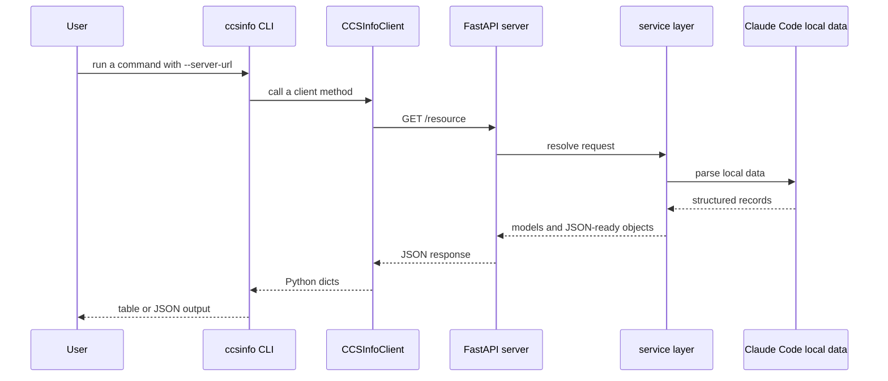

# API Overview
`ccsinfo` includes a read-only REST API for browsing Claude Code sessions, projects, tasks, search results, and usage statistics over HTTP. It sits on top of the same parser and service layer that powers the local CLI, so the data exposed by the API is the same data the CLI reads directly in local mode.

> **Note:** Every route in the current implementation is a `GET` endpoint. The API is designed for inspection, reporting, and integrations, not for mutating data.

## Running The Server
Use the built-in `serve` command to start the FastAPI app. The CLI can also switch into remote mode with `--server-url` or the `CCSINFO_SERVER_URL` environment variable.

```27:59:src/ccsinfo/cli/main.py
@app.command()
def serve(
    host: str = typer.Option("127.0.0.1", "--host", "-h", help="Host to bind to (use 0.0.0.0 for network access)"),
    port: int = typer.Option(8080, "--port", "-p", help="Port to bind"),
) -> None:
    """Start the API server."""
    uvicorn.run(fastapi_app, host=host, port=port)

# ...

@app.callback()
def main_callback(
    # ...
    server_url: str | None = typer.Option(
        None,
        "--server-url",
        "-s",
        envvar="CCSINFO_SERVER_URL",
        help="Remote server URL (e.g., http://localhost:8080). If not set, reads local files.",
    ),
) -> None:
    """Claude Code Session Info CLI."""
    state.server_url = server_url
```

By default, the server listens on `127.0.0.1:8080`, and the routes are mounted directly at the root of that address. There is no extra prefix such as `/api/v1`.

> **Warning:** If you bind the server to `0.0.0.0` for network access, remember that responses include local path data such as `project_path` and, on session detail responses, `file_path`.

The route groups are registered directly on the FastAPI app:

```8:20:src/ccsinfo/server/app.py
app = FastAPI(
    title="ccsinfo",
    description="Claude Code Session Info API",
    version=__version__,
)

# Include routers
app.include_router(sessions.router, prefix="/sessions", tags=["sessions"])
app.include_router(projects.router, prefix="/projects", tags=["projects"])
app.include_router(tasks.router, prefix="/tasks", tags=["tasks"])
app.include_router(stats.router, prefix="/stats", tags=["stats"])
app.include_router(search.router, prefix="/search", tags=["search"])
app.include_router(health.router, tags=["health"])
```

Because the app uses the standard `FastAPI(...)` setup, a running server also exposes FastAPI's generated schema and interactive API documentation.

## Endpoint Groups
### Sessions
| Route | Returns | Notes |
| --- | --- | --- |
| `GET /sessions` | list of `SessionSummary` | Optional `project_id`, `active_only`, and `limit`. Sorted by most recent update. |
| `GET /sessions/active` | list of `SessionSummary` | All currently active sessions. |
| `GET /sessions/{session_id}` | `Session` | Full session detail, including `file_path`. |
| `GET /sessions/{session_id}/messages` | list of message objects | Optional `role` and `limit`. Returns parsed `user` and `assistant` conversation entries. |
| `GET /sessions/{session_id}/tools` | list of tool call objects | Each item contains `id`, `name`, and `input`. |
| `GET /sessions/{session_id}/tasks` | list of task objects | Tasks associated with the session. |
| `GET /sessions/{session_id}/progress` | progress object | Includes `session_id`, `is_active`, `last_activity`, `message_count`, and `active_tasks`. |
| `GET /sessions/{session_id}/summary` | summary object | Lightweight session summary without the full session detail payload. |

### Projects
| Route | Returns | Notes |
| --- | --- | --- |
| `GET /projects` | list of `Project` | All projects, sorted by last activity. |
| `GET /projects/{project_id}` | `Project` | One project by encoded project ID. |
| `GET /projects/{project_id}/sessions` | list of `SessionSummary` | Project-scoped session list with optional `limit`. |
| `GET /projects/{project_id}/sessions/active` | list of `SessionSummary` | Active sessions for one project. |
| `GET /projects/{project_id}/stats` | `ProjectStats` | Per-project totals and last activity. |

### Tasks
| Route | Returns | Notes |
| --- | --- | --- |
| `GET /tasks` | list of `Task` | Optional `session_id` and `status` filters. |
| `GET /tasks/pending` | list of `Task` | Pending tasks across all sessions. |
| `GET /tasks/{task_id}` | `Task` | Requires `session_id` as a query parameter. |

### Stats
| Route | Returns | Notes |
| --- | --- | --- |
| `GET /stats` | `GlobalStats` | Totals across all projects and sessions. |
| `GET /stats/daily` | list of `DailyStats` | Daily activity window controlled by `days`. |
| `GET /stats/trends` | trend object | Last 7/30 day counts, most active projects, most used tools, average session length. |

### Search
| Route | Returns | Notes |
| --- | --- | --- |
| `GET /search` | list of `SessionSummary` | Searches session ID, slug, working directory, git branch, and project path. |
| `GET /search/messages` | list of match objects | Full-text search over user and assistant message text, with snippets. |
| `GET /search/history` | list of match objects | Searches saved prompt history, returning `prompt`, `session_id`, `project_path`, and `timestamp`. |

### Health
| Route | Returns | Notes |
| --- | --- | --- |
| `GET /health` | health object | Simple health check with `status`. |
| `GET /info` | info object | Server version plus total project and session counts. |

> **Note:** Detail routes use standard FastAPI-style error payloads. Missing sessions, projects, and tasks return `404` with a `detail` message, and an invalid task `status` filter returns `400`.

## Shared Models
Most list and detail routes reuse a small set of Pydantic models, which makes the API predictable across resource groups.

| Model | Used by | Key fields |
| --- | --- | --- |
| `SessionSummary` | session lists, project session lists, session search | `id`, `project_path`, `project_name`, `created_at`, `updated_at`, `message_count`, `is_active` |
| `Session` | session detail | all `SessionSummary` fields plus `file_path` |
| `Project` | project list and project detail | `id`, `name`, `path`, `session_count`, `last_activity` |
| `Task` | task endpoints and `active_tasks` in session progress | identifier, subject, description, status, owner, blockers, blocked tasks, active form, metadata |
| `GlobalStats` | `GET /stats` | `total_sessions`, `total_projects`, `total_messages`, `total_tool_calls` |
| `DailyStats` | `GET /stats/daily` | `date`, `session_count`, `message_count` |
| `ProjectStats` | `GET /projects/{project_id}/stats` | `project_id`, `project_name`, `session_count`, `message_count`, `last_activity` |

A few routes return endpoint-specific objects rather than one of the shared models above. That includes message payloads, tool-call lists, progress objects, search snippet results, trend results, and the health/info routes.

Timestamps are serialized as JSON date/time strings, and task status values are plain strings: `pending`, `in_progress`, and `completed`.

> **Tip:** If you need exact wire-level field names for code generation, use the generated schema from your running server. That is especially useful for endpoints that return plain JSON objects instead of a named shared model.

## Common Query Parameters
### Project IDs
`project_id` is not a random database key. It is an encoded version of the project path.

```23:44:src/ccsinfo/utils/paths.py
def encode_project_path(project_path: str) -> str:
    """Encode a project path to Claude Code's directory name format.

    Claude Code replaces:
    - '/' with '-'
    - '.' with '-'

    Example: '/home/user/project' -> '-home-user-project'
    """
    return project_path.replace("/", "-").replace(".", "-")


def decode_project_path(encoded_path: str) -> str:
    """Decode a Claude Code directory name back to the original path.

    Note: This is lossy - we cannot distinguish between original '-' and encoded '/' or '.'.
    """
    # Handle the pattern where /. becomes --
    result = encoded_path.replace("--", "/.")
    result = result.replace("-", "/")
    return result
```

> **Warning:** Treat `project_id` as an opaque identifier in API clients. The decode step is intentionally lossy, so it is not a guaranteed round-trip filesystem path.

### Task IDs
Task IDs are only unique inside a session, so the task detail endpoint needs both a path parameter and a query parameter:

```35:44:src/ccsinfo/server/routers/tasks.py
@router.get("/{task_id}", response_model=Task)
async def get_task(
    task_id: str,
    session_id: str = Query(..., description="Session ID (required since task IDs are only unique within a session)"),
) -> Task:
    """Get task details."""
    task = task_service.get_task(task_id, session_id=session_id)
    if not task:
        raise HTTPException(status_code=404, detail="Task not found")
    return task
```

### Parameter Reference
| Parameter | Where it appears | Default and limits | What it does |
| --- | --- | --- | --- |
| `limit` | `GET /sessions`, `GET /projects/{project_id}/sessions`, `GET /sessions/{session_id}/messages`, all search routes | usually `50`; `100` on session messages; `1..500` where enforced | Caps the number of returned rows. |
| `project_id` | `GET /sessions` | optional | Filters the session list to one project. |
| `active_only` | `GET /sessions` | `false` | Returns only active sessions. |
| `role` | `GET /sessions/{session_id}/messages` | optional | Filters to `user` or `assistant` messages. |
| `status` | `GET /tasks` | optional | Filters to `pending`, `in_progress`, or `completed`. Invalid values return `400`. |
| `session_id` | `GET /tasks/{task_id}` | required | Disambiguates task IDs. |
| `days` | `GET /stats/daily` | `30`, range `1..365` | Controls the daily stats window. |
| `q` | all search routes | required | The search string. |

FastAPI validation also enforces required parameters and numeric bounds automatically, so missing values such as `q` on search routes or out-of-range values such as `days=0` return validation errors before the request reaches the service layer.

## CLI And HTTP
Without `--server-url`, the CLI reads local data directly. With `--server-url`, it becomes a thin HTTP client over the REST API.

```27:37:src/ccsinfo/core/client.py
def list_sessions(
    self,
    project_id: str | None = None,
    active_only: bool = False,
    limit: int = 50,
) -> list[dict[str, Any]]:
    params: dict[str, Any] = {"limit": limit, "active_only": active_only}
    if project_id:
        params["project_id"] = project_id
    return self._get_list("/sessions", params)
```



### Command Mapping
| CLI command | Remote HTTP route |
| --- | --- |
| `ccsinfo sessions list` | `GET /sessions` |
| `ccsinfo sessions list --project <project_id>` | `GET /sessions` with `project_id` |
| `ccsinfo sessions list --active` | `GET /sessions` with `active_only=true` |
| `ccsinfo sessions active` | `GET /sessions/active` |
| `ccsinfo sessions show <session_id>` | `GET /sessions/{session_id}` |
| `ccsinfo sessions messages <session_id>` | `GET /sessions/{session_id}/messages` |
| `ccsinfo sessions tools <session_id>` | `GET /sessions/{session_id}/tools` |
| `ccsinfo projects list` | `GET /projects` |
| `ccsinfo projects show <project_id>` | `GET /projects/{project_id}` |
| `ccsinfo projects stats <project_id>` | `GET /projects/{project_id}/stats` |
| `ccsinfo tasks list` | `GET /tasks` |
| `ccsinfo tasks show <task_id> --session <session_id>` | `GET /tasks/{task_id}` with `session_id` |
| `ccsinfo tasks pending` | `GET /tasks/pending` |
| `ccsinfo stats global` | `GET /stats` |
| `ccsinfo stats daily` | `GET /stats/daily` |
| `ccsinfo stats trends` | `GET /stats/trends` |
| `ccsinfo search sessions <query>` | `GET /search` |
| `ccsinfo search messages <query>` | `GET /search/messages` |
| `ccsinfo search history <query>` | `GET /search/history` |

The bundled CLI does not currently call every server route directly. The most notable API-only helpers are `GET /sessions/{session_id}/tasks`, `GET /sessions/{session_id}/progress`, `GET /sessions/{session_id}/summary`, `GET /projects/{project_id}/sessions`, `GET /projects/{project_id}/sessions/active`, `GET /health`, and `GET /info`.

> **Tip:** If you are building an integration, call the REST API directly for helper endpoints such as session progress and project-scoped session listings. The CLI focuses on common workflows and does not wrap every available route.

> **Note:** The CLI is not always a byte-for-byte passthrough of HTTP defaults. For example, the HTTP route for session messages defaults to `limit=100`, while the CLI command defaults to `--limit 50` unless you override it.

## Behavior Notes
- `is_active` is computed from currently running Claude processes, so it reflects live activity instead of a field stored statically in session data.
- Session and project listings are sorted by most recent activity.
- `GET /search` looks at session metadata such as session ID, slug, working directory, git branch, and project path.
- `GET /search/messages` searches the text content of `user` and `assistant` messages and returns short snippets around the match.
- `GET /sessions/{session_id}/messages` exposes parsed conversation entries for `user` and `assistant`; it is the conversational view, while `GET /sessions/{session_id}/tools` is the cleaner endpoint for tool inventory.
- `GET /stats/daily` buckets activity by each session's first timestamp, not by every day a session may have remained active.
- In `GET /stats/trends`, `most_used_tools` counts how many sessions used a tool at least once, while `GET /stats` reports raw `total_tool_calls` across all sessions.


## Related Pages

- [Sessions API](api-sessions.html)
- [Projects API](api-projects.html)
- [Tasks API](api-tasks.html)
- [Search API](api-search.html)
- [Stats and Health API](api-stats-and-health.html)