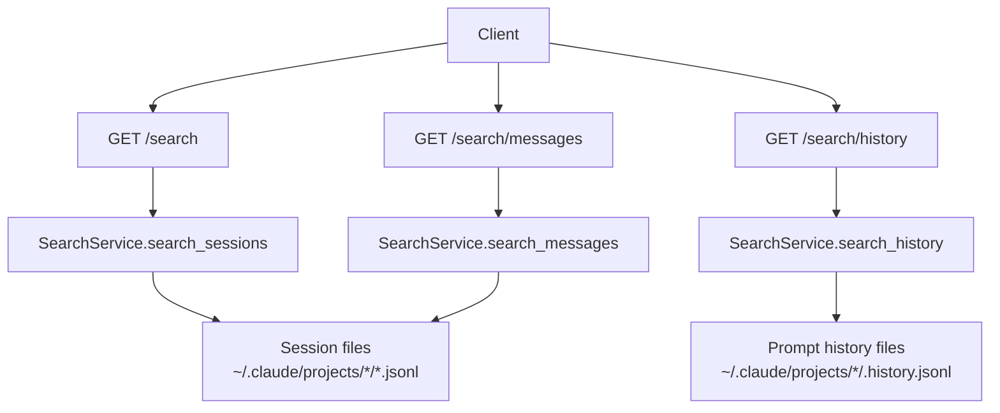

# Search API

The Search API gives you three read-only endpoints under `/search` for finding Claude Code sessions, conversation text, and prompt history. It scans the same local Claude Code data that `ccsinfo` reads from `~/.claude/projects`, so there is no separate search index to maintain.

> **Note:** All search endpoints are `GET` endpoints. Each one requires `q` and accepts `limit`. `limit` defaults to `50` and must be between `1` and `500`.

## Starting the server

If you are using the built-in API server, `ccsinfo` binds to `127.0.0.1:8080` by default:

```27:33:src/ccsinfo/cli/main.py
@app.command()
def serve(
    host: str = typer.Option("127.0.0.1", "--host", "-h", help="Host to bind to (use 0.0.0.0 for network access)"),
    port: int = typer.Option(8080, "--port", "-p", help="Port to bind"),
) -> None:
    """Start the API server."""
    uvicorn.run(fastapi_app, host=host, port=port)
```

If you use the CLI against a running server, the same codebase also supports `--server-url` and `CCSINFO_SERVER_URL`.

## Endpoint overview

| Endpoint | Best for | Searches these fields | Returns |
| --- | --- | --- | --- |
| `GET /search` | Finding a session by ID, slug, branch, directory, or project | `session_id`, `slug`, `cwd`, `git_branch`, decoded `project_path` | Session summaries |
| `GET /search/messages` | Finding words or phrases in conversation text | `user` and `assistant` message text only | Message match objects with snippets |
| `GET /search/history` | Finding prompts you typed | Prompt history `prompt` only | Prompt-history match objects |

Mounted under `/search`, the router exposes exactly these three handlers:

```13:37:src/ccsinfo/server/routers/search.py
@router.get("", response_model=list[SessionSummary])
async def search_sessions(
    q: str = Query(..., description="Search query"),
    limit: int = Query(50, ge=1, le=500, description="Maximum results"),
) -> list[SessionSummary]:
    """Full-text search across sessions."""
    return search_service.search_sessions(q, limit=limit)

@router.get("/messages")
async def search_messages(
    q: str = Query(..., description="Search query"),
    limit: int = Query(50, ge=1, le=500, description="Maximum results"),
) -> list[dict[str, Any]]:
    """Search message content across all sessions."""
    return search_service.search_messages(q, limit=limit)

@router.get("/history")
async def search_history(
    q: str = Query(..., description="Search query"),
    limit: int = Query(50, ge=1, le=500, description="Maximum results"),
) -> list[dict[str, Any]]:
    """Search prompt history."""
    return search_service.search_history(q, limit=limit)
```

## How search works



All three search modes use case-insensitive substring matching. They scan files on disk rather than querying a database or full-text index.

> **Tip:** If search helps you find the right session, follow up with `/sessions/{session_id}` or `/sessions/{session_id}/messages` for the full record. The search endpoints are intentionally lightweight.

## `GET /search`

Use session search when you know something about the session itself, not necessarily the conversation text. This is the right endpoint if you remember a session ID fragment, a branch name, a working directory, a slug, or a project path.

This endpoint is metadata search, not conversation search. It does not look inside message bodies.

The service checks these fields for a match:

```36:56:src/ccsinfo/core/services/search_service.py
for project_path, session in get_all_sessions():
    # Search in various session fields
    searchable_fields = [
        session.session_id,
        session.slug or "",
        session.cwd or "",
        session.git_branch or "",
        project_path,
    ]

    # Check if query matches any field
    if any(query_lower in field.lower() for field in searchable_fields if field):
        summary = SessionSummary(
            id=session.session_id,
            project_path=project_path,
            project_name=Path(project_path).name if project_path else "Unknown",
            created_at=pendulum.instance(session.first_timestamp) if session.first_timestamp else None,
            updated_at=pendulum.instance(session.last_timestamp) if session.last_timestamp else None,
            message_count=session.message_count,
            is_active=session.is_active(),
        )
```

### Response fields

| Field | Type | Meaning |
| --- | --- | --- |
| `id` | string | Session UUID |
| `project_path` | string | Decoded Claude project path for the session |
| `project_name` | string | Last path component of `project_path`, or `Unknown` if no path is available |
| `created_at` | string or `null` | First timestamp seen in the session, serialized as ISO 8601 |
| `updated_at` | string or `null` | Last timestamp seen in the session, serialized as ISO 8601 |
| `message_count` | integer | Count of `user` and `assistant` entries in the session |
| `is_active` | boolean | Whether the session currently appears to be active |

Among collected matches, session ID hits are prioritized ahead of other fields, and then newer sessions are preferred.

> **Note:** `project_path` comes from Claude Code’s encoded project directory name. That decode is intentionally lossy for some path patterns, so treat `project_path` as a useful label rather than a perfect round-trip filesystem path.

## `GET /search/messages`

Use message search when you remember wording from the conversation itself. It searches across all sessions, but it does not search every block inside a Claude Code message.

The implementation only searches `user` and `assistant` entries, and within structured content it only searches blocks whose type is `text`:

```85:121:src/ccsinfo/core/services/search_service.py
for project_path, session in get_all_sessions():
    for entry in session.entries:
        if entry.type not in ("user", "assistant"):
            continue

        # Extract text content to search
        text_content = ""
        if entry.message and entry.message.content:
            if isinstance(entry.message.content, str):
                text_content = entry.message.content
            elif isinstance(entry.message.content, list):
                texts = []
                for content in entry.message.content:
                    if content.type == "text" and content.text:
                        texts.append(content.text)
                text_content = "\n".join(texts)

        if query_lower in text_content.lower():
            # ... snippet building omitted ...
            results.append({
                "session_id": session.session_id,
                "project_path": project_path,
                "message_uuid": entry.uuid,
                "message_type": entry.type,
                "timestamp": entry_ts.isoformat() if entry_ts else None,
                "snippet": snippet,
            })
```

Each matching message produces one result. If the same message contains the query multiple times, the API still returns a single hit and builds the snippet around the first occurrence.

### What this endpoint does search

| Covered content | Notes |
| --- | --- |
| Plain-string message content | Searched directly |
| `text` blocks inside structured message content | Joined with newlines before matching |
| `user` entries | Included |
| `assistant` entries | Included |

### What this endpoint does not search

| Not covered | Why it matters |
| --- | --- |
| `tool_use` blocks | Tool names and tool input JSON are not matched |
| `tool_result` blocks | Tool output is not searched here |
| Non-message session entries | Events outside `user` and `assistant` are skipped |
| Prompt-history-only entries | Use `/search/history` for those |

### Response fields

| Field | Type | Meaning |
| --- | --- | --- |
| `session_id` | string | Session UUID containing the match |
| `project_path` | string | Decoded project path |
| `message_uuid` | string or `null` | UUID of the matching message entry |
| `message_type` | string | `user` or `assistant` |
| `timestamp` | string or `null` | Message timestamp as ISO 8601 |
| `snippet` | string | A short excerpt around the first match |

The returned `snippet` is not the full message. It is built from roughly 50 characters before and after the match, with `...` added when the excerpt is trimmed.

> **Warning:** If you need to search tool calls, tool results, or non-text message blocks, `/search/messages` is not enough. This endpoint is text-only by design.

## `GET /search/history`

Use prompt-history search when you want to find prompts you typed, regardless of how large the corresponding session became. This endpoint reads each project’s `.history.jsonl` file, not the main session message stream.

Raw history entries carry these fields:

```24:31:src/ccsinfo/core/parsers/history.py
class HistoryEntry(BaseModel):
    """A single entry in a prompt history file."""

    prompt: str | None = None
    timestamp: str | None = None
    session_id: str | None = Field(default=None, alias="sessionId")
    cwd: str | None = None
    version: str | None = None
```

The actual search is done against `prompt` only, and the API returns a compact result object:

```141:150:src/ccsinfo/core/services/search_service.py
matches = search_all_history(query, case_sensitive=False)

results: list[dict[str, Any]] = []
for project_path, entry in matches[:limit]:
    entry_ts = entry.get_timestamp()
    results.append({
        "project_path": project_path,
        "prompt": entry.prompt,
        "session_id": entry.session_id,
        "timestamp": entry_ts.isoformat() if entry_ts else None,
    })
```

Each matching history entry produces one result, and unlike message search, the API returns the full stored prompt text rather than a short snippet.

### Search coverage

| Field in raw history entry | Searched by `/search/history` | Returned by `/search/history` |
| --- | --- | --- |
| `prompt` | Yes | Yes |
| `timestamp` | No | Yes |
| `session_id` / `sessionId` | No | Yes |
| `cwd` | No | No |
| `version` | No | No |

### Response fields

| Field | Type | Meaning |
| --- | --- | --- |
| `project_path` | string | Decoded project path that owns the history file |
| `prompt` | string | Full stored prompt text |
| `session_id` | string or `null` | Session UUID linked to the prompt-history entry |
| `timestamp` | string or `null` | Prompt timestamp as ISO 8601 |

> **Warning:** `/search/history` searches prompts you sent, not assistant replies. If you want to search the conversation text on both sides, use `/search/messages`.

## Choosing the right endpoint

Use `/search` when you are trying to locate the right session first. Use `/search/messages` when you remember wording from the conversation. Use `/search/history` when you remember wording from the prompt you typed and want the original prompt text back.

A common workflow is:

1. Search sessions with `/search` if you only know project, branch, slug, directory, or session metadata.
2. Use the returned `id` to inspect the session through `/sessions/{session_id}` or `/sessions/{session_id}/messages`.
3. Use `/search/messages` or `/search/history` when you want content-based search across all projects.


## Related Pages

- [Searching Sessions, Messages, and History](search-guide.html)
- [API Overview](api-overview.html)
- [Sessions API](api-sessions.html)
- [JSON Output and Automation](json-output-and-automation.html)
- [Data Model and Storage](data-model-and-storage.html)