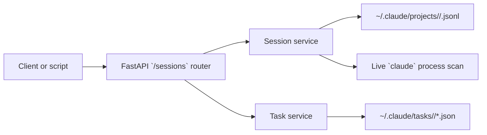

# Sessions API

The Sessions API exposes Claude Code session history under the `/sessions` prefix. All endpoints on this page are read-only `GET` routes. Use them to list sessions across projects, see which sessions are active, inspect one session, retrieve normalized messages, flatten tool calls, read session-scoped task files, and fetch compact progress or summary views.

## Starting the API

`ccsinfo` mounts the sessions router at `/sessions`, and the CLI starts Uvicorn on `127.0.0.1:8080` by default.

```8:19:src/ccsinfo/server/app.py
app = FastAPI(
    title="ccsinfo",
    description="Claude Code Session Info API",
    version=__version__,
)

# Include routers
app.include_router(sessions.router, prefix="/sessions", tags=["sessions"])
app.include_router(projects.router, prefix="/projects", tags=["projects"])
app.include_router(tasks.router, prefix="/tasks", tags=["tasks"])
app.include_router(stats.router, prefix="/stats", tags=["stats"])
app.include_router(search.router, prefix="/search", tags=["search"])
```

```27:33:src/ccsinfo/cli/main.py
@app.command()
def serve(
    host: str = typer.Option("127.0.0.1", "--host", "-h", help="Host to bind to (use 0.0.0.0 for network access)"),
    port: int = typer.Option(8080, "--port", "-p", help="Port to bind"),
) -> None:
    """Start the API server."""
    uvicorn.run(fastapi_app, host=host, port=port)
```

If you use those defaults, the API base URL is `http://127.0.0.1:8080`.

## Quick Reference

| Endpoint | Use it for | Returns |
| --- | --- | --- |
| `GET /sessions` | List sessions, optionally filtered | Array of session summary objects |
| `GET /sessions/active` | List active sessions across all projects | Array of active session summary objects |
| `GET /sessions/{session_id}` | Inspect one session's metadata | One session detail object |
| `GET /sessions/{session_id}/messages` | Read normalized conversation messages | Array of message objects |
| `GET /sessions/{session_id}/tools` | Read flattened tool calls | Array of tool-call objects |
| `GET /sessions/{session_id}/tasks` | Read Claude Code tasks for the session | Array of task objects |
| `GET /sessions/{session_id}/progress` | Get a combined session/task progress view | One progress object |
| `GET /sessions/{session_id}/summary` | Get a compact single-session summary | One session summary object |

## How The Data Is Built

The Sessions API is file-backed. Session endpoints read Claude Code JSONL files from `~/.claude/projects`, and session task data comes from JSON files under `~/.claude/tasks`. There is no separate database layer behind these routes.



The test fixtures are a good example of the on-disk input that the API parses before turning it into HTTP responses:

```25:62:tests/conftest.py
@pytest.fixture
def sample_session_data() -> list[dict[str, Any]]:
    """Sample session JSONL data."""
    return [
        {
            "type": "user",
            "uuid": "msg-001",
            "message": {
                "role": "user",
                "content": [{"type": "text", "text": "Hello"}],
            },
            "timestamp": "2024-01-15T10:00:00Z",
        },
        {
            "type": "assistant",
            "uuid": "msg-002",
            "parentMessageUuid": "msg-001",
            "message": {
                "role": "assistant",
                "content": [{"type": "text", "text": "Hi there!"}],
            },
            "timestamp": "2024-01-15T10:00:01Z",
        },
    ]


@pytest.fixture
def sample_task_data() -> dict[str, Any]:
    """Sample task JSON data."""
    return {
        "id": "1",
        "subject": "Test task",
        "description": "A test task",
        "status": "pending",
        "owner": None,
        "blockedBy": [],
        "blocks": [],
    }
```

> **Note:** The HTTP API normalizes parsed records into snake_case fields such as `parent_message_uuid`, `blocked_by`, and `active_form`.

> **Warning:** Treat `project_id` as an opaque value from `GET /projects`. The path encoding is lossy, so constructing or reverse-engineering IDs from a filesystem path can be unreliable.

```23:44:src/ccsinfo/utils/paths.py
def encode_project_path(project_path: str) -> str:
    """Encode a project path to Claude Code's directory name format.

    Claude Code replaces:
    - '/' with '-'
    - '.' with '-'

    Example: '/home/user/project' -> '-home-user-project'
    """
    return project_path.replace("/", "-").replace(".", "-")


def decode_project_path(encoded_path: str) -> str:
    """Decode a Claude Code directory name back to the original path.

    Note: This is lossy - we cannot distinguish between original '-' and encoded '/' or '.'.
    The path returned should be treated as approximate.
    """
    # Handle the pattern where /. becomes --
    result = encoded_path.replace("--", "/.")
    result = result.replace("-", "/")
    return result
```

> **Note:** Active status is computed from live `claude` processes and `/proc` inspection, not stored in the session file. The active-session lookup is cached for 5 seconds.

## Built-In Client Example

The repository already contains a small HTTP client that calls the core session routes:

```27:57:src/ccsinfo/core/client.py
    # Sessions
    def list_sessions(
        self,
        project_id: str | None = None,
        active_only: bool = False,
        limit: int = 50,
    ) -> list[dict[str, Any]]:
        params: dict[str, Any] = {"limit": limit, "active_only": active_only}
        if project_id:
            params["project_id"] = project_id
        return self._get_list("/sessions", params)

    def get_session(self, session_id: str) -> dict[str, Any]:
        return self._get_dict(f"/sessions/{session_id}")

    def get_session_messages(
        self,
        session_id: str,
        role: str | None = None,
        limit: int = 100,
    ) -> list[dict[str, Any]]:
        params: dict[str, Any] = {"limit": limit}
        if role:
            params["role"] = role
        return self._get_list(f"/sessions/{session_id}/messages", params)

    def get_session_tools(self, session_id: str) -> list[dict[str, Any]]:
        return self._get_list(f"/sessions/{session_id}/tools")

    def get_active_sessions(self) -> list[dict[str, Any]]:
        return self._get_list("/sessions/active")
```

> **Note:** The bundled `CCSInfoClient` covers listing, detail, messages, tools, and active sessions. If you need session `tasks`, `progress`, or `summary`, call those HTTP routes directly.

## Endpoint Reference

### `GET /sessions`

Lists sessions across all projects.

- Query `project_id` filters to a single project. Use the `id` field from `GET /projects`.
- Query `active_only` defaults to `false`.
- Query `limit` defaults to `50` and accepts values from `1` to `500`.
- Results are returned most-recent-first, sorted by `updated_at`.
- The route supports a limit, but not offset or cursor pagination.
- Each item uses the session summary shape described below.

> **Tip:** If you want active sessions for one project, use `GET /sessions?project_id=<id>&active_only=true`.

### `GET /sessions/active`

Lists only sessions that are currently active.

- Returns the same summary shape as `GET /sessions`.
- Results are returned most-recent-first.
- This route does not expose `project_id` or `limit`.
- Use `GET /sessions` instead when you want active sessions plus a project filter or a bounded result set.

### `GET /sessions/{session_id}`

Returns full metadata for one session.

- Includes `file_path`, which is not present in the list and summary responses.
- This is metadata-only detail. Conversation content lives under `GET /sessions/{session_id}/messages`.
- Returns `404` with `{"detail":"Session not found"}` when the session does not exist.

### `GET /sessions/{session_id}/messages`

Returns normalized conversation messages for one session.

- Query `role` is optional. The useful values are `user` and `assistant`, because those are the entry types the extractor keeps.
- Query `limit` defaults to `100` and accepts values from `1` to `500`.
- The route supports a limit, but not offset or cursor pagination.
- Each message includes top-level metadata plus a normalized `message` object when content blocks are present.
- When a message contains both text and tool-use blocks, they are preserved inside `message.content`.
- Returns `404` with `{"detail":"Session not found"}` when the session does not exist.

### `GET /sessions/{session_id}/tools`

Returns a flat list of tool calls found in the session.

- Each item contains `id`, `name`, and `input`.
- The list is flattened across the whole session rather than grouped by message.
- Use this endpoint when you care about tool usage and payloads more than full conversation context.
- Returns `404` with `{"detail":"Session not found"}` when the session does not exist.

### `GET /sessions/{session_id}/tasks`

Returns Claude Code task records associated with the session.

- Data comes from `~/.claude/tasks/<session_id>/*.json`.
- Items use the task shape described below, including `status`, `blocked_by`, `blocks`, and `active_form`.
- This route delegates straight to task parsing rather than performing the upfront session lookup used by the other session-detail routes.

> **Tip:** If you need to verify the session itself exists before reading tasks, call `GET /sessions/{session_id}` first.

### `GET /sessions/{session_id}/progress`

Returns a small combined view of session activity and task progress.

- The response object contains `session_id`, `is_active`, `last_activity`, `message_count`, and `active_tasks`.
- `active_tasks` includes only tasks whose `status` is `in_progress`.
- `last_activity` is the session's `updated_at` value serialized to ISO 8601.
- `active_tasks` reuses the same task object shape as `GET /sessions/{session_id}/tasks`.
- Returns `404` with `{"detail":"Session not found"}` when the session does not exist.

### `GET /sessions/{session_id}/summary`

Returns a compact single-session summary.

- The shape matches the list items returned by `GET /sessions`.
- It omits `file_path`.
- Use it when you already know the session ID and only want the lightweight metadata fields.
- Returns `404` with `{"detail":"Session not found"}` when the session does not exist.

## Response Shapes

### Session Summary Object

Used by `GET /sessions`, `GET /sessions/active`, and `GET /sessions/{session_id}/summary`.

| Field | Type | Meaning |
| --- | --- | --- |
| `id` | string | Session identifier. In practice this is the session file stem and is typically UUID-like. |
| `project_path` | string | Approximate decoded project path. |
| `project_name` | string | Last path component of `project_path`. |
| `created_at` | string or `null` | First parseable timestamp in the session file. |
| `updated_at` | string or `null` | Last parseable timestamp in the session file. |
| `message_count` | integer | Count of `user` and `assistant` entries in the session. |
| `is_active` | boolean | Live active-session flag. |

### Session Detail Object

`GET /sessions/{session_id}` returns the session summary fields plus:

| Field | Type | Meaning |
| --- | --- | --- |
| `file_path` | string or `null` | Full path to the backing JSONL session file. |

### Message Object

Used by `GET /sessions/{session_id}/messages`.

| Field | Type | Meaning |
| --- | --- | --- |
| `uuid` | string | Message identifier. |
| `parent_message_uuid` | string or `null` | Parent message link when present. |
| `timestamp` | string or `null` | Parsed message timestamp. |
| `type` | `user` or `assistant` | Message type. |
| `message` | object or `null` | Normalized message body. |

When `message` is present, it contains:

| Nested field | Type | Meaning |
| --- | --- | --- |
| `message.role` | `user` or `assistant` | Sender role. |
| `message.content` | array | Typed content blocks. |

Content block types used by the session message extractor:

| Block type | Fields |
| --- | --- |
| `text` | `text` |
| `tool_use` | `id`, `name`, `input` |

### Tool Call Object

Used by `GET /sessions/{session_id}/tools`.

| Field | Type | Meaning |
| --- | --- | --- |
| `id` | string | Tool call identifier. |
| `name` | string | Tool name. |
| `input` | object | Tool input payload. |

### Task Object

Used by `GET /sessions/{session_id}/tasks` and inside `active_tasks` on the progress response.

| Field | Type | Meaning |
| --- | --- | --- |
| `id` | string | Task identifier within the session. |
| `subject` | string | Short task title. |
| `description` | string | Longer task description. |
| `status` | `pending`, `in_progress`, or `completed` | Current task status. |
| `owner` | string or `null` | Task owner if present. |
| `blocked_by` | array of strings | Task IDs blocking this task. |
| `blocks` | array of strings | Task IDs this task blocks. |
| `active_form` | string or `null` | Verb-style wording for the task when present. |
| `metadata` | object | Arbitrary task metadata. |
| `created_at` | string or `null` | Creation time if available in the parsed model. |

### Progress Object

Used by `GET /sessions/{session_id}/progress`.

| Field | Type | Meaning |
| --- | --- | --- |
| `session_id` | string | Requested session ID. |
| `is_active` | boolean | Same active-session flag used elsewhere. |
| `last_activity` | string or `null` | ISO 8601 version of the session's `updated_at`. |
| `message_count` | integer | Same user-plus-assistant message count used on the session object. |
| `active_tasks` | array of task objects | Only tasks whose status is `in_progress`. |

## Practical Behavior Notes

- Session listings are file-backed and reflect what is currently on disk under `~/.claude`.
- `message_count` is not a raw line count of the JSONL file. It counts only `user` and `assistant` entries.
- `GET /sessions/{session_id}/tools` is intentionally flattened. It does not include surrounding assistant text or per-message grouping.
- `GET /sessions/{session_id}/summary` is the lightest single-session metadata route when `file_path` is not needed.


## Related Pages

- [Working with Sessions](sessions-guide.html)
- [API Overview](api-overview.html)
- [Projects API](api-projects.html)
- [Tasks API](api-tasks.html)
- [Active Session Detection](active-session-detection.html)