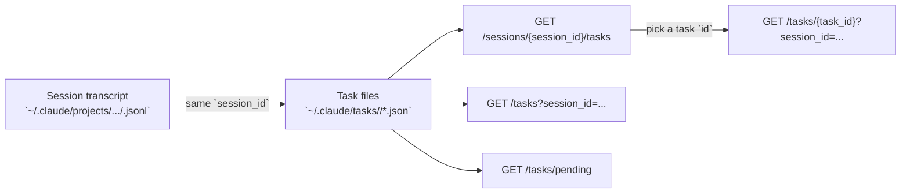

I have enough to draft now. The remaining details are implementation quirks rather than missing endpoint behavior, so I’m switching from repo exploration to writing the page.# Tasks API

The Tasks API lets you inspect Claude Code tasks across all sessions or within a single session. The key idea is simple: task IDs are **not globally unique**, so a full task lookup needs both the task `id` and the `session_id` it belongs to.

By default, the bundled server starts on `127.0.0.1:8080`, so task endpoints are typically available under `http://127.0.0.1:8080/tasks`.

```27:33:src/ccsinfo/cli/main.py
@app.command()
def serve(
    host: str = typer.Option("127.0.0.1", "--host", "-h", help="Host to bind to (use 0.0.0.0 for network access)"),
    port: int = typer.Option(8080, "--port", "-p", help="Port to bind"),
) -> None:
    """Start the API server."""
    uvicorn.run(fastapi_app, host=host, port=port)
```

## How Tasks Relate To Sessions

`ccsinfo` reads task JSON files from `~/.claude/tasks/<session-id>/`. Session transcripts live separately under `~/.claude/projects/.../<session-id>.jsonl`, but both use the same session UUID. That shared `session_id` is what ties the Sessions API and the Tasks API together.

```79:85:src/ccsinfo/core/parsers/tasks.py
def get_tasks_directory() -> Path:
    """Get the Claude Code tasks directory path.

    Returns:
        Path to ~/.claude/tasks/
    """
    return Path.home() / ".claude" / "tasks"
```



> **Tip:** If you know the session but not the task ID, start with `GET /sessions/{session_id}/tasks`, then call `GET /tasks/{task_id}?session_id=...` for the single task you want.

## Endpoint Summary

| Endpoint | What it does | Parameters |
| --- | --- | --- |
| `GET /tasks` | List tasks across all sessions, or within one session | `session_id` optional, `status` optional |
| `GET /tasks/pending` | List all tasks whose status is `pending` | None |
| `GET /tasks/{task_id}` | Get one task by ID within a specific session | `session_id` required |
| `GET /sessions/{session_id}/tasks` | List tasks for one session | `session_id` path parameter |

## `GET /tasks`

Use `GET /tasks` to list tasks globally, or narrow the result set with query parameters.

Supported query parameters:

- `session_id`: limit the list to one session
- `status`: limit the list to one status

Accepted status values are:

- `pending`
- `in_progress`
- `completed`

The route validates `status` and returns HTTP `400` for anything else.

```11:26:src/ccsinfo/server/routers/tasks.py
@router.get("", response_model=list[Task])
async def list_tasks(
    session_id: str | None = Query(None),
    status: str | None = Query(None),
) -> list[Task]:
    """List all tasks."""
    status_enum: TaskStatus | None = None
    if status:
        try:
            status_enum = TaskStatus(status)
        except ValueError as e:
            raise HTTPException(
                status_code=400,
                detail=f"Invalid status: {status}. Valid values: pending, in_progress, completed",
            ) from e
    return task_service.list_tasks(session_id=session_id, status=status_enum)
```

### What to expect

- No query parameters: returns tasks from all sessions that have task files.
- `session_id` only: returns tasks from that session.
- `status` only: returns matching tasks across all sessions.
- `session_id` plus `status`: returns matching tasks inside that session only.
- If nothing matches, you get an empty array.

> **Note:** The API expects the exact lowercase status strings shown above. `pending` works; `Pending` and `PENDING` do not.

> **Note:** Task endpoints do not expose pagination, `limit`, or server-side sort parameters.

## `GET /tasks/pending`

`GET /tasks/pending` is the convenience endpoint for “show me every pending task across all sessions.”

In the service layer, it is just a status filter:

```81:87:src/ccsinfo/core/services/task_service.py
def get_pending_tasks(self) -> list[Task]:
    """Get all pending tasks across all sessions.

    Returns:
        List of pending tasks.
    """
    return self.list_tasks(status=TaskStatus.PENDING)
```

That means it is functionally equivalent to `GET /tasks?status=pending`.

> **Warning:** “Pending” does **not** mean “ready to work.” Blocked tasks are still included here. If you need a ready queue, filter the results client-side so that `blocked_by` or `blockedBy` is empty.

The parser makes this distinction explicit:

```70:76:src/ccsinfo/core/parsers/tasks.py
def get_blocked_tasks(self) -> list[Task]:
    """Get all tasks that are blocked by other tasks."""
    return [t for t in self.tasks if t.blocked_by]

def get_ready_tasks(self) -> list[Task]:
    """Get all pending tasks that are not blocked."""
    return [t for t in self.tasks if t.status == "pending" and not t.blocked_by]
```

## `GET /sessions/{session_id}/tasks`

This is the most practical session-scoped listing endpoint. Use it when you already know the session and want to see all of its tasks before drilling into one.

```61:65:src/ccsinfo/server/routers/sessions.py
@router.get("/{session_id}/tasks")
async def get_session_tasks(session_id: str) -> list[dict[str, Any]]:
    """Get tasks for a session."""
    tasks = task_service.get_session_tasks(session_id)
    return [t.model_dump(mode="json") for t in tasks]
```

### When to use it

- You already have a session ID from the Sessions API.
- You want to discover task IDs within that session.
- You want the full task list for one session without using query parameters.

### Behavior details

- If the session has no task directory, this endpoint returns an empty array.
- It does not add additional filtering for status.
- It is the safest first step before calling the single-task detail endpoint.

## `GET /tasks/{task_id}`

Use this endpoint when you need one specific task.

The important detail is that `session_id` is required as a query parameter:

```35:44:src/ccsinfo/server/routers/tasks.py
@router.get("/{task_id}", response_model=Task)
async def get_task(
    task_id: str,
    session_id: str = Query(..., description="Session ID (required since task IDs are only unique within a session)"),
) -> Task:
    """Get task details."""
    task = task_service.get_task(task_id, session_id=session_id)
    if not task:
        raise HTTPException(status_code=404, detail="Task not found")
    return task
```

### Why the extra `session_id` matters

Task IDs are only guaranteed to be unique **inside a session**. A task with ID `1` can exist in more than one session, so the API requires the session context to resolve the correct task.

### Recommended lookup flow

1. Get or identify the session ID.
2. Call `GET /sessions/{session_id}/tasks`.
3. Take the task `id` you want from that list.
4. Call `GET /tasks/{task_id}?session_id={session_id}`.

> **Warning:** If you omit the session context in your own tooling or UI flow, you can easily point to the wrong task or fail to resolve the task at all.

## Task Shape

The task model exposes these core fields:

```14:34:src/ccsinfo/core/models/tasks.py
class TaskStatus(StrEnum):
    """Task status enum."""

    PENDING = "pending"
    IN_PROGRESS = "in_progress"
    COMPLETED = "completed"


class Task(BaseORJSONModel):
    """A Claude Code task from ~/.claude/tasks/<session-uuid>/*.json."""

    id: str
    subject: str
    description: str = ""
    status: TaskStatus = TaskStatus.PENDING
    owner: str | None = None
    blocked_by: list[str] = Field(default_factory=list, alias="blockedBy")
    blocks: list[str] = Field(default_factory=list)
    active_form: str | None = Field(default=None, alias="activeForm")
    metadata: dict[str, Any] = Field(default_factory=dict)
    created_at: datetime | None = None
```

### Field reference

| Field | Meaning |
| --- | --- |
| `id` | Task identifier string |
| `subject` | Short task title |
| `description` | Longer description, defaulting to an empty string |
| `status` | One of `pending`, `in_progress`, or `completed` |
| `owner` | Optional owner/assignee |
| `blocked_by` / `blockedBy` | Task IDs that must finish first |
| `blocks` | Task IDs this task is blocking |
| `active_form` / `activeForm` | Optional active wording for the task |
| `metadata` | Free-form metadata object |
| `created_at` | Nullable timestamp field on the model |

> **Note:** The repository uses snake_case fields in Python models and camelCase aliases for some raw task JSON fields. In practice, `blocked_by` maps to `blockedBy`, and `active_form` maps to `activeForm`.

The test fixture below shows the raw task JSON shape the parser expects:

```52:62:tests/conftest.py
return {
    "id": "1",
    "subject": "Test task",
    "description": "A test task",
    "status": "pending",
    "owner": None,
    "blockedBy": [],
    "blocks": [],
}
```

## Ordering And Filtering Details

Within a session, tasks are read from `*.json` files and then sorted by task ID, using numeric ordering when the IDs are numeric strings.

```104:128:src/ccsinfo/core/parsers/tasks.py
def parse_session_tasks(session_id: str) -> TaskCollection:
    """Parse all tasks for a given session."""
    tasks_dir = get_tasks_directory() / session_id
    tasks: list[Task] = []

    if not tasks_dir.exists():
        logger.debug("No tasks directory found for session %s", session_id)
        return TaskCollection(session_id=session_id, tasks=[])

    for task_file in iter_json_files(tasks_dir, "*.json"):
        task = parse_task_file(task_file)
        if task is not None:
            tasks.append(task)

    # Sort by ID (numeric sort if possible)
    tasks.sort(key=lambda t: (int(t.id) if t.id.isdigit() else float("inf"), t.id))

    return TaskCollection(session_id=session_id, tasks=tasks)
```

What this means in practice:

- Per-session ordering is stable and ID-based.
- Cross-session listing is not exposed with a custom sort option.
- If a session has no task directory, session-scoped listing returns `[]`.

> **Note:** If an individual task file fails to parse, the parser skips that file instead of failing the entire task list response.

## Python Client Example From The Codebase

If you want to see how the project itself calls these endpoints, the built-in HTTP client is a good reference:

```69:86:src/ccsinfo/core/client.py
# Tasks
def list_tasks(
    self,
    session_id: str | None = None,
    status: str | None = None,
) -> list[dict[str, Any]]:
    params: dict[str, Any] = {}
    if session_id:
        params["session_id"] = session_id
    if status:
        params["status"] = status
    return self._get_list("/tasks", params)

def get_task(self, task_id: str, session_id: str) -> dict[str, Any]:
    return self._get_dict(f"/tasks/{task_id}", {"session_id": session_id})

def get_pending_tasks(self) -> list[dict[str, Any]]:
    return self._get_list("/tasks/pending")
```

This mirrors the intended usage:

- `list_tasks()` for broad listing and filtering
- `get_pending_tasks()` for a cross-session pending queue
- `get_task(task_id, session_id)` for an exact task lookup

## Best Practices

- Use `GET /sessions/{session_id}/tasks` first when you know the session but not the task ID.
- Use `GET /tasks?status=in_progress` or `GET /tasks?status=completed` for simple status filtering.
- Use `GET /tasks/pending` when you want a global backlog view.
- Check `blocked_by` / `blockedBy` before treating a pending task as ready to work.
- Do not assume task IDs are globally unique across sessions.


## Related Pages

- [Working with Tasks](tasks-guide.html)
- [API Overview](api-overview.html)
- [Sessions API](api-sessions.html)
- [Project IDs and Lookups](project-ids-and-lookups.html)
- [Data Model and Storage](data-model-and-storage.html)