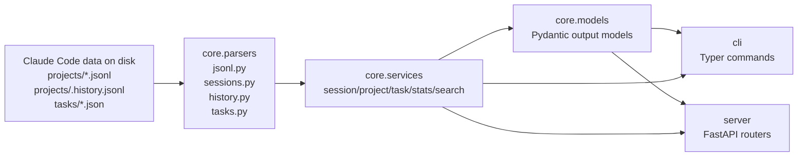

# Architecture and Project Structure

`ccsinfo` is built around one simple idea: read Claude Code data from disk, normalize it into typed Python models, and expose it through either a command-line interface or a small HTTP API.

If you only remember one thing from this page, remember this: **the real behavior lives in `core.services`**. The CLI and the server are intentionally thin layers on top of that shared logic.

## Package Map

| Package | What it contains | Why it exists |
|---|---|---|
| `src/ccsinfo/cli` | Typer app, command groups, CLI state | User-facing commands such as `sessions`, `projects`, `tasks`, `stats`, and `search` |
| `src/ccsinfo/core/models` | Pydantic models for sessions, messages, tasks, projects, and stats | Defines the typed data shape returned by services and the API |
| `src/ccsinfo/core/parsers` | Low-level readers for JSON and JSONL files | Knows how Claude Code data is stored on disk |
| `src/ccsinfo/core/services` | Business logic and aggregation | Turns raw parsed data into useful summaries, searches, and reports |
| `src/ccsinfo/server` | FastAPI app and route modules | Exposes the same data through HTTP |
| `src/ccsinfo/utils` | Path helpers and Rich output helpers | Keeps filesystem discovery and terminal formatting out of the business logic |
| `tests` | Fixtures and layer-focused tests | Verifies parsers, models, services, and path handling |

## High-Level Architecture

At runtime, `ccsinfo` reads three kinds of Claude Code data:

- session transcripts in `~/.claude/projects/<encoded-project>/*.jsonl`
- prompt history in `~/.claude/projects/<encoded-project>/.history.jsonl`
- task files in `~/.claude/tasks/<session-id>/*.json`

Those files flow through parsers, then services, and finally out through the CLI or the API.



A practical way to trace any feature is:

1. Find the user-facing command or route.
2. Jump to the matching service in `core.services`.
3. Follow that service into the parser that reads the underlying files.

## The Data Layout ccsinfo Expects

The test fixtures are a good way to see the expected Claude Code directory shape without guessing. The repository creates a miniature `.claude` tree like this:

```84:112:tests/conftest.py
def mock_claude_dir(
    tmp_path: Path, sample_session_data: list[dict[str, Any]], sample_task_data: dict[str, Any]
) -> Path:
    """Create a fully populated mock .claude directory."""
    claude_dir = tmp_path / ".claude"

    # Create projects directory with a sample project
    projects_dir = claude_dir / "projects"
    project_dir = projects_dir / "-home-user-test-project"
    project_dir.mkdir(parents=True)

    # Create a session file in the project
    session_file = project_dir / "abc-123-def-456.jsonl"
    with session_file.open("w") as f:
        for entry in sample_session_data:
            f.write(json.dumps(entry) + "\n")

    # Create tasks directory with a session's tasks
    tasks_dir = claude_dir / "tasks"
    session_tasks_dir = tasks_dir / "abc-123-def-456"
    session_tasks_dir.mkdir(parents=True)

    # Create a task file
    task_file = session_tasks_dir / "1.json"
    with task_file.open("w") as f:
        json.dump(sample_task_data, f)

    return claude_dir
```

That fixture highlights an important design decision:

- sessions and history are grouped by project
- tasks are grouped by session

This is why project-focused views mostly start from `~/.claude/projects`, while task-focused views start from `~/.claude/tasks`.

### Encoded Project Paths

Claude Code stores project directories using an encoded version of the original path. `ccsinfo` centralizes that logic in `utils.paths`:

```23:44:src/ccsinfo/utils/paths.py
def encode_project_path(project_path: str) -> str:
    """Encode a project path to Claude Code's directory name format.

    Claude Code replaces:
    - '/' with '-'
    - '.' with '-'

    Example: '/home/user/project' -> '-home-user-project'
    """
    return project_path.replace("/", "-").replace(".", "-")


def decode_project_path(encoded_path: str) -> str:
    """Decode a Claude Code directory name back to the original path.

    Note: This is lossy - we cannot distinguish between original '-' and encoded '/' or '.'.
    The path returned should be treated as approximate.
    """
    # Handle the pattern where /. becomes --
    result = encoded_path.replace("--", "/.")
    result = result.replace("-", "/")
    return result
```

> **Warning:** Project IDs are encoded path strings, and `decode_project_path()` is intentionally lossy. The decoded path is useful for display and grouping, but it should not be treated as a perfect round-trip back to the original filesystem path.

## The `core` Package

The `core` package is the center of the project. It is split into three layers:

- `core.models`: typed outputs
- `core.parsers`: file readers
- `core.services`: the behavior shared by CLI and API

### `core.models`

The models are all Pydantic-based and describe the stable shapes the rest of the project works with.

The most important model groups are:

- `sessions.py`: `SessionSummary`, `Session`, and `SessionDetail`
- `messages.py`: message blocks, tool calls, and tool results
- `projects.py`: project metadata
- `tasks.py`: task status, blockers, owner, and metadata
- `stats.py`: global, daily, and per-project statistics

This separation matters because the raw Claude Code files are not especially friendly to consume directly. The models give the rest of the codebase a predictable interface.

A good example is task alias handling. On disk, task JSON uses names like `blockedBy` and `activeForm`, but the codebase exposes `blocked_by` and `active_form` consistently through the model layer.

### `core.parsers`

The parser layer understands Claude Code’s storage formats.

Here is what each parser module does:

- `jsonl.py` provides the generic JSON and JSONL reading utilities used everywhere else.
- `sessions.py` parses transcript files, computes counts, exposes session metadata, and discovers whether a session is currently active.
- `history.py` parses `.history.jsonl` and supports prompt search across projects.
- `tasks.py` parses per-session task JSON files and groups them into `TaskCollection` objects.

A few details are especially worth knowing:

- `parse_jsonl()` skips malformed lines by default, so transcript parsing is intentionally resilient.
- `sessions.py` ignores dot-prefixed JSONL files when scanning session files, which keeps `.history.jsonl` separate from transcript parsing.
- `tasks.py` sorts tasks numerically when possible, so `1.json`, `2.json`, `10.json` come back in a sensible order.

> **Note:** Session “active” status is not stored in transcript files. It is computed at runtime by inspecting live `claude` processes and cached briefly in `core.parsers.sessions`, so active-state results are best-effort rather than permanent metadata.

### `core.services`

Services are where raw parsed data becomes user-facing behavior.

| Service | Main job | Main dependencies |
|---|---|---|
| `SessionService` | Lists sessions, returns session detail, extracts messages and tool calls | `core.parsers.sessions`, `core.models.sessions`, `core.models.messages` |
| `ProjectService` | Discovers projects and computes project-level stats | `core.parsers.sessions`, `utils.paths`, `core.models.projects`, `core.models.stats` |
| `TaskService` | Reads and filters tasks by session or status | `core.parsers.tasks`, `core.models.tasks` |
| `StatsService` | Computes totals, daily breakdowns, and usage trends | `core.parsers.sessions`, `core.models.stats` |
| `SearchService` | Searches session metadata, message text, and prompt history | `core.parsers.sessions`, `core.parsers.history` |

This is the layer to read first when you want to understand behavior. For example, `SessionService.list_sessions()` does not care whether the caller is the CLI or the API. It just iterates parsed sessions, filters them, sorts them, and returns summaries:

```47:76:src/ccsinfo/core/services/session_service.py
for project_path, session in get_all_sessions():
    # Filter by project if specified
    if project_id is not None:
        try:
            decoded = decode_project_path(project_id)
            if project_path != decoded:
                continue
        except Exception:
            continue

    # Convert to summary
    summary = self._session_to_summary(session, project_path)

    # Filter active only
    if active_only and not summary.is_active:
        continue

    summaries.append(summary)

# Sort by updated_at descending (most recent first)
summaries.sort(
    key=lambda s: s.updated_at or pendulum.datetime(1970, 1, 1),
    reverse=True,
)

# Apply limit
if limit is not None:
    summaries = summaries[:limit]

return summaries
```

That same pattern repeats across the service layer:

- search services read raw session/history data, then return compact search results
- stats services aggregate across all sessions
- project services reuse parsed sessions to compute project summaries
- task services convert parsed task JSON into typed `Task` objects

> **Note:** Task IDs are only unique within a session. That is why single-task lookups require both a task ID and a session ID in the API and CLI.

## The `server` Package

The server is a small FastAPI wrapper around the service layer. It lives in `src/ccsinfo/server` and is split into:

- `app.py` for application setup
- `routers/` for route groups:
  - `sessions.py`
  - `projects.py`
  - `tasks.py`
  - `stats.py`
  - `search.py`
  - `health.py`

The route modules are intentionally thin. They validate request parameters, call the matching service, and return typed models or plain dictionaries. A sessions route looks like this:

```13:20:src/ccsinfo/server/routers/sessions.py
@router.get("", response_model=list[SessionSummary])
async def list_sessions(
    project_id: str | None = Query(None, description="Filter by project"),
    active_only: bool = Query(False, description="Show only active sessions"),
    limit: int = Query(50, ge=1, le=500, description="Maximum results"),
) -> list[SessionSummary]:
    """List all sessions."""
    return session_service.list_sessions(project_id=project_id, active_only=active_only, limit=limit)
```

That same “thin router” pattern is used across the rest of `server/routers`.

A few practical takeaways:

- `/sessions`, `/projects`, `/tasks`, `/stats`, and `/search` mirror the project’s main user-facing concepts.
- `health.py` adds `/health` and `/info` for health and lightweight instance metadata.
- The API surface is read-only in the current codebase.

> **Tip:** Every route in the current repository is a `GET` endpoint. The server is designed for inspection, reporting, and remote access to Claude Code data, not for mutating it.

## The `cli` Package

The CLI is built with Typer and mirrors the same high-level concepts as the API: sessions, projects, tasks, stats, and search.

The application composition is straightforward:

```13:33:src/ccsinfo/cli/main.py
app = typer.Typer(
    name="ccsinfo",
    help="Claude Code Session Info CLI",
    no_args_is_help=True,
)

# Add command groups
app.add_typer(sessions.app, name="sessions", help="Session management")
app.add_typer(projects.app, name="projects", help="Project management")
app.add_typer(tasks.app, name="tasks", help="Task management")
app.add_typer(stats.app, name="stats", help="Statistics")
app.add_typer(search.app, name="search", help="Search")


@app.command()
def serve(
    host: str = typer.Option("127.0.0.1", "--host", "-h", help="Host to bind to (use 0.0.0.0 for network access)"),
    port: int = typer.Option(8080, "--port", "-p", help="Port to bind"),
) -> None:
    """Start the API server."""
    uvicorn.run(fastapi_app, host=host, port=port)
```

This tells you almost everything you need to know about the CLI package:

- `main.py` assembles the command tree
- `commands/` holds one module per subject area
- `serve` launches the same FastAPI app defined in `server/app.py`
- presentation is handled with Rich tables, panels, and JSON helpers from `utils/formatters.py`

The command modules follow a consistent shape:

- accept Typer arguments and options
- call the relevant service logic
- render either rich terminal output or `--json`

That consistency is useful when you are learning the project. If you understand `sessions`, the `projects`, `tasks`, `stats`, and `search` command modules feel very similar.

## The `utils` Package

`utils` is deliberately small, but it does important support work.

`utils.paths.py` is responsible for:

- locating `~/.claude`
- finding the `projects` and `tasks` directories
- listing project/session/task files
- encoding and decoding project directory names

`utils.formatters.py` is responsible for:

- formatting timestamps and relative times
- creating Rich tables
- printing JSON cleanly
- showing CLI errors, warnings, and success messages

The architectural benefit is that neither the service layer nor the parser layer needs to care about terminal presentation, and the CLI layer does not need to hard-code Claude Code path conventions.

## The `tests` Package

The test suite is focused on the layers where most behavior actually lives.

| Test module | What it verifies |
|---|---|
| `tests/conftest.py` | reusable fixtures, including a fake `.claude` directory |
| `tests/test_parsers.py` | JSON/JSONL parsing behavior and malformed-line handling |
| `tests/test_models.py` | Pydantic models, aliases, enums, and computed properties |
| `tests/test_services.py` | service singletons, sorting, aggregation, and integration-style behavior |
| `tests/test_utils_paths.py` | Claude path discovery plus project path encode/decode rules |

One useful architectural signal is what is *not* here: most of the test coverage is below the CLI and router layer. That fits the rest of the codebase, because the CLI and server are intentionally thin and the core behavior is centralized in `core`.

The repository’s main test runner is `tox`, and it drives `pytest` through `uv`:

```1:10:tox.ini
[tox]
envlist = py312
isolated_build = true

[testenv]
allowlist_externals = uv
commands =
    uv sync --extra dev
    uv run pytest -n auto {posargs:tests}
```

Other quality tooling is configured in the root:

- `pyproject.toml` defines the package entry point, strict mypy settings, Ruff settings, and pytest defaults.
- `.pre-commit-config.yaml` runs Flake8, Ruff, MyPy, and secret-scanning hooks.
- There are no checked-in GitHub Actions workflow files in the current repository.

> **Tip:** If you change behavior in `ccsinfo`, the best place to add tests is usually the matching parser, model, service, or utility module, because that is where the shared behavior lives.

## How the Pieces Fit in Practice

Here is the simplest mental model for the whole project:

- `cli` and `server` are the front doors.
- `core.services` is the control room.
- `core.parsers` knows how Claude Code stores data.
- `core.models` defines what “good, normalized output” looks like.
- `utils` handles filesystem conventions and terminal presentation.
- `tests` are strongest around the shared core logic.

If you are trying to orient yourself quickly:

- start in `cli` when you care about command names, arguments, and output formatting
- start in `server` when you care about route names and HTTP response shapes
- start in `core.services` when you care about actual behavior
- start in `core.parsers` when a field seems to be missing or misread from disk
- start in `utils.paths` when project names or paths look surprising
- start in `tests` when you want the shortest path to concrete examples of expected behavior

That division is what makes `ccsinfo` easy to follow: one shared core, two thin interfaces, and a file-oriented parser layer underneath both.


## Related Pages

- [Overview](overview.html)
- [Data Model and Storage](data-model-and-storage.html)
- [Development Setup](development-setup.html)
- [Testing and Quality Checks](testing-and-quality.html)
- [API Overview](api-overview.html)