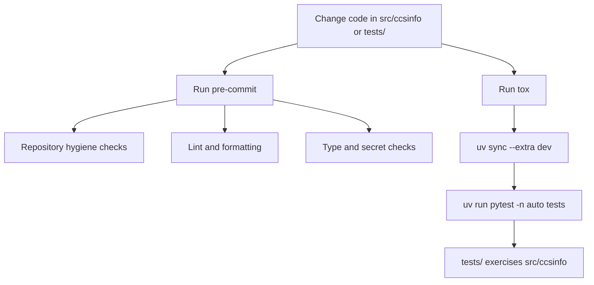

# Automation and CI

If you are changing `ccsinfo` locally, there are two checked-in automation layers to know about: `tox` for the test suite and `pre-commit` for code-quality checks. There are currently no checked-in GitHub Actions or other CI pipeline files, so the automation visible in the repository is mainly local.

> **Note:** `tox` and `pre-commit` are separate. `tox` runs tests, while `pre-commit` handles linting, formatting, type checking, and secret scanning.



## `tox`: the test runner

The checked-in `tox` configuration is short and focused:

```ini
[tox]
envlist = py312
isolated_build = true

[testenv]
allowlist_externals = uv
commands =
    uv sync --extra dev
    uv run pytest -n auto {posargs:tests}
```

This setup tells you a few important things right away:

- only one tox environment is declared: `py312`
- `tox` delegates dependency sync and command execution to `uv`
- the default test command is `pytest -n auto`, so the suite uses parallel workers through `pytest-xdist`
- `tests` is the default target, but `tox` can pass a narrower path through `posargs`

The isolated build step matches the `hatchling` build backend declared in `pyproject.toml`, and the development dependencies come from the checked-in `dev` extra:

```toml
[project.optional-dependencies]
dev = [
  "pytest>=7.4.0",
  "pytest-cov>=4.1.0",
  "pytest-asyncio>=0.21.0",
  "pytest-xdist>=3.5.0",
  "ruff>=0.1.0",
  "mypy>=1.5.0",
  "tox>=4.0.0",
]
```

`pytest` is also configured in `pyproject.toml`:

```toml
[tool.pytest.ini_options]
testpaths = ["tests"]
asyncio_mode = "auto"
addopts = ["-v", "--tb=short", "--strict-markers"]
```

In practice, that means:

- the default suite lives under `tests/`
- test output is verbose
- tracebacks are shortened
- marker handling is strict

The current suite is organized as ordinary `pytest` modules such as `tests/test_parsers.py`, `tests/test_models.py`, `tests/test_utils_paths.py`, and `tests/test_services.py`, with shared fixtures in `tests/conftest.py`. Those tests exercise code under the `src/ccsinfo` layout.

The repository also checks in `uv.lock`, so `uv sync --extra dev` has a lockfile available when syncing the development environment.

> **Tip:** Because `tox` uses `{posargs:tests}`, you can point it at a smaller target when you only want to run one part of the suite.

## What `tox` does not currently cover

The test automation is useful, but its scope is intentionally narrow.

- There is no multi-version tox matrix beyond `py312`.
- Linting, formatting, typing, and secret scanning are not part of the default `tox` command.
- Coverage settings exist, but the default `tox` command does not turn them on.

Coverage is already configured in `pyproject.toml`:

```toml
[tool.coverage.run]
source = ["src/ccsinfo"]
branch = true

[tool.coverage.report]
exclude_lines = [
  "pragma: no cover",
  "if TYPE_CHECKING:",
  "if __name__ == .__main__.:",
  "raise NotImplementedError",
]
```

> **Note:** `pytest-cov` and coverage settings are checked in, but `tox` currently runs plain `pytest` rather than `pytest --cov ...`.

## `pre-commit`: linting, formatting, typing, and secret checks

Most of the repository’s non-test automation lives in `.pre-commit-config.yaml`.

At the top of that file, the project sets a general Python hook version and defines optional `pre-commit.ci` behavior:

```yaml
default_language_version:
  python: python3

ci:
  autofix_prs: false
  autoupdate_commit_msg: "ci: [pre-commit.ci] pre-commit autoupdate"
```

The hook set is broad. A selected excerpt shows the main categories:

```yaml
repos:
  - repo: https://github.com/pre-commit/pre-commit-hooks
    rev: v6.0.0
    hooks:
      - id: check-added-large-files
      - id: check-merge-conflict
      - id: detect-private-key
      - id: trailing-whitespace
        args: [--markdown-linebreak-ext=md]
      - id: end-of-file-fixer
      - id: check-toml

  - repo: https://github.com/PyCQA/flake8
    rev: 7.3.0
    hooks:
      - id: flake8
        args: [--config=.flake8]
        additional_dependencies:
          [git+https://github.com/RedHatQE/flake8-plugins.git, flake8-mutable]

  - repo: https://github.com/astral-sh/ruff-pre-commit
    rev: v0.14.14
    hooks:
      - id: ruff
      - id: ruff-format

  - repo: https://github.com/pre-commit/mirrors-mypy
    rev: v1.19.1
    hooks:
      - id: mypy
        exclude: (tests/)
        additional_dependencies:
          [types-requests, types-PyYAML, types-colorama, types-aiofiles]

  - repo: https://github.com/Yelp/detect-secrets
    rev: v1.5.0
    hooks:
      - id: detect-secrets

  - repo: https://github.com/gitleaks/gitleaks
    rev: v8.30.0
    hooks:
      - id: gitleaks
```

In plain language, the checked-in hooks cover four major areas:

- repository hygiene, such as merge conflicts, file endings, whitespace, and large files
- Python linting and formatting through `flake8`, `ruff`, and `ruff-format`
- static type checking through `mypy`
- secret and credential scanning through `detect-private-key`, `detect-secrets`, and `gitleaks`

Those hooks are backed by checked-in tool settings. `flake8` uses `.flake8`:

```ini
[flake8]
max-line-length = 120
extend-ignore = E203, E501, W503
```

`ruff` and `mypy` are configured in `pyproject.toml`:

```toml
[tool.ruff]
preview = true
line-length = 120
fix = true
output-format = "grouped"

[tool.ruff.lint]
select = ["E", "F", "W", "I", "B", "UP", "PLC0415", "ARG", "RUF059"]

[tool.mypy]
check_untyped_defs = true
disallow_any_generics = true
disallow_incomplete_defs = true
disallow_untyped_defs = true
no_implicit_optional = true
show_error_codes = true
warn_unused_ignores = true
strict_equality = true
extra_checks = true
warn_unused_configs = true
warn_redundant_casts = true
```

A few practical implications follow from that setup:

- the lint stack is layered rather than minimal, because both `flake8` and `ruff` run
- `mypy` is configured with a strict baseline
- the pre-commit type-check step targets application code and excludes `tests/`
- secret scanning is also layered, because multiple tools look for different kinds of leaks
- some hooks can rewrite files for you, especially formatting and whitespace-related hooks

> **Tip:** If a hook rewrites files, rerun the hooks and restage the results before committing.

One small gap is worth knowing about: the `dev` extra includes `pytest`, `ruff`, `mypy`, and `tox`, but it does **not** include `pre-commit` itself. If you want to use the checked-in hook configuration locally, you will need `pre-commit` installed separately.

## Current CI status

No checked-in CI pipeline definitions are present in the repository. There is no `.github/workflows/` directory, and there are no checked-in files such as `.gitlab-ci.yml`, `.circleci/`, `Jenkinsfile`, `azure-pipelines.yml`, or similar pipeline definitions.

That has two practical consequences:

- nothing in the repository itself shows `tox` or `pre-commit` being run automatically on push or pull request
- the visible automation story is local development automation, not repo-defined CI orchestration

> **Warning:** The `ci:` block in `.pre-commit-config.yaml` is only configuration for `pre-commit.ci` if that external service has been enabled elsewhere. By itself, it does not create a GitHub Actions workflow or any other checked-in CI pipeline.

## Practical local workflow

Given the current setup, the safest way to validate changes locally is to run both the test path and the pre-commit path:

```bash
uv sync --extra dev
tox
pre-commit run --all-files
```

If you want checks to run automatically at commit time, install `pre-commit` separately and enable its git hook in your local clone.

Until a checked-in CI pipeline is added, passing these local checks is the best representation of the automation the repository currently defines.


## Related Pages

- [Testing and Quality Checks](testing-and-quality.html)
- [Development Setup](development-setup.html)
- [Architecture and Project Structure](architecture-and-project-structure.html)
- [Installation](installation.html)