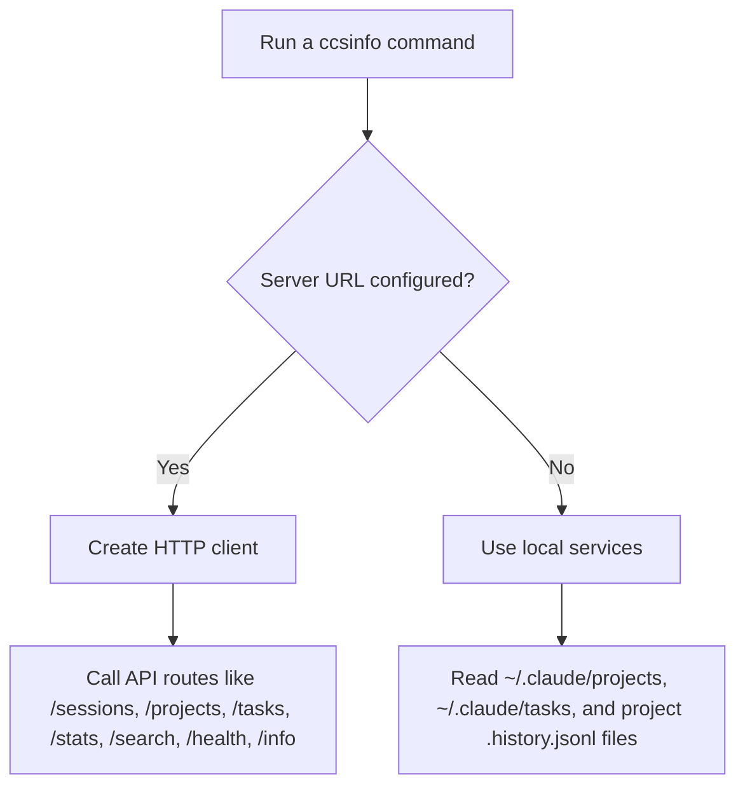

# Configuration

`ccsinfo` has two runtime modes:

- Local mode: the CLI reads Claude Code data from files on the current machine.
- Remote mode: the CLI sends requests to a running `ccsinfo` API server.

You switch between those modes with `CCSINFO_SERVER_URL` or `--server-url`. If you run the built-in API server with `ccsinfo serve`, you can also choose the bind `--host` and `--port`.



## Quick Reference

| Setting | Scope | Default | What it controls |
| --- | --- | --- | --- |
| `CCSINFO_SERVER_URL` | Environment variable | Unset | Makes CLI commands use a remote `ccsinfo` server |
| `--server-url`, `-s` | Global CLI option | Unset | One-run way to point the CLI at a remote server |
| `serve --host`, `-h` | `serve` command option | `127.0.0.1` | Which network interface the API server binds to |
| `serve --port`, `-p` | `serve` command option | `8080` | Which port the API server listens on |

## Remote CLI Configuration

### `CCSINFO_SERVER_URL`

`CCSINFO_SERVER_URL` is the persistent way to put the CLI into remote mode. The top-level CLI definition wires the environment variable directly into the global `--server-url` option:

```python
@app.callback()
def main_callback(
    _version: bool | None = typer.Option(
        None,
        "--version",
        "-v",
        help="Show version information.",
        callback=version_callback,
        is_eager=True,
    ),
    server_url: str | None = typer.Option(
        None,
        "--server-url",
        "-s",
        envvar="CCSINFO_SERVER_URL",
        help="Remote server URL (e.g., http://localhost:8080). If not set, reads local files.",
    ),
) -> None:
    """Claude Code Session Info CLI."""
    state.server_url = server_url
```

If this value is present, `ccsinfo` uses HTTP. If it is missing, the CLI falls back to local file access.

Ordinary commands continue to work the same way. With a server URL configured, they use the API instead of local files:

```bash
ccsinfo sessions list --json
ccsinfo sessions active --json
ccsinfo projects list --json
ccsinfo stats global --json
ccsinfo search sessions "<query>" --json
```

> **Note:** Use the server root URL, such as `http://localhost:8080`, not a specific endpoint like `/sessions` or `/health`.

> **Tip:** A trailing slash is fine. The client normalizes the value with `rstrip("/")`, so both `http://localhost:8080` and `http://localhost:8080/` work.

### `--server-url`

`--server-url` is the command-line version of the same setting. Its short form is `-s`.

Use it when you want remote mode for a single invocation instead of changing your shell environment. Because it is defined in the top-level `@app.callback()`, it applies across the whole CLI, not just one subcommand.

In practical terms:

- Set `CCSINFO_SERVER_URL` when you want a default server for your shell session or environment.
- Use `--server-url` when you want to choose a server for just one run.
- Leave both unset when you want local mode.

The client code expects a base URL and then adds API paths itself, including `/sessions`, `/projects`, `/tasks`, `/stats`, `/search`, `/health`, and `/info`.

## Local Mode

If no server URL is configured, `ccsinfo` reads Claude Code data directly from your home directory. The path helpers in the project point at `~/.claude/projects` and `~/.claude/tasks`:

```python
def get_projects_dir() -> Path:
    """Get the projects directory (~/.claude/projects)."""
    return get_claude_base_dir() / "projects"

def get_tasks_dir() -> Path:
    """Get the tasks directory (~/.claude/tasks)."""
    return get_claude_base_dir() / "tasks"
```

Search history is also read locally from `.history.jsonl` files inside project directories.

This is the default behavior, so you do not need to configure anything to use `ccsinfo` against data on the same machine where Claude Code ran.

> **Note:** Local mode is what the CLI uses whenever `CCSINFO_SERVER_URL` and `--server-url` are both absent.

## Built-in Server Configuration

The built-in server is started with `ccsinfo serve`. In the code, that command passes its options straight to Uvicorn:

```python
@app.command()
def serve(
    host: str = typer.Option("127.0.0.1", "--host", "-h", help="Host to bind to (use 0.0.0.0 for network access)"),
    port: int = typer.Option(8080, "--port", "-p", help="Port to bind"),
) -> None:
    """Start the API server."""
    uvicorn.run(fastapi_app, host=host, port=port)
```

### `serve --host`

`--host` controls which interface the API server listens on.

- Default: `127.0.0.1`
- Short flag: `-h`

With the default `127.0.0.1`, the server is only reachable from the same machine. That is the safest default and matches the example URL shown in the CLI help text: `http://localhost:8080`.

If you need clients on other machines to connect, use `0.0.0.0` or another reachable interface address.

> **Warning:** Binding to `0.0.0.0` exposes the API to the network. The server code in this repository does not configure authentication, TLS, or CORS middleware, so do not expose it broadly without your own network controls in front of it.

> **Tip:** On the `serve` command, `-h` means `--host`, not help. Use `--help` if you want the help screen.

### `serve --port`

`--port` controls which TCP port the API server listens on.

- Default: `8080`
- Short flag: `-p`

If you change the port, the client URL needs to change with it. For example, the default combination of `127.0.0.1` and `8080` corresponds to `http://localhost:8080`.

> **Note:** The repository code does not define separate environment variables for the built-in server's host or port. For `ccsinfo serve`, you configure both at startup with `--host` and `--port`.

## Checking That the Server Is Up

The server exposes lightweight health routes that are useful when you are confirming the right base URL:

- `GET /health` returns `{"status": "healthy"}`
- `GET /info` returns server metadata including version, total sessions, and total projects

Those routes come from the built-in FastAPI app and are part of the same server URL you use for `CCSINFO_SERVER_URL` or `--server-url`.

## Recommended Setups

For most users, one of these patterns is enough:

- Local-only workflow: leave `CCSINFO_SERVER_URL` unset and let `ccsinfo` read local files from `~/.claude`.
- Same-machine server workflow: start `ccsinfo serve` with the defaults and use `http://localhost:8080` as the server URL.
- Shared-server workflow: start `ccsinfo serve` with a network-reachable host and chosen port, then point each client at that host and port with `CCSINFO_SERVER_URL` or `--server-url`.

If you remember just one rule, make it this: use `CCSINFO_SERVER_URL` or `--server-url` for the CLI, and use `serve --host` and `serve --port` for the server process itself.


## Related Pages

- [Quickstart: Local CLI Mode](local-cli-quickstart.html)
- [Quickstart: Remote Server Mode](remote-server-quickstart.html)
- [Running the Server](server-operations.html)
- [JSON Output and Automation](json-output-and-automation.html)
- [Troubleshooting](troubleshooting.html)