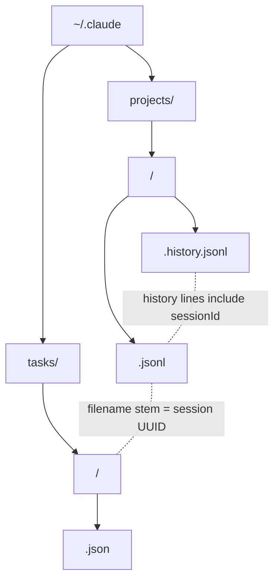

# Data Model and Storage

`ccsinfo` does not maintain its own database. It reads Claude Code’s files directly from `~/.claude`, so the storage model is really the Claude Code filesystem layout.

At a high level, there are two roots:

| Location | What it stores | Format | Key |
| --- | --- | --- | --- |
| `~/.claude/projects/<encoded-project-path>/` | One project’s stored Claude data | Directory | Encoded project path |
| `~/.claude/projects/<encoded-project-path>/<session-uuid>.jsonl` | Full session transcript | JSONL | Session UUID from filename |
| `~/.claude/projects/<encoded-project-path>/.history.jsonl` | Prompt history for the project | JSONL | `sessionId` inside each line |
| `~/.claude/tasks/<session-uuid>/` | One session’s task directory | Directory | Session UUID |
| `~/.claude/tasks/<session-uuid>/*.json` | Individual task records | JSON | Task `id` within that session |

The most important relationship is this: project data is organized by **project path**, while task data is organized by **session UUID**. The session UUID is the join key that ties transcripts, prompt history, and tasks together.

## On-Disk Layout

The test suite builds a representative `.claude` tree like this:

```89:110:tests/conftest.py
claude_dir = tmp_path / ".claude"

# Create projects directory with a sample project
projects_dir = claude_dir / "projects"
project_dir = projects_dir / "-home-user-test-project"
project_dir.mkdir(parents=True)

# Create a session file in the project
session_file = project_dir / "abc-123-def-456.jsonl"
with session_file.open("w") as f:
    for entry in sample_session_data:
        f.write(json.dumps(entry) + "\n")

# Create tasks directory with a session's tasks
tasks_dir = claude_dir / "tasks"
session_tasks_dir = tasks_dir / "abc-123-def-456"
session_tasks_dir.mkdir(parents=True)

# Create a task file
task_file = session_tasks_dir / "1.json"
with task_file.open("w") as f:
    json.dump(sample_task_data, f)
```



> **Tip:** If you are tracing data by hand, start with the session UUID. It is the cleanest link between the transcript file, prompt history entries, and the task directory.

## Encoded Project Path Names

Directories under `~/.claude/projects` are **not** stored with the literal filesystem path. Instead, Claude Code uses a simple dash-based encoding, and `ccsinfo` mirrors that logic directly:

```23:44:src/ccsinfo/utils/paths.py
def encode_project_path(project_path: str) -> str:
    """Encode a project path to Claude Code's directory name format.

    Claude Code replaces:
    - '/' with '-'
    - '.' with '-'

    Example: '/home/user/project' -> '-home-user-project'
    """
    return project_path.replace("/", "-").replace(".", "-")


def decode_project_path(encoded_path: str) -> str:
    """Decode a Claude Code directory name back to the original path.

    Note: This is lossy - we cannot distinguish between original '-' and encoded '/' or '.'.
    The path returned should be treated as approximate.
    """
    # Handle the pattern where /. becomes --
    result = encoded_path.replace("--", "/.")
    result = result.replace("-", "/")
    return result
```

In practice, that means:

- `/home/user/project` becomes `-home-user-project`
- `/home/user/.config/project` becomes `-home-user--config-project`
- The directory name under `~/.claude/projects` is also the `project_id` used by the API layer

> **Warning:** Decoding is best-effort, not perfectly reversible. Because `/`, `.` and original `-` characters all collapse into dashes during encoding, a decoded path should be treated as approximate human context, not as a guaranteed round-trip identifier.

> **Tip:** If you are calling the API, use the encoded directory name as `project_id`, not the decoded filesystem path.

## Session JSONL Files

A session transcript lives at:

`~/.claude/projects/<encoded-project-path>/<session-uuid>.jsonl`

The filename stem becomes the session ID. For example, `abc-123-def-456.jsonl` maps to session `abc-123-def-456`.

When `ccsinfo` enumerates session transcripts, it deliberately ignores dot-prefixed JSONL files so that `.history.jsonl` is handled separately:

```359:362:src/ccsinfo/core/parsers/sessions.py
for session_file in sorted(project_path.glob("*.jsonl")):
    # Skip history files
    if session_file.name.startswith("."):
        continue
```

The test fixtures use session entries like these before writing them one-per-line to JSONL:

```28:47:tests/conftest.py
{
    "type": "user",
    "uuid": "msg-001",
    "message": {
        "role": "user",
        "content": [{"type": "text", "text": "Hello"}],
    },
    "timestamp": "2024-01-15T10:00:00Z",
},
{
    "type": "assistant",
    "uuid": "msg-002",
    "parentMessageUuid": "msg-001",
    "message": {
        "role": "assistant",
        "content": [{"type": "text", "text": "Hi there!"}],
    },
    "timestamp": "2024-01-15T10:00:01Z",
},
```

What to expect in session files:

- Each line is a standalone JSON object.
- `type` distinguishes the kind of entry you are looking at. `user` and `assistant` are the main conversational records.
- `message` holds the actual conversational payload.
- `timestamp`, `cwd`, `version`, `gitBranch`, `permissionMode`, `slug`, and related fields can appear as metadata on entries.
- Assistant entries can include tool usage inside `message.content`, not in separate files.
- The parser also recognizes snapshot-style data, with fields such as `messageId`, `snapshot`, and `isSnapshotUpdate`.

This means a session file is more than a plain chat log. It is the main per-session event stream.

> **Note:** Session transcripts use JSONL rather than a single large JSON object. That makes them append-friendly and easy to process one line at a time.

> **Note:** `ccsinfo` reads JSONL defensively. Blank lines are ignored, and malformed lines are skipped by default instead of aborting the entire file.

## Prompt History Files

Prompt history lives beside session transcripts as a hidden file named `.history.jsonl` inside the project directory.

`ccsinfo` models each history line with a very small schema:

```24:33:src/ccsinfo/core/parsers/history.py
class HistoryEntry(BaseModel):
    """A single entry in a prompt history file."""

    prompt: str | None = None
    timestamp: str | None = None
    session_id: str | None = Field(default=None, alias="sessionId")
    cwd: str | None = None
    version: str | None = None

    model_config = {"populate_by_name": True, "extra": "allow"}
```

A prompt history file is useful when you want a lightweight record of what was asked without opening the full session transcript.

A few important details:

- Prompt history is **project-scoped**, not global.
- The file is named exactly `.history.jsonl`.
- Each entry includes the `sessionId`, which lets `ccsinfo` map a prompt back to the session that produced it.
- The history model stores prompt text and basic context, but not the full assistant response stream.

That separation is why `ccsinfo` can offer prompt-history search independently from full session search.

> **Note:** If a project has no `.history.jsonl`, `ccsinfo` treats that as “no prompt history” for that project rather than as an error.

## Task Files Under `~/.claude/tasks`

Tasks are stored separately from the project directories. Instead of grouping by project path, Claude Code groups tasks by **session UUID**:

`~/.claude/tasks/<session-uuid>/*.json`

A task file in the tests looks like this:

```54:62:tests/conftest.py
return {
    "id": "1",
    "subject": "Test task",
    "description": "A test task",
    "status": "pending",
    "owner": None,
    "blockedBy": [],
    "blocks": [],
}
```

From the parser, the task model also supports optional fields such as `activeForm` and `metadata`, alongside the core dependency fields:

- `id`
- `subject`
- `description`
- `status`
- `blockedBy`
- `blocks`
- `owner`
- `activeForm`
- `metadata`

A few behaviors matter here:

- Task files are regular JSON, not JSONL.
- Task IDs are only unique **within a session**, not globally.
- Tasks are read from `~/.claude/tasks/<session-uuid>/` and then sorted by `id`, using numeric order when possible.
- Dependency information is explicit through `blockedBy` and `blocks`.

The API makes the session-scoped nature of task IDs explicit:

```35:44:src/ccsinfo/server/routers/tasks.py
@router.get("/{task_id}", response_model=Task)
async def get_task(
    task_id: str,
    session_id: str = Query(..., description="Session ID (required since task IDs are only unique within a session)"),
) -> Task:
    """Get task details."""
    task = task_service.get_task(task_id, session_id=session_id)
    if not task:
        raise HTTPException(status_code=404, detail="Task not found")
```

> **Tip:** If you only know a project and need to find its tasks, first identify the session UUID from the project’s session JSONL or `.history.jsonl`. Tasks do not live under the project directory.

## How the Pieces Fit Together

The storage model is easiest to remember as three layers:

- **Project layer:** `~/.claude/projects/<encoded-project-path>/`
- **Session layer:** `<session-uuid>.jsonl` inside a project directory
- **Task layer:** `~/.claude/tasks/<session-uuid>/`

That gives you a simple mental model:

- Open the session JSONL file when you need the full event stream for a conversation.
- Open `.history.jsonl` when you only need prompt history for a project.
- Open `~/.claude/tasks/<session-uuid>/` when you need task state for a specific session.
- Use the session UUID as the stable link across all three.

If you keep that one rule in mind, the rest of the storage layout is straightforward.


## Related Pages

- [Architecture and Project Structure](architecture-and-project-structure.html)
- [Project IDs and Lookups](project-ids-and-lookups.html)
- [Working with Sessions](sessions-guide.html)
- [Working with Tasks](tasks-guide.html)
- [Searching Sessions, Messages, and History](search-guide.html)