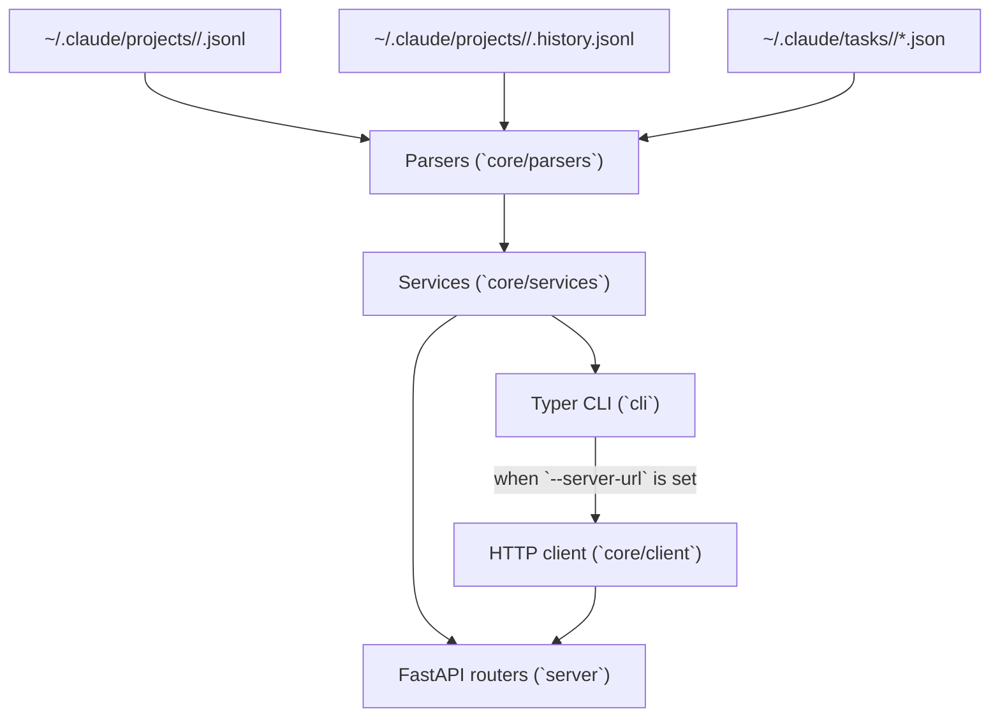

# Development Setup

`ccsinfo` is a single Python project with a `src/` layout. The same package powers both the Typer CLI and the optional FastAPI server, and both are designed to work directly with Claude Code data on disk. You do not need a database, a frontend toolchain, or containers to start developing locally.

## Before You Install

- Python `3.12` or newer
- `uv` for dependency management and command execution
- Optional Claude Code data under `~/.claude` if you want to test against real sessions instead of fixtures

> **Tip:** Use Python `3.12` if you want your local environment to match the repository's default `tox` setup exactly. The package allows `>=3.12`, but `tox` only defines `py312`.

```31:75:pyproject.toml
[project]
name = "ccsinfo"
version = "0.1.2"
description = "Claude Code Session Info CLI and Server"
readme = "README.md"
license = "MIT"
requires-python = ">=3.12"
authors = [{ name = "Meni Yakove", email = "myakove@gmail.com" }]
keywords = ["claude", "claude-code", "cli", "sessions", "api"]
classifiers = [
  "Development Status :: 3 - Alpha",
  "Environment :: Console",
  "Intended Audience :: Developers",
  "License :: OSI Approved :: MIT License",
  "Operating System :: OS Independent",
  "Programming Language :: Python :: 3",
  "Programming Language :: Python :: 3.12",
  "Programming Language :: Python :: 3.13",
  "Topic :: Software Development :: Libraries :: Python Modules",
  "Typing :: Typed",
]
dependencies = [
  "typer>=0.9.0",
  "rich>=13.0.0",
  "orjson>=3.9.0",
  "pydantic>=2.0.0",
  "pendulum>=3.0.0",
  "fastapi>=0.109.0",
  "uvicorn[standard]>=0.27.0",
  "httpx>=0.27.0",
]

[project.optional-dependencies]
dev = [
  "pytest>=7.4.0",
  "pytest-cov>=4.1.0",
  "pytest-asyncio>=0.21.0",
  "pytest-xdist>=3.5.0",
  "ruff>=0.1.0",
  "mypy>=1.5.0",
  "tox>=4.0.0",
]

[project.scripts]
ccsinfo = "ccsinfo.cli.main:main"
```

```1:10:tox.ini
[tox]
envlist = py312
isolated_build = true

[testenv]
allowlist_externals = uv
commands =
    uv sync --extra dev
    uv run pytest -n auto {posargs:tests}
```

## `uv` And Editable Installs

`uv` is the repository's default workflow. Start with a full development sync:

```bash
uv sync --extra dev
uv run ccsinfo --version
```

That sync is already editable. The lockfile records the local package as `source = { editable = "." }`, so changes under `src/ccsinfo` are picked up immediately without a separate reinstall step.

```46:69:uv.lock
[[package]]
name = "ccsinfo"
version = "0.1.2"
source = { editable = "." }
dependencies = [
    { name = "fastapi" },
    { name = "httpx" },
    { name = "orjson" },
    { name = "pendulum" },
    { name = "pydantic" },
    { name = "rich" },
    { name = "typer" },
    { name = "uvicorn", extra = ["standard"] },
]

[package.optional-dependencies]
dev = [
    { name = "mypy" },
    { name = "pytest" },
    { name = "pytest-asyncio" },
    { name = "pytest-cov" },
    { name = "pytest-xdist" },
    { name = "ruff" },
    { name = "tox" },
]
```

## Source Layout

This is a conventional `src/` layout project. The importable package lives in `src/ccsinfo`.

- `src/ccsinfo/cli`: the Typer application, subcommands, and CLI state
- `src/ccsinfo/core/parsers`: low-level readers for Claude Code JSON and JSONL files
- `src/ccsinfo/core/services`: shared business logic used by both CLI and API
- `src/ccsinfo/core/models`: Pydantic models returned by services and the API
- `src/ccsinfo/server`: the FastAPI application and route handlers
- `src/ccsinfo/utils`: path discovery and terminal formatting helpers
- `tests`: unit and integration-style tests, including temporary `.claude` fixture builders

> **Note:** The top-level `ccsinfo/` directory in the repository is not the runtime package. The Python code you import and edit lives under `src/ccsinfo`.

The CLI and server mirror the same main domains:

```13:33:src/ccsinfo/cli/main.py
app = typer.Typer(
    name="ccsinfo",
    help="Claude Code Session Info CLI",
    no_args_is_help=True,
)

# Add command groups
app.add_typer(sessions.app, name="sessions", help="Session management")
app.add_typer(projects.app, name="projects", help="Project management")
app.add_typer(tasks.app, name="tasks", help="Task management")
app.add_typer(stats.app, name="stats", help="Statistics")
app.add_typer(search.app, name="search", help="Search")


@app.command()
def serve(
    host: str = typer.Option("127.0.0.1", "--host", "-h", help="Host to bind to (use 0.0.0.0 for network access)"),
    port: int = typer.Option(8080, "--port", "-p", help="Port to bind"),
) -> None:
    """Start the API server."""
    uvicorn.run(fastapi_app, host=host, port=port)
```

```8:20:src/ccsinfo/server/app.py
app = FastAPI(
    title="ccsinfo",
    description="Claude Code Session Info API",
    version=__version__,
)

# Include routers
app.include_router(sessions.router, prefix="/sessions", tags=["sessions"])
app.include_router(projects.router, prefix="/projects", tags=["projects"])
app.include_router(tasks.router, prefix="/tasks", tags=["tasks"])
app.include_router(stats.router, prefix="/stats", tags=["stats"])
app.include_router(search.router, prefix="/search", tags=["search"])
app.include_router(health.router, tags=["health"])
```



## Local Claude Code Data

By default, `ccsinfo` is local-first. It looks for Claude Code data in your home directory, not inside the repository.

```8:50:src/ccsinfo/utils/paths.py
def get_claude_base_dir() -> Path:
    """Get the base Claude Code directory (~/.claude)."""
    return Path.home() / ".claude"


def get_projects_dir() -> Path:
    """Get the projects directory (~/.claude/projects)."""
    return get_claude_base_dir() / "projects"


def get_tasks_dir() -> Path:
    """Get the tasks directory (~/.claude/tasks)."""
    return get_claude_base_dir() / "tasks"


def encode_project_path(project_path: str) -> str:
    """Encode a project path to Claude Code's directory name format.

    Claude Code replaces:
    - '/' with '-'
    - '.' with '-'

    Example: '/home/user/project' -> '-home-user-project'
    """
    return project_path.replace("/", "-").replace(".", "-")


def decode_project_path(encoded_path: str) -> str:
    """Decode a Claude Code directory name back to the original path.
    ...
    """
    result = encoded_path.replace("--", "/.")
    result = result.replace("-", "/")
    return result


def get_project_dir(project_path: str) -> Path:
    """Get the Claude data directory for a project path."""
    encoded = encode_project_path(project_path)
    return get_projects_dir() / encoded
```

That detail matters when you inspect test data or API output: a "project ID" in this repository is usually the encoded directory name from `~/.claude/projects`, not a generated database key.

> **Note:** If your machine does not have any Claude Code data yet, local list commands will simply return empty results. The application does not seed demo data for you.

The tests intentionally model the same directory layout with temporary fixtures instead of touching your real home directory:

```84:112:tests/conftest.py
@pytest.fixture
def mock_claude_dir(
    tmp_path: Path, sample_session_data: list[dict[str, Any]], sample_task_data: dict[str, Any]
) -> Path:
    """Create a fully populated mock .claude directory."""
    claude_dir = tmp_path / ".claude"

    # Create projects directory with a sample project
    projects_dir = claude_dir / "projects"
    project_dir = projects_dir / "-home-user-test-project"
    project_dir.mkdir(parents=True)

    # Create a session file in the project
    session_file = project_dir / "abc-123-def-456.jsonl"
    ...
    # Create tasks directory with a session's tasks
    tasks_dir = claude_dir / "tasks"
    session_tasks_dir = tasks_dir / "abc-123-def-456"
    session_tasks_dir.mkdir(parents=True)
    ...
    return claude_dir
```

> **Tip:** When you add parser or service tests, follow this fixture pattern. It is easier to reason about than mocking every file read, and it matches the real runtime layout.

## CLI And Server Workflows

One codebase supports two development modes:

- Local mode: CLI commands read directly from `~/.claude`
- Remote mode: the same CLI commands call the HTTP API when `--server-url` or `CCSINFO_SERVER_URL` is set

```27:63:src/ccsinfo/cli/main.py
@app.command()
def serve(
    host: str = typer.Option("127.0.0.1", "--host", "-h", help="Host to bind to (use 0.0.0.0 for network access)"),
    port: int = typer.Option(8080, "--port", "-p", help="Port to bind"),
) -> None:
    """Start the API server."""
    uvicorn.run(fastapi_app, host=host, port=port)
...
@app.callback()
def main_callback(
    _version: bool | None = typer.Option(
        None,
        "--version",
        "-v",
        help="Show version information.",
        callback=version_callback,
        is_eager=True,
    ),
    server_url: str | None = typer.Option(
        None,
        "--server-url",
        "-s",
        envvar="CCSINFO_SERVER_URL",
        help="Remote server URL (e.g., http://localhost:8080). If not set, reads local files.",
    ),
) -> None:
    """Claude Code Session Info CLI."""
    state.server_url = server_url
```

The command handlers really do switch between the local service layer and the HTTP client:

```39:73:src/ccsinfo/cli/commands/sessions.py
client = get_client(state.server_url)

if client:
    # Remote mode - use HTTP client
    sessions_data = client.list_sessions(project_id=project, active_only=active, limit=limit)
    ...
else:
    # Local mode - use services
    session_service = _get_session_service()
    sessions = session_service.list_sessions(project_id=project, active_only=active, limit=limit)
```

Typical local development commands look like this:

```bash
uv run ccsinfo sessions list
uv run ccsinfo serve --host 127.0.0.1 --port 8080
uv run ccsinfo --server-url http://127.0.0.1:8080 sessions list
```

If you are working on the API layer, the FastAPI app exposes `sessions`, `projects`, `tasks`, `stats`, `search`, `health`, and `info` endpoints from the same shared service layer.

## Tests, Typing, And Automation

The repository's main automation is local. There is no checked-in `.github/workflows/` directory and no Dockerfile, so `tox`, `pytest`, and pre-commit are the practical source of truth for development checks.

`tox` is intentionally thin: it uses `uv` to sync the dev environment and then runs `pytest` with `xdist` (`-n auto`). The rest of the quality policy lives in `pyproject.toml` and `.pre-commit-config.yaml`.

```1:25:pyproject.toml
[tool.ruff]
preview = true
line-length = 120
fix = true
output-format = "grouped"

[tool.ruff.lint]
select = ["E", "F", "W", "I", "B", "UP", "PLC0415", "ARG", "RUF059"]

[tool.ruff.format]
exclude = [".git", ".venv", ".mypy_cache", ".tox", "__pycache__"]

[tool.mypy]
check_untyped_defs = true
disallow_any_generics = true
disallow_incomplete_defs = true
disallow_untyped_defs = true
no_implicit_optional = true
show_error_codes = true
warn_unused_ignores = true
strict_equality = true
extra_checks = true
warn_unused_configs = true
warn_redundant_casts = true
```

```29:60:.pre-commit-config.yaml
- repo: https://github.com/PyCQA/flake8
  rev: 7.3.0
  hooks:
    - id: flake8
      args: [--config=.flake8]
      additional_dependencies:
        [git+https://github.com/RedHatQE/flake8-plugins.git, flake8-mutable]

- repo: https://github.com/Yelp/detect-secrets
  rev: v1.5.0
  hooks:
    - id: detect-secrets

- repo: https://github.com/astral-sh/ruff-pre-commit
  rev: v0.14.14
  hooks:
    - id: ruff
    - id: ruff-format

- repo: https://github.com/gitleaks/gitleaks
  rev: v8.30.0
  hooks:
    - id: gitleaks

- repo: https://github.com/pre-commit/mirrors-mypy
  rev: v1.19.1
  hooks:
    - id: mypy
      exclude: (tests/)
```

A practical loop is:

```bash
uv sync --extra dev
tox
```

> **Warning:** `.pre-commit-config.yaml` is present, but `pre-commit` itself is not part of the `dev` extra shown in `pyproject.toml`. Install the `pre-commit` tool separately if you want hooks on your machine.

## Environment Notes

Most of the codebase is plain Python and file I/O, but active-session detection is more environment-specific. If you work on the "is this Claude session running right now?" behavior, the implementation shells out to `pgrep` and inspects Linux-style `/proc` paths.

```254:295:src/ccsinfo/core/parsers/sessions.py
result = subprocess.run(
    ["pgrep", "-f", "claude"],
    capture_output=True,
    text=True,
    timeout=5,
)
...
cmdline_path = Path(f"/proc/{pid}/cmdline")
...
environ_path = Path(f"/proc/{pid}/environ")
...
fd_dir = Path(f"/proc/{pid}/fd")
...
if ".claude/tasks/" in target_str or ".claude/projects/" in target_str:
    active_ids.update(uuid_pattern.findall(target_str))
```

> **Warning:** That part of the code is easiest to develop and debug on Linux. If you are working on parsers, services, models, or docs, you can ignore this and stick to fixture-based tests.

This setup is intentionally lightweight: install with `uv`, work inside `src/ccsinfo`, use temporary `.claude` fixtures for repeatable tests, and only bring up the FastAPI server when you want to exercise the HTTP path.


## Related Pages

- [Architecture and Project Structure](architecture-and-project-structure.html)
- [Data Model and Storage](data-model-and-storage.html)
- [Testing and Quality Checks](testing-and-quality.html)
- [Automation and CI](automation-and-ci.html)
- [Installation](installation.html)