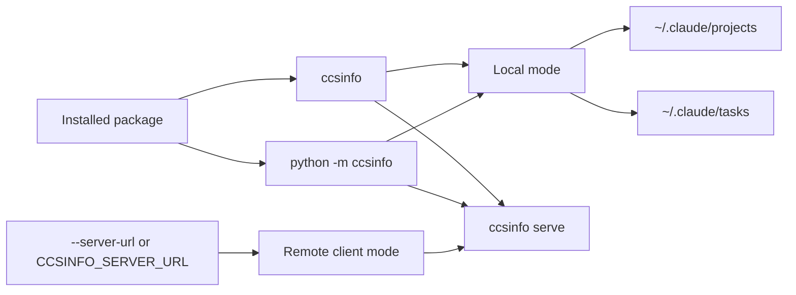

# Installation

`ccsinfo` is a standard Python package that installs a command-line tool named `ccsinfo`. A normal install also gives you the built-in FastAPI server behind `ccsinfo serve`, so there is no separate server package or extra to install.

## Requirements

You need Python 3.12 or newer. The package metadata explicitly requires `>=3.12`, and it advertises Python 3.12 and 3.13 support.

```31:51:pyproject.toml
[project]
name = "ccsinfo"
version = "0.1.2"
description = "Claude Code Session Info CLI and Server"
readme = "README.md"
license = "MIT"
requires-python = ">=3.12"
authors = [{ name = "Meni Yakove", email = "myakove@gmail.com" }]
keywords = ["claude", "claude-code", "cli", "sessions", "api"]
classifiers = [
  "Development Status :: 3 - Alpha",
  "Environment :: Console",
  "Intended Audience :: Developers",
  "License :: OSI Approved :: MIT License",
  "Operating System :: OS Independent",
  "Programming Language :: Python :: 3",
  "Programming Language :: Python :: 3.12",
  "Programming Language :: Python :: 3.13",
  "Topic :: Software Development :: Libraries :: Python Modules",
  "Typing :: Typed",
]
```

When you use `ccsinfo` in local mode, it looks for Claude Code data in `~/.claude`, specifically `~/.claude/projects` and `~/.claude/tasks`.

```8:20:src/ccsinfo/utils/paths.py
def get_claude_base_dir() -> Path:
    """Get the base Claude Code directory (~/.claude)."""
    return Path.home() / ".claude"

def get_projects_dir() -> Path:
    """Get the projects directory (~/.claude/projects)."""
    return get_claude_base_dir() / "projects"

def get_tasks_dir() -> Path:
    """Get the tasks directory (~/.claude/tasks)."""
    return get_claude_base_dir() / "tasks"
```

> **Note:** `~/.claude/projects` and `~/.claude/tasks` are only needed for local mode. If those directories do not exist yet, `ccsinfo` can still install and start, but local-mode commands will not have Claude Code data to show.

## Install the package

From the repository root, install `ccsinfo` into a virtual environment. The example below uses a Python 3.12 interpreter explicitly, but any Python 3.12+ interpreter is fine.

```bash
python3.12 -m venv .venv
source .venv/bin/activate
python -m pip install --upgrade pip
python -m pip install .
```

The base install already includes both the CLI and server dependencies, and it registers the `ccsinfo` console script:

```52:75:pyproject.toml
dependencies = [
  "typer>=0.9.0",
  "rich>=13.0.0",
  "orjson>=3.9.0",
  "pydantic>=2.0.0",
  "pendulum>=3.0.0",
  "fastapi>=0.109.0",
  "uvicorn[standard]>=0.27.0",
  "httpx>=0.27.0",
]

[project.optional-dependencies]
dev = [
  "pytest>=7.4.0",
  "pytest-cov>=4.1.0",
  "pytest-asyncio>=0.21.0",
  "pytest-xdist>=3.5.0",
  "ruff>=0.1.0",
  "mypy>=1.5.0",
  "tox>=4.0.0",
]

[project.scripts]
ccsinfo = "ccsinfo.cli.main:main"
```

> **Tip:** If you already have an active virtual environment, the only required install step is `python -m pip install .`.

## Entry points

After installation, you can start the tool in either of these ways:

- `ccsinfo`
- `python -m ccsinfo`

The top-level CLI exposes these main command groups:

- `sessions`
- `projects`
- `tasks`
- `stats`
- `search`
- `serve`

The entrypoint wiring is defined directly in the code:

```13:33:src/ccsinfo/cli/main.py
app = typer.Typer(
    name="ccsinfo",
    help="Claude Code Session Info CLI",
    no_args_is_help=True,
)

# Add command groups
app.add_typer(sessions.app, name="sessions", help="Session management")
app.add_typer(projects.app, name="projects", help="Project management")
app.add_typer(tasks.app, name="tasks", help="Task management")
app.add_typer(stats.app, name="stats", help="Statistics")
app.add_typer(search.app, name="search", help="Search")


@app.command()
def serve(
    host: str = typer.Option("127.0.0.1", "--host", "-h", help="Host to bind to (use 0.0.0.0 for network access)"),
    port: int = typer.Option(8080, "--port", "-p", help="Port to bind"),
) -> None:
    """Start the API server."""
    uvicorn.run(fastapi_app, host=host, port=port)
```

```43:67:src/ccsinfo/cli/main.py
@app.callback()
def main_callback(
    _version: bool | None = typer.Option(
        None,
        "--version",
        "-v",
        help="Show version information.",
        callback=version_callback,
        is_eager=True,
    ),
    server_url: str | None = typer.Option(
        None,
        "--server-url",
        "-s",
        envvar="CCSINFO_SERVER_URL",
        help="Remote server URL (e.g., http://localhost:8080). If not set, reads local files.",
    ),
) -> None:
    """Claude Code Session Info CLI."""
    state.server_url = server_url


def main() -> None:
    """Entry point for the CLI."""
    app()
```

```1:5:src/ccsinfo/__main__.py
"""Entry point for running ccsinfo as a module."""

from ccsinfo.cli.main import main

main()
```

A quick smoke test after installation:

```bash
ccsinfo --version
ccsinfo --help
python -m ccsinfo --version
```

> **Tip:** Running `ccsinfo` with no arguments shows help, because the CLI is configured with `no_args_is_help=True`.

## Local mode and server mode

`ccsinfo` supports two practical ways of working:

- Local mode: the CLI reads Claude Code data directly from `~/.claude`.
- Server mode: `ccsinfo serve` starts an API server, and the CLI talks to it over HTTP when `--server-url` or `CCSINFO_SERVER_URL` is set.



Common first commands after installation:

```bash
# Read local Claude Code data
ccsinfo sessions list
ccsinfo projects list
ccsinfo stats global

# Start the built-in API server
ccsinfo serve --host 127.0.0.1 --port 8080

# Use the server for a single command
ccsinfo --server-url http://127.0.0.1:8080 sessions list

# Make remote mode the default in your current shell
export CCSINFO_SERVER_URL=http://127.0.0.1:8080
ccsinfo tasks list
```

> **Note:** If `--server-url` is not set, the CLI reads local files. If you set `CCSINFO_SERVER_URL`, remote mode becomes the default for that shell session.

> **Warning:** `ccsinfo serve` binds to `127.0.0.1` by default. Use `--host 0.0.0.0` only when you intentionally want the service reachable from outside the local machine.

## Optional developer dependencies

If you are contributing, running tests, or editing the package locally, install the `dev` extra in editable mode:

```bash
python -m pip install -e ".[dev]"
```

Editable mode is convenient during development because the installed `ccsinfo` command points at your working tree, so local code changes are picked up immediately.

The `dev` extra includes:

- `pytest`
- `pytest-cov`
- `pytest-asyncio`
- `pytest-xdist`
- `ruff`
- `mypy`
- `tox`

If you prefer the repository's `uv`-based workflow, the `tox` configuration shows the expected pattern:

```bash
uv sync --extra dev
uv run pytest -n auto
```

```1:9:tox.ini
[tox]
envlist = py312
isolated_build = true

[testenv]
allowlist_externals = uv
commands =
    uv sync --extra dev
    uv run pytest -n auto {posargs:tests}
```

> **Note:** The package itself supports Python 3.12+, while the repository's current `tox` configuration defines a `py312` test environment.


## Related Pages

- [Overview](overview.html)
- [Quickstart: Local CLI Mode](local-cli-quickstart.html)
- [Quickstart: Remote Server Mode](remote-server-quickstart.html)
- [Configuration](configuration.html)
- [Development Setup](development-setup.html)