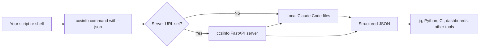

# JSON Output and Automation

`ccsinfo` has two output styles: human-friendly terminal views and machine-friendly JSON. For scripts, CI jobs, dashboards, or other tooling, add `--json` (or `-j`) so you can consume structured data instead of parsing Rich tables and panels.

## JSON-First Workflow

The same CLI commands work in both local and remote modes. By default, `ccsinfo` reads Claude Code data from the local machine. If you set `CCSINFO_SERVER_URL` or pass `--server-url`, it switches to HTTP and reads from a `ccsinfo` server instead. You can start that server with `ccsinfo serve`.

```27:59:src/ccsinfo/cli/main.py
@app.command()
def serve(
    host: str = typer.Option("127.0.0.1", "--host", "-h", help="Host to bind to (use 0.0.0.0 for network access)"),
    port: int = typer.Option(8080, "--port", "-p", help="Port to bind"),
) -> None:
    """Start the API server."""
    uvicorn.run(fastapi_app, host=host, port=port)

# ... other callback options omitted ...

server_url: str | None = typer.Option(
    None,
    "--server-url",
    "-s",
    envvar="CCSINFO_SERVER_URL",
    help="Remote server URL (e.g., http://localhost:8080). If not set, reads local files.",
)
```



```bash
ccsinfo serve --host 127.0.0.1 --port 8080

export CCSINFO_SERVER_URL=http://127.0.0.1:8080
ccsinfo sessions list --json
ccsinfo stats global --json
```

> **Note:** Most list and search commands default to `50` results. `stats daily` defaults to `30` days. If you call the HTTP API directly, `limit` is capped at `500` and `days` at `365`.

## Local Data Sources

In local mode, `ccsinfo` reads from the Claude Code data directory under your home folder.

```8:20:src/ccsinfo/utils/paths.py
def get_claude_base_dir() -> Path:
    """Get the base Claude Code directory (~/.claude)."""
    return Path.home() / ".claude"

def get_projects_dir() -> Path:
    """Get the projects directory (~/.claude/projects)."""
    return get_claude_base_dir() / "projects"

def get_tasks_dir() -> Path:
    """Get the tasks directory (~/.claude/tasks)."""
    return get_claude_base_dir() / "tasks"
```

That resolves to a layout like this:

```text
~/.claude/
  projects/
    <encoded-project-id>/
      <session-id>.jsonl
      .history.jsonl
  tasks/
    <session-id>/
      <task-id>.json
```

- Session transcripts come from `~/.claude/projects/<encoded-project-id>/*.jsonl`
- Prompt history comes from `~/.claude/projects/<encoded-project-id>/.history.jsonl`
- Tasks come from `~/.claude/tasks/<session-id>/*.json`

> **Tip:** Use the `id` values returned by `projects list --json` instead of trying to build project IDs yourself. Claude's project path encoding is lossy, so the returned ID is the safest thing to feed back into later commands.

## Commands That Support `--json`

All of the major command families expose JSON output.

| Area | JSON-enabled commands | Useful flags | Typical data |
| --- | --- | --- | --- |
| Sessions | `sessions list`, `sessions show`, `sessions messages`, `sessions tools`, `sessions active` | `--project`, `--active`, `--limit`, `--role` | session summaries, session details, message objects, tool-call objects |
| Projects | `projects list`, `projects show`, `projects stats` | none beyond `--json` | project objects and per-project stats |
| Tasks | `tasks list`, `tasks show`, `tasks pending` | `--session`, `--status` | task objects and filtered task lists |
| Stats | `stats global`, `stats daily`, `stats trends` | `--days` | totals, day-by-day activity, trend summaries |
| Search | `search sessions`, `search messages`, `search history` | `--limit` | matching sessions, message snippets, prompt history hits |

Representative commands:

```bash
ccsinfo sessions list --active --json
ccsinfo sessions messages <session_id> --role user --json
ccsinfo projects stats <project_id> --json
ccsinfo tasks show <task_id> --session <session_id> --json
ccsinfo stats daily --days 14 --json
ccsinfo search messages "timeout" --limit 10 --json
```

## What Each JSON Command Returns

- `sessions list`, `sessions active`, and `search sessions` return session summary objects with `id`, `project_path`, `project_name`, `created_at`, `updated_at`, `message_count`, and `is_active`.
- `sessions show` returns the same core session metadata plus `file_path`.
- `sessions messages` returns message objects with `uuid`, `parent_message_uuid`, `timestamp`, `type`, and nested `message.content` blocks.
- `sessions tools` returns normalized tool-call objects with just `id`, `name`, and `input`, which is usually easier to automate against than parsing message content yourself.
- `projects list` and `projects show` return `id`, `name`, `path`, `session_count`, and `last_activity`.
- `projects stats` returns `project_id`, `project_name`, `session_count`, `message_count`, and `last_activity`.
- `tasks list`, `tasks show`, and `tasks pending` return task objects with `id`, `subject`, `description`, `status`, `owner`, `blocked_by`, `blocks`, `active_form`, `metadata`, and `created_at`.
- `stats global` returns `total_projects`, `total_sessions`, `total_messages`, and `total_tool_calls`.
- `stats daily` returns a list of `{date, session_count, message_count}` objects.
- `stats trends` returns `sessions_last_7_days`, `sessions_last_30_days`, `messages_last_7_days`, `messages_last_30_days`, `most_active_projects`, `most_used_tools`, and `average_session_length`.
- `search messages` returns `session_id`, `project_path`, `message_uuid`, `message_type`, `timestamp`, and a matched `snippet`.
- `search history` returns `project_path`, `prompt`, `session_id`, and `timestamp`.

> **Note:** `search sessions` is broader than its name suggests. It searches session ID, slug, working directory, git branch, and project path, so it is often the fastest way to find a session before following up with `sessions show` or `sessions messages`.

> **Note:** `tasks show` requires `--session`, because task IDs are only unique within a session.

## Shell Automation

For shell pipelines, `--json` works especially well with `jq`.

```bash
# List active session IDs
ccsinfo sessions active --json | jq -r '.[].id'

# Build a compact 14-day activity report
ccsinfo stats daily --days 14 --json \
  | jq '[.[] | {date, sessions: .session_count, messages: .message_count}]'

# Fetch stats for the first project in the list
PROJECT_ID="$(ccsinfo projects list --json | jq -r '.[0].id')"
ccsinfo projects stats "$PROJECT_ID" --json \
  | jq '{project_name, session_count, message_count}'
```

If you are scripting in Python, you can call the CLI directly and decode the JSON result:

```python
import json
import subprocess

result = subprocess.run(
    ["ccsinfo", "search", "history", "automation", "--json"],
    check=True,
    capture_output=True,
    text=True,
)

entries = json.loads(result.stdout)
for entry in entries:
    print(entry["session_id"], entry["timestamp"])
```

> **Tip:** For tool usage automation, prefer `sessions tools --json` over scanning raw session JSONL files yourself. It gives you a clean list of `{id, name, input}` objects.

## Using the HTTP API Directly

If you do not want to shell out to the CLI, `ccsinfo serve` exposes a FastAPI application. The CLI's remote mode is a thin HTTP client on top of that API.

```88:106:src/ccsinfo/core/client.py
def get_global_stats(self) -> dict[str, Any]:
    return self._get_dict("/stats")

def get_daily_stats(self, days: int = 30) -> list[dict[str, Any]]:
    return self._get_list("/stats/daily", {"days": days})

def search_sessions(self, query: str, limit: int = 50) -> list[dict[str, Any]]:
    return self._get_list("/search", {"q": query, "limit": limit})

def search_messages(self, query: str, limit: int = 50) -> list[dict[str, Any]]:
    return self._get_list("/search/messages", {"q": query, "limit": limit})

def search_history(self, query: str, limit: int = 50) -> list[dict[str, Any]]:
    return self._get_list("/search/history", {"q": query, "limit": limit})
```

> **Note:** The HTTP paths are close to the CLI names, but not identical. `stats global` maps to `GET /stats`, and `search sessions` maps to `GET /search`.

Common mappings:

| CLI command | HTTP endpoint |
| --- | --- |
| `ccsinfo sessions list --json` | `GET /sessions` |
| `ccsinfo sessions active --json` | `GET /sessions/active` |
| `ccsinfo sessions show <id> --json` | `GET /sessions/{id}` |
| `ccsinfo sessions messages <id> --json` | `GET /sessions/{id}/messages` |
| `ccsinfo sessions tools <id> --json` | `GET /sessions/{id}/tools` |
| `ccsinfo projects list --json` | `GET /projects` |
| `ccsinfo projects stats <id> --json` | `GET /projects/{id}/stats` |
| `ccsinfo tasks list --json` | `GET /tasks` |
| `ccsinfo tasks show <id> --session <sid> --json` | `GET /tasks/{id}?session_id=<sid>` |
| `ccsinfo stats global --json` | `GET /stats` |
| `ccsinfo stats daily --days 30 --json` | `GET /stats/daily?days=30` |
| `ccsinfo stats trends --json` | `GET /stats/trends` |
| `ccsinfo search sessions "foo" --json` | `GET /search?q=foo` |
| `ccsinfo search messages "foo" --json` | `GET /search/messages?q=foo` |
| `ccsinfo search history "foo" --json` | `GET /search/history?q=foo` |

A few direct `curl` examples:

```bash
curl http://127.0.0.1:8080/health
curl http://127.0.0.1:8080/info
curl "http://127.0.0.1:8080/sessions?active_only=true&limit=10"
curl "http://127.0.0.1:8080/search/messages?q=timeout&limit=10"
```

The server also exposes a few JSON endpoints that are useful for dashboards or services even though they are not first-class CLI commands:

- `GET /sessions/{session_id}/tasks`
- `GET /sessions/{session_id}/progress`
- `GET /sessions/{session_id}/summary`
- `GET /projects/{project_id}/sessions`
- `GET /projects/{project_id}/sessions/active`
- `GET /health`
- `GET /info`

## Caveats for Automation

> **Warning:** `ccsinfo sessions messages --json` and `ccsinfo sessions tools --json` are not strict JSON when a session exists but has no matching data. In that case the CLI prints a human message instead of `[]`. If you need guaranteed JSON for empty results, call the HTTP API directly.

> **Tip:** Treat `show` commands as assertions in scripts. `sessions show`, `projects show`, `projects stats`, and `tasks show` exit with a non-zero status when the requested item does not exist.

> **Note:** `search messages --json` returns snippets around the match, not the full message body. If you need the complete stored message content, follow up with `sessions messages <session_id> --json`.

> **Note:** `stats daily --json` returns only dates that had activity. If you need a gap-free time series, fill missing dates in your own script.

> **Note:** In `stats trends --json`, `most_used_tools` counts whether a tool appeared in a session, not the raw number of tool invocations.

> **Note:** `is_active` is computed on the machine that reads the data. In local mode that is your machine; in server mode it is the server host.


## Related Pages

- [API Overview](api-overview.html)
- [Searching Sessions, Messages, and History](search-guide.html)
- [Using Statistics and Trends](statistics-guide.html)
- [Configuration](configuration.html)
- [Quickstart: Remote Server Mode](remote-server-quickstart.html)