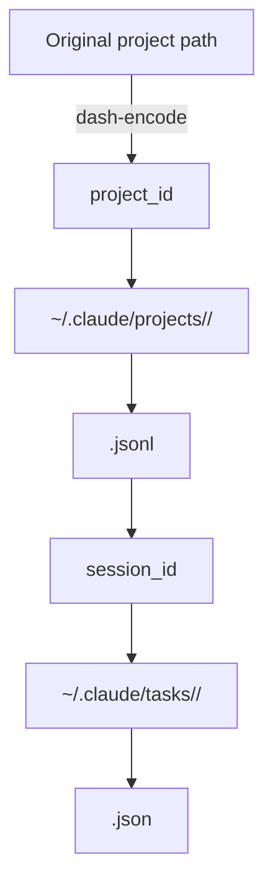

# Project IDs and Lookups
`ccsinfo` does not invent its own identifier scheme. It exposes the IDs Claude Code already uses under `~/.claude`, which is why project IDs look like paths, session IDs behave like filenames, and task lookups need more context than you might expect.

| ID | What it identifies | Where it comes from | What to use it for |
| --- | --- | --- | --- |
| `project_id` | one Claude project | the directory name under `~/.claude/projects/` | project detail and project-scoped session discovery |
| `session_id` | one session transcript | the `.jsonl` filename without the extension | session detail, messages, tools, and session-scoped task lists |
| `task_id` | one task inside one session | a task JSON file under `~/.claude/tasks/<session_id>/` | task detail, but only when paired with `session_id` |

## Project IDs
Project IDs are dash-encoded filesystem paths. Claude Code replaces `/` and `.` with `-`, and `ccsinfo` uses that directory name as the project identifier:

```23:44:src/ccsinfo/utils/paths.py
def encode_project_path(project_path: str) -> str:
    """Encode a project path to Claude Code's directory name format.

    Claude Code replaces:
    - '/' with '-'
    - '.' with '-'

    Example: '/home/user/project' -> '-home-user-project'
    """
    return project_path.replace("/", "-").replace(".", "-")


def decode_project_path(encoded_path: str) -> str:
    """Decode a Claude Code directory name back to the original path.

    Note: This is lossy - we cannot distinguish between original '-' and encoded '/' or '.'.
    The path returned should be treated as approximate.
    """
    # Handle the pattern where /. becomes --
    result = encoded_path.replace("--", "/.")
    result = result.replace("-", "/")
    return result
```

In practice, that means:

- `/home/user/project` becomes `-home-user-project`
- `/home/user/.config/project` becomes `-home-user--config-project`
- a double dash often means a dot-prefixed segment such as `/.config`

> **Warning:** Treat `project_id` as an opaque value returned by `ccsinfo projects list` or `GET /projects`. The decode step is lossy, so the displayed path is best-effort context, not a safe source for rebuilding the ID by hand.

## Storage Layout
The repo’s own test fixture shows the on-disk relationship between project IDs, session IDs, and task files:

```91:109:tests/conftest.py
# Create projects directory with a sample project
projects_dir = claude_dir / "projects"
project_dir = projects_dir / "-home-user-test-project"
project_dir.mkdir(parents=True)

# Create a session file in the project
session_file = project_dir / "abc-123-def-456.jsonl"
with session_file.open("w") as f:
    for entry in sample_session_data:
        f.write(json.dumps(entry) + "\n")

# Create tasks directory with a session's tasks
tasks_dir = claude_dir / "tasks"
session_tasks_dir = tasks_dir / "abc-123-def-456"
session_tasks_dir.mkdir(parents=True)

# Create a task file
task_file = session_tasks_dir / "1.json"
```



## Session Lookups
Use `project_id` when you are finding sessions inside a project. Use `session_id` when you already know the exact session you want.

A reliable CLI flow is:

```bash
ccsinfo projects list --json
ccsinfo sessions list --project <project_id> --json
ccsinfo sessions show <session_id> --json
ccsinfo sessions messages <session_id> --json
ccsinfo sessions tools <session_id> --json
```

The reason `session_id` works on its own is that `ccsinfo` searches every project directory for an exact `<session_id>.jsonl` filename:

```394:402:src/ccsinfo/core/parsers/sessions.py
projects_dir = get_projects_directory()
if not projects_dir.exists():
    return None

for project_dir in projects_dir.iterdir():
    if project_dir.is_dir():
        session_file = project_dir / f"{session_id}.jsonl"
        if session_file.exists():
            return parse_session_file(session_file)
```

That has two practical consequences:

- session detail lookups are global across projects
- once you have `session_id`, you do not need `project_id` again
- the match is filename-based, so the safest input is the full session ID

If you prefer the API, the common entry points are:

- `GET /projects/{project_id}`
- `GET /projects/{project_id}/sessions`
- `GET /sessions/{session_id}`

> **Note:** One CLI help string says a session ID “can be partial,” but the current lookup implementation checks for an exact `<session_id>.jsonl` filename. Use the full session ID for reliable lookups.

## Why Task Lookups Need `session_id`
Task detail lookup is stricter because tasks are stored under a session-specific directory, not under a globally unique task namespace:

```113:128:src/ccsinfo/core/parsers/tasks.py
tasks_dir = get_tasks_directory() / session_id
tasks: list[Task] = []

if not tasks_dir.exists():
    logger.debug("No tasks directory found for session %s", session_id)
    return TaskCollection(session_id=session_id, tasks=[])

for task_file in iter_json_files(tasks_dir, "*.json"):
    task = parse_task_file(task_file)
    if task is not None:
        tasks.append(task)

# Sort by ID (numeric sort if possible)
tasks.sort(key=lambda t: (int(t.id) if t.id.isdigit() else float("inf"), t.id))

return TaskCollection(session_id=session_id, tasks=tasks)
```

Because task IDs are only unique inside that one session, the public task-detail API requires `session_id`:

```35:44:src/ccsinfo/server/routers/tasks.py
@router.get("/{task_id}", response_model=Task)
async def get_task(
    task_id: str,
    session_id: str = Query(..., description="Session ID (required since task IDs are only unique within a session)"),
) -> Task:
    """Get task details."""
    task = task_service.get_task(task_id, session_id=session_id)
    if not task:
        raise HTTPException(status_code=404, detail="Task not found")
    return task
```

The CLI enforces the same rule:

```130:145:src/ccsinfo/cli/commands/tasks.py
@app.command("show")
def show_task(
    task_id: str = typer.Argument(..., help="Task ID"),
    session: str = typer.Option(
        ..., "--session", "-s", help="Session ID (required since task IDs are only unique within a session)"
    ),
    json_output: bool = typer.Option(False, "--json", "-j", help="Output as JSON"),
) -> None:
    """Show task details."""
    client = get_client(state.server_url)

    if client:
        # Remote mode - use HTTP client
        try:
            task_data = client.get_task(task_id, session_id=session)
```

In other words, the stable API shape is:

- `GET /sessions/{session_id}/tasks` to list tasks for a known session
- `GET /tasks/{task_id}?session_id=<session_id>` to fetch one specific task

> **Warning:** `task_id` is not a global key. `1` means “task 1 in this session,” not “the only task 1 everywhere.”

> **Tip:** Prefer a session-first workflow for tasks: `ccsinfo tasks list --session <session_id> --json` or `GET /sessions/{session_id}/tasks` first, then `ccsinfo tasks show <task_id> --session <session_id> --json`. The public task payload does not carry `session_id`, so a global task list is best treated as an overview, not as a standalone lookup table.

## Recommended Lookup Flow
When you need to move from a project to a specific task, the safest path is:

1. List projects and copy the exact `project_id`.
2. List sessions for that project and pick the `session_id`.
3. Open the session by `session_id`.
4. List tasks for that session.
5. Open the task with both `task_id` and `session_id`.

```bash
ccsinfo projects list --json
ccsinfo sessions list --project <project_id> --json
ccsinfo sessions show <session_id> --json
ccsinfo tasks list --session <session_id> --json
ccsinfo tasks show <task_id> --session <session_id> --json
```

If you are building scripts or UI flows, keep the three IDs together as you drill down:

- `project_id` gets you to the right project and session list
- `session_id` gets you to the right transcript
- `session_id + task_id` gets you to the right task

That one rule of thumb will keep nearly every lookup in `ccsinfo` unambiguous and predictable.


## Related Pages

- [Data Model and Storage](data-model-and-storage.html)
- [Working with Projects](projects-guide.html)
- [Working with Sessions](sessions-guide.html)
- [Working with Tasks](tasks-guide.html)
- [API Overview](api-overview.html)