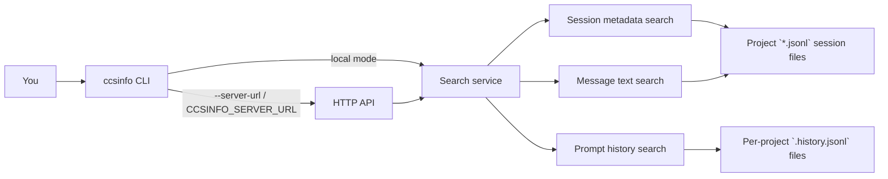

# Searching Sessions, Messages, and History

`ccsinfo` has three different search commands because Claude Code data is stored in two different places: session JSONL files for conversations, and a separate `.history.jsonl` file for prompt history. The right search depends on what you remember.

| Search | Scans | Does not scan | Best when you remember |
| --- | --- | --- | --- |
| `ccsinfo search sessions <query>` | Session-level metadata | Message bodies and prompt-history text | a project name, branch, slug, or part of a session identifier |
| `ccsinfo search messages <query>` | Text from `user` and `assistant` messages | Tool-call payloads and `.history.jsonl` prompts | a phrase from the conversation itself |
| `ccsinfo search history <query>` | Prompt text stored in `.history.jsonl` | Assistant replies and session-level metadata | something you typed, but not where you typed it |

> **Tip:** If you only remember the wording and do not remember whether you typed it or Claude said it, run both `ccsinfo search history <query>` and `ccsinfo search messages <query>`.



## Run Search

By default, the CLI reads local files under `~/.claude`. If you want the same commands to go through the server API instead, start the server with `ccsinfo serve` and point the CLI at it with `--server-url` or `CCSINFO_SERVER_URL`.

```27:62:src/ccsinfo/cli/main.py
@app.command()
def serve(
    host: str = typer.Option("127.0.0.1", "--host", "-h", help="Host to bind to (use 0.0.0.0 for network access)"),
    port: int = typer.Option(8080, "--port", "-p", help="Port to bind"),
) -> None:
    """Start the API server."""
    uvicorn.run(fastapi_app, host=host, port=port)

# ...

@app.callback()
def main_callback(
    # ...
    server_url: str | None = typer.Option(
        None,
        "--server-url",
        "-s",
        envvar="CCSINFO_SERVER_URL",
        help="Remote server URL (e.g., http://localhost:8080). If not set, reads local files.",
    ),
) -> None:
    """Claude Code Session Info CLI."""
    state.server_url = server_url
```

The CLI and API line up directly:

| CLI | API |
| --- | --- |
| `ccsinfo search sessions <query>` | `GET /search?q=<query>&limit=<n>` |
| `ccsinfo search messages <query>` | `GET /search/messages?q=<query>&limit=<n>` |
| `ccsinfo search history <query>` | `GET /search/history?q=<query>&limit=<n>` |

All three API routes use `q` for the query. The API default `limit` is `50`, and the HTTP routes enforce `1` through `500`. The CLI also supports `--limit` and `--json`.

## Search Sessions

`ccsinfo search sessions <query>` is the broadest search. It does a case-insensitive match against session metadata, including the session identifier, slug, branch information, and stored path information. It returns session summaries, not conversation text.

Use session search when:

- you remember a project or path fragment
- you remember a branch name or slug
- you want to find the right session before opening it

Once you have the right match, follow up with `ccsinfo sessions show <full-session-id>` or `ccsinfo sessions messages <full-session-id> --json`.

## Search Message Text

`ccsinfo search messages <query>` reads the session files themselves. The test fixture shows the kind of JSONL entries it searches:

```29:46:tests/conftest.py
{
    "type": "user",
    "uuid": "msg-001",
    "message": {
        "role": "user",
        "content": [{"type": "text", "text": "Hello"}],
    },
    "timestamp": "2024-01-15T10:00:00Z",
},
{
    "type": "assistant",
    "uuid": "msg-002",
    "parentMessageUuid": "msg-001",
    "message": {
        "role": "assistant",
        "content": [{"type": "text", "text": "Hi there!"}],
    },
    "timestamp": "2024-01-15T10:00:01Z",
},
```

When message search runs, it only scans `user` and `assistant` entries and only extracts text content. It then builds a context snippet around the match instead of returning the full message body:

```85:112:src/ccsinfo/core/services/search_service.py
for project_path, session in get_all_sessions():
    for entry in session.entries:
        if entry.type not in ("user", "assistant"):
            continue

        text_content = ""
        if entry.message and entry.message.content:
            if isinstance(entry.message.content, str):
                text_content = entry.message.content
            elif isinstance(entry.message.content, list):
                texts = []
                for content in entry.message.content:
                    if content.type == "text" and content.text:
                        texts.append(content.text)
                text_content = "\n".join(texts)

        if query_lower in text_content.lower():
            idx = text_content.lower().find(query_lower)
            start = max(0, idx - 50)
            end = min(len(text_content), idx + len(query) + 50)
            snippet = text_content[start:end]
            if start > 0:
                snippet = "..." + snippet
            if end < len(text_content):
                snippet = snippet + "..."
```

That makes message search good for finding where a phrase appeared in a conversation, but not for dumping the whole conversation. If you need the complete exchange after a hit, use `ccsinfo sessions messages <session-id> --json`.

> **Warning:** `search messages` only searches extracted text blocks from `user` and `assistant` messages. Tool-call payloads, tool results, and other non-text content are not part of message search.

## Search Prompt History

`ccsinfo search history <query>` is for finding what you asked, not what Claude answered. It searches the prompt text stored in each project's `.history.jsonl` file.

```98:129:src/ccsinfo/core/parsers/history.py
def search_prompts(self, query: str, *, case_sensitive: bool = False) -> list[HistoryEntry]:
    """Search for prompts containing a query string."""
    results: list[HistoryEntry] = []
    search_query = query if case_sensitive else query.lower()

    for entry in self.entries:
        if entry.prompt:
            prompt_text = entry.prompt if case_sensitive else entry.prompt.lower()
            if search_query in prompt_text:
                results.append(entry)

    return results

def get_history_file(project_dir: Path) -> Path:
    """Get the path to the history file for a project."""
    return project_dir / ".history.jsonl"
```

This is the best search when:

- you remember part of a prompt but not the session it came from
- you want to reuse an older prompt across projects
- you want the stored prompt text itself

History search returns the project path, prompt text, timestamp, and the related session identifier. In table output the prompt preview is shortened; in JSON or API output the full stored prompt is returned.

## Practical Limits and Behaviors

All three searches are simple, case-insensitive substring scans over JSONL data. There is no fuzzy matching, stemming, or semantic ranking, so broad queries can produce noisy results. If you expect lots of hits, use a more specific phrase or raise `--limit`.

Search also tolerates damaged files by skipping bad lines instead of failing the whole run:

```43:77:src/ccsinfo/core/parsers/jsonl.py
if not file_path.exists():
    raise FileNotFoundError(f"JSONL file not found: {file_path}")

with file_path.open("rb") as f:
    for line_num, line in enumerate(f, start=1):
        line = line.strip()
        if not line:
            continue

        try:
            data = orjson.loads(line)
        except orjson.JSONDecodeError as e:
            if skip_malformed:
                logger.warning(
                    "Skipping malformed JSON at line %d in %s: %s",
                    line_num,
                    file_path,
                    e,
                )
                continue
            raise

        if model is not None:
            try:
                yield model.model_validate(data)
            except Exception as e:
                if skip_malformed:
                    logger.warning(
                        "Skipping invalid data at line %d in %s: %s",
                        line_num,
                        file_path,
                        e,
                    )
                    continue
```

> **Tip:** Use `--json` when you want full identifiers, want to script against results, or want the full prompt text from history search. The pretty tables shorten IDs and previews.

> **Note:** Project paths are reconstructed from encoded directory names under `~/.claude/projects`, so treat them as best-effort labels rather than perfect originals.

> **Warning:** Malformed JSONL lines are skipped rather than failing the whole search. That keeps the command usable, but it can also mean a damaged session or history file produces incomplete results instead of a hard error.


## Related Pages

- [Working with Sessions](sessions-guide.html)
- [Search API](api-search.html)
- [Data Model and Storage](data-model-and-storage.html)
- [JSON Output and Automation](json-output-and-automation.html)
- [Troubleshooting](troubleshooting.html)