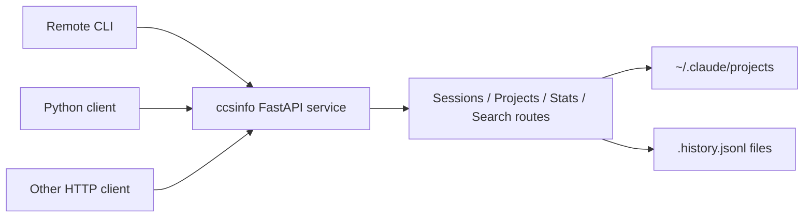

# Running the Server

`ccsinfo` can run as a FastAPI service so other machines, shells, or programs can query one central source of Claude Code data over HTTP. In server mode, the API reads the `~/.claude` data on the machine where the service is running and returns JSON from there. There is no database or separate sync layer in this repository.



> **Note:** Run the server on the machine that actually has the Claude Code data you want to expose. Starting it on a different host does not automatically give that host access to your local sessions.

## Start the server

The built-in CLI wraps Uvicorn and exposes two server settings: `--host` and `--port`.

```python
@app.command()
def serve(
    host: str = typer.Option("127.0.0.1", "--host", "-h", help="Host to bind to (use 0.0.0.0 for network access)"),
    port: int = typer.Option(8080, "--port", "-p", help="Port to bind"),
) -> None:
    """Start the API server."""
    uvicorn.run(fastapi_app, host=host, port=port)
```

Start it with the installed CLI:

```bash
ccsinfo serve
```

Make it reachable from other machines:

```bash
ccsinfo serve --host 0.0.0.0 --port 8080
```

Or run it as a module:

```bash
python -m ccsinfo serve --host 0.0.0.0 --port 8080
```

By default, the server listens on `127.0.0.1:8080`, which means only the same machine can connect.

That is the full built-in server surface: the bundled `serve` command passes only `host` and `port` into `uvicorn.run(...)`. If you need TLS, authentication, or reverse-proxy features, add those outside `ccsinfo`.

> **Note:** If the server host does not have `~/.claude/projects` yet, the API can still start. In that case, list endpoints return empty arrays and summary endpoints such as `/info` report zero counts.

## Choose a host and port

| Situation | Recommended host | Port guidance |
| --- | --- | --- |
| Local-only use on one machine | `127.0.0.1` | Keep the default `8080` unless it is already in use |
| Access from other machines on the same LAN or VPN | `0.0.0.0` | Use `8080` or any other free port and allow it through your firewall |
| Behind a reverse proxy | `127.0.0.1` or a specific private IP | Choose any internal port your proxy forwards to |

If you bind to `0.0.0.0`, clients should connect to the server's real hostname or IP address, such as `http://192.168.1.50:8080`, not `http://0.0.0.0:8080`.

> **Warning:** This FastAPI app does not add authentication, TLS, or CORS middleware in this repository. Binding to `0.0.0.0` makes the API reachable on your network, so expose it only on trusted networks or put it behind your own proxy and authentication layer.

## Health checks

The API includes a lightweight liveness endpoint and a small info endpoint:

```python
@router.get("/health")
async def health() -> dict[str, str]:
    """Health check endpoint."""
    return {"status": "healthy"}


@router.get("/info")
async def info() -> dict[str, Any]:
    """Server info endpoint."""
    stats = stats_service.get_global_stats()
    return {
        "version": __version__,
        "total_sessions": stats.total_sessions,
        "total_projects": stats.total_projects,
    }
```

Use them like this:

```bash
curl http://127.0.0.1:8080/health
curl http://127.0.0.1:8080/info
```

Use `/health` when you want a fast "is the process responding?" check. Use `/info` when you also want a quick sanity check that the service can enumerate local data and report version and high-level totals.

> **Tip:** `/health` is the better choice for load balancer or container liveness checks. `/info`, `/stats`, and search routes do more work because they walk local session data to build their responses.

## Remote client usage

### Use the CLI against a remote server

The CLI has a global `--server-url` option, and the same value can come from `CCSINFO_SERVER_URL`:

```python
server_url: str | None = typer.Option(
    None,
    "--server-url",
    "-s",
    envvar="CCSINFO_SERVER_URL",
    help="Remote server URL (e.g., http://localhost:8080). If not set, reads local files.",
),
```

Once this is set, the normal CLI commands switch from local file reads to HTTP requests. Real command groups in the repository include `projects list`, `sessions active`, `stats global`, and `search history`.

```bash
ccsinfo --server-url http://server.example:8080 projects list
ccsinfo --server-url http://server.example:8080 sessions active
CCSINFO_SERVER_URL=http://server.example:8080 ccsinfo stats global
CCSINFO_SERVER_URL=http://server.example:8080 ccsinfo search history "rate limit"
```

If you do not set `--server-url` or `CCSINFO_SERVER_URL`, the CLI falls back to local mode and reads files directly instead of using HTTP.

> **Tip:** Use `projects list` first when you need a `project_id` for project-specific routes. The API expects the actual project ID returned by the server, not just the human-friendly project name.

### Use the Python HTTP client

The repository also includes a small `httpx` client:

```python
def __init__(self, base_url: str) -> None:
    self.base_url = base_url.rstrip("/")
    self._client = httpx.Client(base_url=self.base_url, timeout=30.0)
```

It exposes real convenience methods such as `list_sessions()`, `list_projects()`, `get_global_stats()`, `search_history()`, `health()`, and `info()`.

```python
from ccsinfo.core.client import CCSInfoClient

client = CCSInfoClient("http://server.example:8080")

print(client.health())
print(client.info())
print(client.list_sessions(active_only=True, limit=25))
print(client.get_global_stats())
print(client.search_history("rate limit", limit=10))
```

The client strips any trailing slash from the base URL and uses a 30-second timeout for requests.

## Common request patterns

These are the main patterns exposed by the FastAPI routes:

| Route | What it is for | Important parameters |
| --- | --- | --- |
| `GET /health` | Liveness check | None |
| `GET /info` | Version plus high-level counts | None |
| `GET /sessions` | List sessions | `project_id`, `active_only`, `limit` |
| `GET /sessions/active` | Show active sessions | None |
| `GET /sessions/{session_id}/messages` | Read message history for one session | `role`, `limit` |
| `GET /projects` | Discover valid project IDs | None |
| `GET /projects/{project_id}/sessions` | List sessions for one project | `limit` |
| `GET /projects/{project_id}/stats` | Project-specific totals | None |
| `GET /stats` | Global totals | None |
| `GET /stats/daily` | Daily activity breakdown | `days` |
| `GET /stats/trends` | Trend summary | None |
| `GET /search` | Search sessions | `q`, `limit` |
| `GET /search/messages` | Search message text | `q`, `limit` |
| `GET /search/history` | Search prompt history | `q`, `limit` |

The list and search routes generally default to `limit=50` and cap it at `500`. The session-message route defaults to `limit=100` and also caps at `500`. Daily stats default to `30` days and cap at `365`.

> **Note:** Active-session detection is based on local process inspection and uses a 5-second cache, so `/sessions/active` is near-real-time rather than instant.

> **Tip:** Because the app uses FastAPI defaults, the interactive API docs are available at `http://HOST:PORT/docs`, and the OpenAPI schema is available at `http://HOST:PORT/openapi.json`.


## Related Pages

- [Quickstart: Remote Server Mode](remote-server-quickstart.html)
- [Configuration](configuration.html)
- [API Overview](api-overview.html)
- [Stats and Health API](api-stats-and-health.html)
- [Troubleshooting](troubleshooting.html)