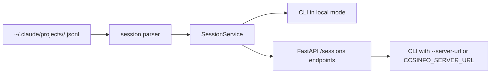

# Working with Sessions

A session in `ccsinfo` is a single Claude Code conversation. Sessions are discovered from Claude’s local data under `~/.claude/projects`, where each project gets its own encoded directory and each session is stored as a `*.jsonl` file named after the session ID.

You can work with sessions in two ways:

- local mode: run `ccsinfo` directly and it reads your local Claude data
- server mode: run `ccsinfo serve`, then use the same CLI commands with `--server-url` or `CCSINFO_SERVER_URL`



| Task | CLI | API |
| --- | --- | --- |
| List sessions | `ccsinfo sessions list` | `GET /sessions` |
| Show only active sessions | `ccsinfo sessions list --active` or `ccsinfo sessions active` | `GET /sessions/active` |
| Filter by project | `ccsinfo sessions list --project <project-id>` | `GET /sessions?project_id=<project-id>` or `GET /projects/{project_id}/sessions` |
| View session details | `ccsinfo sessions show <session-id>` | `GET /sessions/{session_id}` |
| Read messages | `ccsinfo sessions messages <session-id>` | `GET /sessions/{session_id}/messages` |
| Inspect tool calls | `ccsinfo sessions tools <session-id>` | `GET /sessions/{session_id}/tools` |

## Local and server mode

If you want to expose session data over HTTP, start the built-in server and point the CLI at it:

```bash
ccsinfo serve --host 127.0.0.1 --port 8080
CCSINFO_SERVER_URL=http://127.0.0.1:8080 ccsinfo sessions list
```

The session routes exposed by the API are defined here:

```13:58:src/ccsinfo/server/routers/sessions.py
@router.get("", response_model=list[SessionSummary])
async def list_sessions(
    project_id: str | None = Query(None, description="Filter by project"),
    active_only: bool = Query(False, description="Show only active sessions"),
    limit: int = Query(50, ge=1, le=500, description="Maximum results"),
) -> list[SessionSummary]:
    """List all sessions."""
    return session_service.list_sessions(project_id=project_id, active_only=active_only, limit=limit)

@router.get("/active", response_model=list[SessionSummary])
async def active_sessions() -> list[SessionSummary]:
    """List currently running sessions."""
    return session_service.get_active_sessions()

@router.get("/{session_id}", response_model=Session)
async def get_session(session_id: str) -> Session:
    """Get session details."""
    session = session_service.get_session(session_id)
    if not session:
        raise HTTPException(status_code=404, detail="Session not found")
    return session

@router.get("/{session_id}/messages")
async def get_messages(
    session_id: str,
    role: str | None = Query(None),
    limit: int = Query(100, ge=1, le=500),
) -> list[dict[str, Any]]:
    """Get messages from a session."""
    session = session_service.get_session(session_id)
    if not session:
        raise HTTPException(status_code=404, detail="Session not found")
    messages = session_service.get_session_messages(session_id, role=role, limit=limit)
    return [msg.model_dump(mode="json") for msg in messages]

@router.get("/{session_id}/tools")
async def get_tools(session_id: str) -> list[dict[str, Any]]:
    """Get tool calls from a session."""
    session = session_service.get_session(session_id)
    if not session:
        raise HTTPException(status_code=404, detail="Session not found")
    return session_service.get_session_tools(session_id)
```

## List sessions

Use `ccsinfo sessions list` to browse sessions across all projects. Results are sorted by most recent activity first, and the CLI defaults to `--limit 50`.

```bash
ccsinfo sessions list
ccsinfo sessions list --limit 20
ccsinfo sessions list --json
ccsinfo sessions active
```

The table view is designed for scanning. It shows:

- session ID
- project name
- message count
- last activity time
- active or inactive status

On the API side, `GET /sessions` supports:

- `project_id`
- `active_only`
- `limit`

The API default is `limit=50`, and the allowed range is `1` to `500`.

> **Note:** Active status is a live, best-effort check based on running `claude` processes, not just the timestamp in the session file. The implementation caches that check briefly, so a just-started or just-finished session may take a few seconds to update.

## Filter by project or active status

Project filtering uses the project ID, not the human-friendly project name. The safest way to get it is:

```bash
ccsinfo projects list --json
```

Then use that exact `id` value when filtering sessions:

```bash
ccsinfo sessions list --project <project-id>
ccsinfo sessions list --project <project-id> --active
```

If you are using the API, you can either pass the query parameter:

- `GET /sessions?project_id=<project-id>`

Or go straight to the project-scoped endpoints:

- `GET /projects/{project_id}/sessions`
- `GET /projects/{project_id}/sessions/active`

The tests show how project IDs are encoded from paths:

```26:39:tests/test_utils_paths.py
path = "/home/user/project"
encoded = encode_project_path(path)
assert "/" not in encoded
assert encoded == "-home-user-project"

path = "/home/user/.config/project"
encoded = encode_project_path(path)
assert "/" not in encoded
assert "." not in encoded
assert encoded == "-home-user--config-project"
```

> **Warning:** Treat project IDs as opaque values. `ccsinfo` can decode them back into a readable path, but that decode is explicitly approximate. Copy the exact `id` returned by `projects list --json` instead of rebuilding it by hand.

> **Tip:** The Rich table views shorten IDs for readability. If you need the exact `project_id` or `session_id` for a follow-up command, use `--json`.

## View session details

Use `ccsinfo sessions show <session-id>` to inspect one session without loading the whole transcript.

```bash
ccsinfo sessions show <session-id>
ccsinfo sessions show <session-id> --json
```

The detail view includes:

- the full session `id`
- `project_name`
- `project_path`
- `created_at`
- `updated_at`
- `message_count`
- `is_active`
- `file_path` when available

The API equivalent is `GET /sessions/{session_id}`.

A practical detail matters here: the details endpoint returns session metadata only. If you want the conversation itself, use the messages endpoint next.

> **Warning:** Use a full session ID for `show`, `messages`, and `tools`. The list tables display shortened IDs, so `ccsinfo sessions list --json` is the easiest way to copy an exact value.

## Read messages

Use `ccsinfo sessions messages <session-id>` to read the conversation inside a session.

```bash
ccsinfo sessions messages <session-id>
ccsinfo sessions messages <session-id> --role user
ccsinfo sessions messages <session-id> --role assistant --limit 100 --json
```

The CLI supports:

- `--role user`
- `--role assistant`
- `--limit`
- `--json`

The API equivalent is:

- `GET /sessions/{session_id}/messages`
- `GET /sessions/{session_id}/messages?role=user`
- `GET /sessions/{session_id}/messages?role=assistant&limit=100`

The API default is `limit=100` and accepts up to `500`. The CLI default is `--limit 50`.

The repository’s test fixtures show the JSONL structure `ccsinfo` parses into messages:

```28:47:tests/conftest.py
{
    "type": "user",
    "uuid": "msg-001",
    "message": {
        "role": "user",
        "content": [{"type": "text", "text": "Hello"}],
    },
    "timestamp": "2024-01-15T10:00:00Z",
},
{
    "type": "assistant",
    "uuid": "msg-002",
    "parentMessageUuid": "msg-001",
    "message": {
        "role": "assistant",
        "content": [{"type": "text", "text": "Hi there!"}],
    },
    "timestamp": "2024-01-15T10:00:01Z",
},
```

A few practical details make the transcript view easier to use:

- messages are returned in session order
- the `role` filter is applied before the `limit`
- the table view shows a content preview, not the full message body
- if a message contains only tool calls and no text, the preview shows `<tool calls only>`

> **Tip:** For long conversations, use `--json` and raise the limit. The limit is applied from the start of the session, not the end.

> **Note:** The transcript view is conversation-focused. It surfaces `user` and `assistant` entries, not every raw record that may exist in the underlying session file.

## Inspect tool calls

Use `ccsinfo sessions tools <session-id>` when you want to see what the assistant actually invoked.

```bash
ccsinfo sessions tools <session-id>
ccsinfo sessions tools <session-id> --json
```

The CLI table shows:

- tool call ID
- tool name
- a preview of the input payload

The API equivalent is `GET /sessions/{session_id}/tools`.

`ccsinfo` flattens tool calls out of the assistant messages and returns simple dictionaries with `id`, `name`, and `input`:

```173:195:src/ccsinfo/core/services/session_service.py
def get_session_tools(self, session_id: str) -> list[dict[str, Any]]:
    """Get tool calls from a session.
    ...
    """
    detail = self.get_session_detail(session_id)
    if detail is None:
        return []

    tools: list[dict[str, Any]] = []
    for message in detail.messages:
        for tool_call in message.tool_calls:
            tools.append({
                "id": tool_call.id,
                "name": tool_call.name,
                "input": tool_call.input,
            })

    return tools
```

The message model tests show the kind of calls that get extracted:

```535:550:tests/test_models.py
msg = Message(
    uuid="msg-1",
    type="assistant",
    message=MessageContent(
        role="assistant",
        content=[
            TextContent(text="Let me run this"),
            ToolUseContent(id="t1", name="bash", input={"command": "ls"}),
            ToolUseContent(id="t2", name="read_file", input={"path": "/tmp"}),
        ],
    ),
)
calls = msg.tool_calls
assert len(calls) == 2
assert calls[0].name == "bash"
assert calls[1].name == "read_file"
```

> **Note:** `sessions tools` is a flat list of tool call metadata. It is great for answering “what tools were used?”, but it does not preserve the surrounding message grouping or show full tool output.

> **Tip:** If you need the assistant text around a tool call, use `ccsinfo sessions messages <session-id> --json` alongside `sessions tools`.

## Typical workflow

1. Get the exact project ID with `ccsinfo projects list --json`.
2. Narrow the session list with `ccsinfo sessions list --project <project-id> --json`.
3. Inspect the session metadata with `ccsinfo sessions show <session-id>`.
4. Read the transcript with `ccsinfo sessions messages <session-id>`.
5. Review the assistant’s actions with `ccsinfo sessions tools <session-id>`.

That flow maps cleanly to the repository’s CLI commands and API routes, and it is the most reliable way to move from “which session do I want?” to “what happened inside it?”


## Related Pages

- [Working with Projects](projects-guide.html)
- [Working with Tasks](tasks-guide.html)
- [Project IDs and Lookups](project-ids-and-lookups.html)
- [Sessions API](api-sessions.html)
- [Active Session Detection](active-session-detection.html)