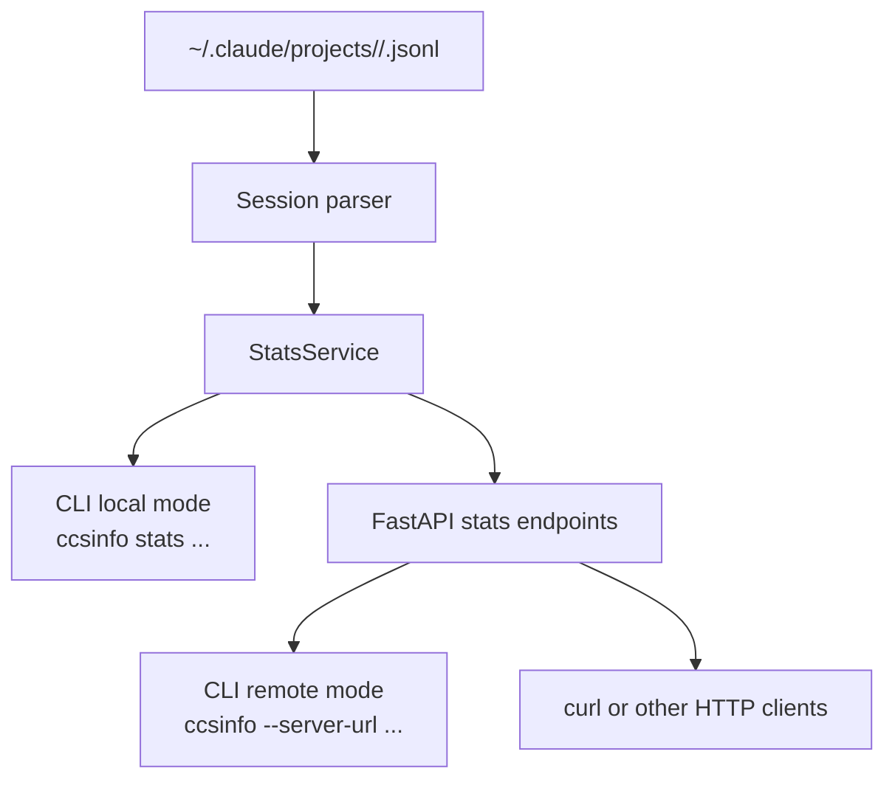

# Using Statistics and Trends

`ccsinfo` gives you three built-in ways to understand Claude Code usage:

- `global` for all-time totals
- `daily` for day-by-day activity
- `trends` for recent momentum, active projects, and tool usage

By default, the CLI reads your local Claude Code data from `~/.claude`. If you start the API server, the same statistics are available over HTTP at `/stats`, `/stats/daily`, and `/stats/trends`.

## Quick Start

Use the CLI directly against your local data:

```bash
ccsinfo stats global
ccsinfo stats daily --days 30
ccsinfo stats trends
ccsinfo stats trends --json
```

Or run the API server and query the same information remotely:

```bash
ccsinfo serve
ccsinfo --server-url http://127.0.0.1:8080 stats trends
curl "http://127.0.0.1:8080/stats"
curl "http://127.0.0.1:8080/stats/daily?days=30"
curl "http://127.0.0.1:8080/stats/trends"
```

> **Note:** You can set `CCSINFO_SERVER_URL` instead of passing `--server-url` every time. If it is not set, the CLI reads local files directly.

```53:59:src/ccsinfo/cli/main.py
    server_url: str | None = typer.Option(
        None,
        "--server-url",
        "-s",
        envvar="CCSINFO_SERVER_URL",
        help="Remote server URL (e.g., http://localhost:8080). If not set, reads local files.",
    ),
```

## How Statistics Flow

`ccsinfo` builds statistics from Claude Code session files stored under `~/.claude/projects`. In local mode, the CLI parses those files directly. In server mode, the API parses them and returns the same categories of data over HTTP.



## Global Totals

Use `ccsinfo stats global` when you want the big picture.

The command returns four values:

- `total_projects`: unique projects found across parsed sessions
- `total_sessions`: total parsed sessions
- `total_messages`: total `user` and `assistant` messages
- `total_tool_calls`: total assistant `tool_use` entries

```20:46:src/ccsinfo/core/services/stats_service.py
def get_global_stats(self) -> GlobalStats:
    """Get global usage statistics across all sessions and projects."""
    total_sessions = 0
    total_projects = 0
    total_messages = 0
    total_tool_calls = 0

    project_ids = set()

    for project_path, session in get_all_sessions():
        total_sessions += 1
        project_ids.add(project_path)
        total_messages += session.message_count
        total_tool_calls += session.tool_use_count

    total_projects = len(project_ids)

    return GlobalStats(
        total_sessions=total_sessions,
        total_projects=total_projects,
        total_messages=total_messages,
        total_tool_calls=total_tool_calls,
    )
```

> **Tip:** Use `ccsinfo stats global --json` if you want to feed the totals into a script or dashboard.

## Daily Activity Breakdowns

Use `ccsinfo stats daily --days 7`, `30`, or `90` when you want to see how activity is spread over time.

Each row contains:

- `date`
- `session_count`
- `message_count`

The API accepts `days` values from `1` to `365`.

```48:90:src/ccsinfo/core/services/stats_service.py
def get_daily_stats(self, days: int = 30) -> list[DailyStats]:
    """Get daily activity breakdown for the last N days."""
    now = pendulum.now()
    cutoff = now.subtract(days=days)

    daily_data: dict[str, dict[str, int]] = defaultdict(lambda: {"session_count": 0, "message_count": 0})

    for _project_path, session in get_all_sessions():
        ts = session.first_timestamp
        if ts is None:
            continue

        session_dt = pendulum.instance(ts)
        if session_dt < cutoff:
            continue

        date_key = session_dt.format("YYYY-MM-DD")
        daily_data[date_key]["session_count"] += 1
        daily_data[date_key]["message_count"] += session.message_count

    results: list[DailyStats] = []
    for date_str, data in sorted(daily_data.items()):
        parsed_dt = pendulum.parse(date_str)
        date = parsed_dt.date() if parsed_dt else None
        results.append(
            DailyStats(
                date=date,
                session_count=data["session_count"],
                message_count=data["message_count"],
            )
        )

    return results
```

> **Warning:** Daily stats are based on each session's first timestamp. If a session crosses midnight, its messages are still counted on the day the session started.

> **Note:** The built-in daily view tracks sessions and messages only. It does not include a per-day tool breakdown.

> **Tip:** Quiet days are omitted rather than filled with zeroes. If you are charting the API output, add missing dates yourself if you want a continuous timeline.

## Trend Analysis

Use `ccsinfo stats trends` when you want one compact summary of recent activity plus your biggest projects and tools.

The trend output includes:

- sessions in the last 7 days
- sessions in the last 30 days
- messages in the last 7 days
- messages in the last 30 days
- the top 5 most active projects
- the top 10 most used tools
- average session length

```105:163:src/ccsinfo/core/services/stats_service.py
now = pendulum.now()
cutoff_7 = now.subtract(days=7)
cutoff_30 = now.subtract(days=30)

sessions_7 = 0
sessions_30 = 0
messages_7 = 0
messages_30 = 0

project_activity: dict[str, int] = defaultdict(int)
tool_usage: dict[str, int] = defaultdict(int)
total_sessions = 0
total_messages = 0

for project_path, session in get_all_sessions():
    total_sessions += 1
    total_messages += session.message_count
    project_activity[project_path] += session.message_count

    for tool in session.get_unique_tools_used():
        tool_usage[tool] += 1

    ts = session.first_timestamp
    if ts is not None:
        session_dt = pendulum.instance(ts)
        if session_dt >= cutoff_30:
            sessions_30 += 1
            messages_30 += session.message_count
            if session_dt >= cutoff_7:
                sessions_7 += 1
                messages_7 += session.message_count

most_active = sorted(project_activity.items(), key=lambda x: x[1], reverse=True)[:5]
most_used_tools = sorted(tool_usage.items(), key=lambda x: x[1], reverse=True)[:10]
avg_length = total_messages / total_sessions if total_sessions > 0 else 0

return {
    "sessions_last_7_days": sessions_7,
    "sessions_last_30_days": sessions_30,
    "messages_last_7_days": messages_7,
    "messages_last_30_days": messages_30,
    "most_active_projects": [{"project": p, "message_count": c} for p, c in most_active],
    "most_used_tools": [{"tool": t, "count": c} for t, c in most_used_tools],
    "average_session_length": round(avg_length, 2),
}
```

> **Note:** The 7-day and 30-day counts are recent windows, but `most_active_projects`, `most_used_tools`, and `average_session_length` are calculated across all parsed sessions.

> **Warning:** `average_session_length` is not time. It is `total_messages / total_sessions`, shown in messages.

## Most Active Projects

The "Most Active Projects" leaderboard is based on total message volume per project, not session count. A project with fewer but longer conversations can outrank a project with many short sessions.

A few things are worth knowing:

- only the top 5 projects are shown
- the trend table uses the decoded project path as its display value
- long paths are truncated in the CLI table
- if you need an exact identifier, use the project ID

A practical follow-up workflow is:

```bash
ccsinfo projects list --json
ccsinfo projects stats <project_id>
curl "http://127.0.0.1:8080/projects/<project_id>/stats"
```

`project_id` is the encoded directory name inside `~/.claude/projects`. The human-readable path is derived from that encoded name and is only approximate.

```23:44:src/ccsinfo/utils/paths.py
def encode_project_path(project_path: str) -> str:
    """Encode a project path to Claude Code's directory name format.

    Claude Code replaces:
    - '/' with '-'
    - '.' with '-'
    """
    return project_path.replace("/", "-").replace(".", "-")


def decode_project_path(encoded_path: str) -> str:
    """Decode a Claude Code directory name back to the original path.

    Note: This is lossy - we cannot distinguish between original '-' and encoded '/' or '.'.
    The path returned should be treated as approximate.
    """
    result = encoded_path.replace("--", "/.")
    result = result.replace("-", "/")
    return result
```

> **Warning:** Use the project ID for scripts and follow-up commands. The decoded path shown in trend output is meant to be readable, not perfectly reversible.

> **Tip:** `ccsinfo projects list --json` is the safest way to get the full project ID because the default table shortens long values.

## Most Used Tools

The "Most Used Tools" table shows which tools appear most often across your session history, but its `count` field is session-based, not call-based.

That means:

- a tool counts once per session if it appears at all
- repeated calls to the same tool in one session do not increase its trend count
- the leaderboard shows only the top 10 tools

```205:215:src/ccsinfo/core/parsers/sessions.py
def get_unique_tools_used(self) -> set[str]:
    """Get the set of unique tool names used in the session."""
    tools: set[str] = set()
    for entry in self.entries:
        if entry.type == "assistant" and entry.message:
            content = entry.message.content
            if isinstance(content, list):
                for c in content:
                    if isinstance(c, MessageContent) and c.type == "tool_use" and c.name:
                        tools.add(c.name)
    return tools
```

> **Note:** A tool used 20 times in one session still contributes only `1` to `most_used_tools` for that session. If you need raw tool-call volume, check `ccsinfo stats global` and use `total_tool_calls`.

## Practical Workflow

A simple way to use these features day to day is:

- start with `ccsinfo stats global` to understand overall scale
- use `ccsinfo stats daily --days 7` and `--days 30` to spot short-term changes
- use `ccsinfo stats trends` to compare recent activity with your all-time project and tool patterns
- switch to `--json` whenever you want to chart, export, or automate the results
- drill into standout projects with `ccsinfo projects stats <project_id>`


## Related Pages

- [Stats and Health API](api-stats-and-health.html)
- [Working with Projects](projects-guide.html)
- [Quickstart: Local CLI Mode](local-cli-quickstart.html)
- [JSON Output and Automation](json-output-and-automation.html)
- [Overview](overview.html)