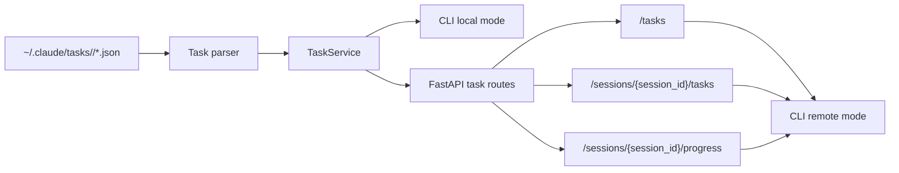

# Working with Tasks

ccsinfo gives you a read-only view of Claude Code task data. You can use it to scan all tasks across sessions, narrow the view to one session, filter by status, inspect task details, and understand blocker relationships.

> **Note:** ccsinfo does not create, update, or complete tasks. It reads task files that Claude Code has already written.

## Where tasks come from

Each session's tasks live in `~/.claude/tasks/<session-id>/` as individual `*.json` files. ccsinfo can read them in two ways:

- locally, by reading your `~/.claude` directory directly
- remotely, by querying the built-in API server

The CLI is wired for both modes:

```python
server_url: str | None = typer.Option(
    None,
    "--server-url",
    "-s",
    envvar="CCSINFO_SERVER_URL",
    help="Remote server URL (e.g., http://localhost:8080). If not set, reads local files.",
)
```

In practice, that means:

```bash
# Local mode
ccsinfo tasks list

# Start the API server
ccsinfo serve --host 127.0.0.1 --port 8080

# Remote mode
CCSINFO_SERVER_URL=http://localhost:8080 ccsinfo tasks list --json
```



Within a session, ccsinfo reads sorted `*.json` task files and then sorts the task collection by numeric task ID when it can.

## Task format and fields

A raw task file looks like this:

```json
{
  "id": "1",
  "subject": "Test task",
  "description": "A test task",
  "status": "pending",
  "owner": null,
  "blockedBy": [],
  "blocks": []
}
```

Optional fields such as `activeForm` and `metadata` may also be present.

The supported status values come directly from the task model:

```python
class TaskStatus(StrEnum):
    """Task status enum."""

    PENDING = "pending"
    IN_PROGRESS = "in_progress"
    COMPLETED = "completed"
```

| Field | Meaning |
| --- | --- |
| `id` | The task's identifier inside one session |
| `subject` | Short task title |
| `description` | Longer task details |
| `status` | One of `pending`, `in_progress`, or `completed` |
| `owner` | Optional assignee or owner |
| `blockedBy` / `blocked_by` | Task IDs that must finish first |
| `blocks` | Task IDs that depend on this task |
| `activeForm` / `active_form` | Optional active wording for the task |
| `metadata` | Extra structured data attached to the task |

> **Tip:** If you work with both raw Claude Code task files and ccsinfo output, watch the naming style. Raw files use camelCase names such as `blockedBy` and `activeForm`, while ccsinfo's internal models use snake_case names such as `blocked_by` and `active_form`.

> **Warning:** Status filters accept only `pending`, `in_progress`, or `completed`. Invalid values return an error in both the CLI and the API.

## List and filter tasks

Use `ccsinfo tasks list` for a broad overview.

```bash
ccsinfo tasks list --json
ccsinfo tasks list --session <session-id> --json
ccsinfo tasks list --status pending --json
ccsinfo tasks list --session <session-id> --status in_progress --json
```

If you are using the API directly, the same filters are available on `GET /tasks`:

```bash
curl "http://localhost:8080/tasks"
curl "http://localhost:8080/tasks?session_id=<session-id>"
curl "http://localhost:8080/tasks?status=pending"
curl "http://localhost:8080/tasks?session_id=<session-id>&status=in_progress"
```

In human-readable mode, the list view shows a compact table with:

- `ID`
- `Subject`
- `Status`
- `Owner`
- `Blocked By`

That makes `tasks list` good for scanning, but not for deep inspection. Descriptions, `blocks`, `active_form`, and `metadata` only appear in the detailed view.

> **Tip:** Use `--json` when you need full field values or want to script against the results.

> **Warning:** The top-level task list is cross-session, but the returned tasks do not include a session ID. Use it as an overview. When you need an unambiguous task reference, scope the list to one session first.

## Pending work views

The quickest way to see outstanding work across all sessions is:

```bash
ccsinfo tasks pending --json
```

API equivalent:

```bash
curl "http://localhost:8080/tasks/pending"
```

In human-readable mode, the pending view focuses on:

- `ID`
- `Subject`
- `Owner`
- `Blocked By`

The pending view is purely status-based. In the service layer, it is implemented as:

```python
def get_pending_tasks(self) -> list[Task]:
    """Get all pending tasks across all sessions.

    Returns:
        List of pending tasks.
    """
    return self.list_tasks(status=TaskStatus.PENDING)
```

That matters because `pending` does not automatically mean "ready to start." The parser also has a stricter internal helper for ready work:

```python
def get_ready_tasks(self) -> list[Task]:
    """Get all pending tasks that are not blocked."""
    return [t for t in self.tasks if t.status == "pending" and not t.blocked_by]
```

So the practical difference is:

- `pending` means the task status is still open
- `ready` would mean `pending` and no blockers

> **Note:** ccsinfo exposes a built-in `pending` view, but it does not currently expose a dedicated `ready` or `unblocked` command. A task can appear in `ccsinfo tasks pending` and still be blocked by other tasks.

> **Tip:** For pending work in one session, combine the normal list and status filter: `ccsinfo tasks list --session <session-id> --status pending`.

Because the pending view is also cross-session and omits session IDs, it works best as a backlog scan. If you plan to inspect a specific task next, switch to a session-scoped list first.

## View task details

Use the detailed view when you already know the task ID and the session it belongs to:

```bash
ccsinfo tasks show <task-id> --session <session-id> --json
```

API equivalent:

```bash
curl "http://localhost:8080/tasks/<task-id>?session_id=<session-id>"
```

The detailed CLI view shows:

- `ID`
- `Subject`
- `Description`
- `Status`
- `Owner`
- `Active Form`
- `Blocked By`
- `Blocks`
- `Metadata`

> **Warning:** Task IDs are only unique within a session. That is why `ccsinfo tasks show` requires `--session`, and the API requires the `session_id` query parameter for `GET /tasks/{task_id}`. Use the full session ID here.

A missing task returns a `Task not found` error in the CLI and a `404` from the API.

## Understand blocking relationships

ccsinfo surfaces task dependencies directly instead of hiding them behind a derived status. The task model keeps both sides of the relationship:

- `blockedBy` / `blocked_by`: this task cannot move forward until those task IDs are resolved
- `blocks`: these downstream tasks depend on this task

The model also exposes a simple blocked check:

```python
@property
def is_blocked(self) -> bool:
    """Check if task is blocked by other tasks."""
    return len(self.blocked_by) > 0
```

In practice, this means:

- A task with `status: "pending"` and a non-empty `blockedBy` list is still pending, but not ready.
- A task with an empty `blockedBy` list may be ready, as long as its status is still `pending`.
- `blocks` helps you see the downstream impact of completing a task.

The list and pending views already show the `Blocked By` column, so you can spot blocked work quickly. Use the detailed view when you need both sides of the relationship, especially the `blocks` list.

> **Tip:** There is no dedicated `ccsinfo tasks blocked` command today. Use the `Blocked By` column in list views or the detailed view to inspect dependencies.

## Session-scoped task lookup

When you want task context instead of a global overview, start from the session.

There are two useful session-scoped task entry points:

- `ccsinfo tasks list --session <session-id>`
- `GET /sessions/{session_id}/tasks`

```bash
curl "http://localhost:8080/sessions/<session-id>/tasks"
```

This is the safest way to inspect a session's task set, because you keep the session context all the way through.

If you want a session's current activity instead of its full task list, use the progress route. The server builds that response like this:

```python
active_tasks = [t for t in tasks if t.status.value == "in_progress"]
return {
    "session_id": session_id,
    "is_active": session.is_active,
    "last_activity": session.updated_at.isoformat() if session.updated_at else None,
    "message_count": session.message_count,
    "active_tasks": [t.model_dump(mode="json") for t in active_tasks],
}
```

So `GET /sessions/{session_id}/progress` is best when you want:

- whether the session is active
- the last activity timestamp
- the session's message count
- only the tasks that are currently `in_progress`

```bash
curl "http://localhost:8080/sessions/<session-id>/progress"
```

> **Tip:** A session-scoped task list is usually the best starting point when you plan to follow up with `ccsinfo tasks show`, because top-level task lists do not include session IDs.

The session ID is also the link between Claude Code's session and task storage:

- session transcript: `~/.claude/projects/<encoded-project-path>/<session-id>.jsonl`
- task directory: `~/.claude/tasks/<session-id>/`

That shared session ID is what lets ccsinfo connect task data back to the right conversation session.


## Related Pages

- [Working with Sessions](sessions-guide.html)
- [Project IDs and Lookups](project-ids-and-lookups.html)
- [Tasks API](api-tasks.html)
- [Sessions API](api-sessions.html)
- [Data Model and Storage](data-model-and-storage.html)