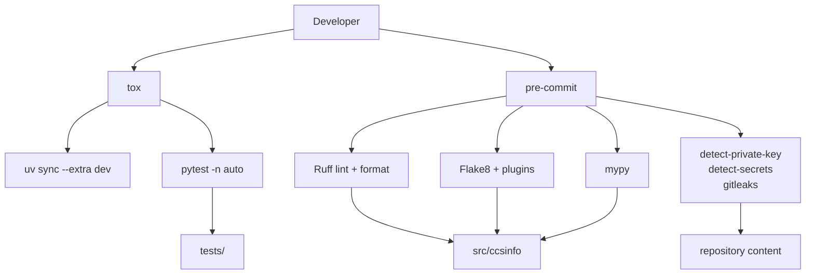

# Testing and Quality Checks

`ccsinfo` uses a layered quality workflow rather than one all-in-one script. `tox` is the repeatable test entry point, `pytest` runs the suite, `pytest-xdist` parallelizes it, `ruff` handles formatting and most linting, `mypy` enforces typing, and `pre-commit` bundles repository hygiene, `flake8`, and secret scanning.

## At a Glance

- `tox` runs the canonical automated test environment on Python 3.12.
- `pytest` discovers tests under `tests/`.
- `pytest-xdist` is enabled by default in tox via `-n auto`.
- `ruff` formats code and runs the primary lint pass.
- `mypy` uses strict settings for source code.
- `flake8` still runs as an additional check inside `pre-commit`.
- `pre-commit` also runs secret scanners before code is committed.



## Setup and Quick Start

The tox definition is intentionally small and easy to reason about:

```1:10:tox.ini
[tox]
envlist = py312
isolated_build = true

[testenv]
allowlist_externals = uv
commands =
    uv sync --extra dev
    uv run pytest -n auto {posargs:tests}
```

The `dev` extra contains the core test and static-analysis tools that tox depends on:

```63:71:pyproject.toml
[project.optional-dependencies]
dev = [
  "pytest>=7.4.0",
  "pytest-cov>=4.1.0",
  "pytest-asyncio>=0.21.0",
  "pytest-xdist>=3.5.0",
  "ruff>=0.1.0",
  "mypy>=1.5.0",
  "tox>=4.0.0",
]
```

A practical starting point is:

```bash
uv sync --extra dev
tox
```

To narrow the tox run to one part of the suite, pass pytest arguments after `--`, for example `tox -- tests/test_parsers.py`.

The project metadata declares Python `>=3.12`, but tox currently standardizes on a single `py312` environment, so that is the canonical automated test target.

> **Note:** `pre-commit` is configured in this repository, but it is not part of the `dev` extra shown above. `flake8` is also hook-managed rather than installed by `uv sync --extra dev`. In practice, that means tox is the built-in path for tests, while `pre-commit` must be available separately if you want hook-based runs.

## Pytest

Pytest is configured in `pyproject.toml` rather than a separate `pytest.ini`:

```92:107:pyproject.toml
[tool.pytest.ini_options]
testpaths = ["tests"]
asyncio_mode = "auto"
addopts = ["-v", "--tb=short", "--strict-markers"]

[tool.coverage.run]
source = ["src/ccsinfo"]
branch = true

[tool.coverage.report]
exclude_lines = [
  "pragma: no cover",
  "if TYPE_CHECKING:",
  "if __name__ == .__main__.:",
  "raise NotImplementedError",
]
```

That configuration has a few practical consequences:

- Test discovery is limited to `tests/`.
- Runs are verbose by default, with shorter tracebacks.
- Unknown pytest markers are treated as errors because of `--strict-markers`.
- Coverage settings are ready to use, but coverage is not turned on by default by tox or by `addopts`.

The checked-in suite is organized around project boundaries:

- `tests/test_models.py` checks Pydantic models, enums, aliases, and helper properties.
- `tests/test_parsers.py` checks JSON and JSONL parsing, malformed input handling, and iterator helpers.
- `tests/test_services.py` covers service-layer behavior, including patched data sources.
- `tests/test_utils_paths.py` checks path encoding, decoding, and filesystem helpers around `~/.claude`.

The fixtures are designed to build realistic temporary Claude Code data layouts without touching a real home directory:

```84:112:tests/conftest.py
@pytest.fixture
def mock_claude_dir(
    tmp_path: Path, sample_session_data: list[dict[str, Any]], sample_task_data: dict[str, Any]
) -> Path:
    """Create a fully populated mock .claude directory."""
    claude_dir = tmp_path / ".claude"

    # Create projects directory with a sample project
    projects_dir = claude_dir / "projects"
    project_dir = projects_dir / "-home-user-test-project"
    project_dir.mkdir(parents=True)

    # Create a session file in the project
    session_file = project_dir / "abc-123-def-456.jsonl"
    with session_file.open("w") as f:
        for entry in sample_session_data:
            f.write(json.dumps(entry) + "\n")

    # Create tasks directory with a session's tasks
    tasks_dir = claude_dir / "tasks"
    session_tasks_dir = tasks_dir / "abc-123-def-456"
    session_tasks_dir.mkdir(parents=True)

    # Create a task file
    task_file = session_tasks_dir / "1.json"
    with task_file.open("w") as f:
        json.dump(sample_task_data, f)

    return claude_dir
```

A representative parser test shows the kind of failure handling the suite expects:

```135:153:tests/test_parsers.py
def test_parse_jsonl_skip_malformed_default(self, tmp_path: Path) -> None:
    """Test that malformed lines are skipped by default."""
    content = '{"a": 1}\nnot json\n{"b": 2}'
    file_path = tmp_path / "test.jsonl"
    file_path.write_text(content)

    results = list(parse_jsonl(file_path))
    assert len(results) == 2
    assert results[0]["a"] == 1
    assert results[1]["b"] == 2

def test_parse_jsonl_raise_on_malformed(self, tmp_path: Path) -> None:
    """Test that malformed lines raise when skip_malformed=False."""
    content = '{"a": 1}\nnot json\n{"b": 2}'
    file_path = tmp_path / "test.jsonl"
    file_path.write_text(content)

    with pytest.raises(orjson.JSONDecodeError):
        list(parse_jsonl(file_path, skip_malformed=False))
```

> **Note:** `pytest-asyncio` is installed and `asyncio_mode = "auto"` is enabled, but the current checked-in suite is synchronous.

> **Tip:** The current tests are a good fit for parallel execution because they lean on `tmp_path`, temporary files, and mocks instead of shared mutable global state.

### Coverage

`pytest-cov` is part of the `dev` extra, and coverage settings are already in `pyproject.toml`, but tox does not add `--cov` by default. If you want coverage output, run `pytest` directly with `pytest-cov` options rather than relying on the default tox command.

## Tox and xdist

`tox` currently defines a single environment, `py312`, and always runs `pytest` with `-n auto`. That means parallel test execution is the default behavior whenever you use tox.

This is the key xdist integration in the repo:

```7:10:tox.ini
commands =
    uv sync --extra dev
    uv run pytest -n auto {posargs:tests}
```

In practice:

- `-n auto` lets `pytest-xdist` choose a worker count automatically.
- `{posargs:tests}` means tox forwards extra pytest arguments.
- `tox -- tests/test_parsers.py` is a simple way to narrow a run while keeping the same tox-managed environment.

> **Warning:** Because tox hardcodes `-n auto`, it is not the best entry point for debugging order-sensitive or timing-sensitive failures. For that kind of investigation, run `pytest` directly so you can control whether parallelism is enabled.

## Ruff Formatting and Linting

Ruff is the primary formatter and linter configured in the repository:

```1:11:pyproject.toml
[tool.ruff]
preview = true
line-length = 120
fix = true
output-format = "grouped"

[tool.ruff.lint]
select = ["E", "F", "W", "I", "B", "UP", "PLC0415", "ARG", "RUF059"]

[tool.ruff.format]
exclude = [".git", ".venv", ".mypy_cache", ".tox", "__pycache__"]
```

This setup means:

- Formatting and linting are both handled by Ruff.
- The line length target is `120`.
- Ruff is allowed to auto-fix many issues because `fix = true` is enabled.
- Import sorting is covered by `I`.
- Extra rule families such as `B` (bugbear), `UP` (pyupgrade), and `ARG` (unused arguments) are enabled in addition to the usual `E`, `F`, and `W` rules.

Once the `dev` extra is installed, the common direct Ruff commands are:

```bash
uv run ruff format .
uv run ruff check .
```

> **Tip:** Because the repo enables Ruff auto-fixes, a lint run can rewrite files. If Ruff touches a large set of files, run the tests again afterward.

## mypy

Type checking is strict in this project. The main mypy settings make it clear that type annotations are part of the expected code quality bar, not an optional extra:

```13:25:pyproject.toml
[tool.mypy]
check_untyped_defs = true
disallow_any_generics = true
disallow_incomplete_defs = true
disallow_untyped_defs = true
no_implicit_optional = true
show_error_codes = true
warn_unused_ignores = true
strict_equality = true
extra_checks = true
warn_unused_configs = true
warn_redundant_casts = true
```

Only a narrow override is applied, and it is limited to decorator-heavy CLI and router modules:

```84:90:pyproject.toml
[[tool.mypy.overrides]]
module = [
  "ccsinfo.cli.commands.*",
  "ccsinfo.cli.main",
  "ccsinfo.server.routers.*",
]
disallow_untyped_decorators = false
```

The source itself is written in a style that benefits from strict checking. For example, the parser layer uses generic return types instead of falling back to untyped helpers:

```21:26:src/ccsinfo/core/parsers/jsonl.py
def parse_jsonl[T: "BaseModel"](
    file_path: Path,
    model: type[T] | None = None,
    *,
    skip_malformed: bool = True,
) -> Iterator[T | dict[str, Any]]:
```

If you want to run mypy directly, a typical local command is:

```bash
uv run mypy src
```

When mypy runs through `pre-commit`, it focuses on source code and brings in a few extra stub packages:

```53:60:.pre-commit-config.yaml
- repo: https://github.com/pre-commit/mirrors-mypy
  rev: v1.19.1
  hooks:
    - id: mypy
      exclude: (tests/)
      additional_dependencies:
        [types-requests, types-PyYAML, types-colorama, types-aiofiles]
```

> **Note:** The pre-commit mypy hook excludes `tests/`, so the hook is intentionally narrower than an unrestricted project-wide type check.

## Flake8

Ruff is the main linter, but `flake8` is still part of the repository’s quality story through `pre-commit`. The dedicated Flake8 config is small:

```1:12:.flake8
[flake8]
max-line-length = 120
extend-ignore = E203, E501, W503
exclude =
    .git,
    __pycache__,
    .venv,
    venv,
    build,
    dist,
    *.egg-info,
```

And the pre-commit hook adds plugin-based checks on top of base Flake8:

```29:35:.pre-commit-config.yaml
- repo: https://github.com/PyCQA/flake8
  rev: 7.3.0
  hooks:
    - id: flake8
      args: [--config=.flake8]
      additional_dependencies:
        [git+https://github.com/RedHatQE/flake8-plugins.git, flake8-mutable]
```

This is important for day-to-day use:

- `flake8` is not listed in the project `dev` extra.
- The supported repo-defined way to run Flake8 is through `pre-commit`.
- If `pre-commit` reports a Flake8 failure even though Ruff is happy, the issue may be coming from the extra Flake8 plugins rather than overlapping style rules.

A focused Flake8 run looks like this:

```bash
pre-commit run flake8 --all-files
```

## Pre-commit Hooks and Secret Scanners

`pre-commit` is the broadest single quality gate in the repository. It combines repository hygiene, Python quality checks, and multiple secret scanners:

```9:60:.pre-commit-config.yaml
repos:
  - repo: https://github.com/pre-commit/pre-commit-hooks
    rev: v6.0.0
    hooks:
      - id: check-added-large-files
      - id: check-docstring-first
      - id: check-executables-have-shebangs
      - id: check-merge-conflict
      - id: check-symlinks
      - id: detect-private-key
      - id: mixed-line-ending
      - id: debug-statements
      - id: trailing-whitespace
        args: [--markdown-linebreak-ext=md] # Do not process Markdown files.
      - id: end-of-file-fixer
      - id: check-ast
      - id: check-builtin-literals
      - id: check-docstring-first
      - id: check-toml

  - repo: https://github.com/PyCQA/flake8
    rev: 7.3.0
    hooks:
      - id: flake8
        args: [--config=.flake8]
        additional_dependencies:
          [git+https://github.com/RedHatQE/flake8-plugins.git, flake8-mutable]

  - repo: https://github.com/Yelp/detect-secrets
    rev: v1.5.0
    hooks:
      - id: detect-secrets

  - repo: https://github.com/astral-sh/ruff-pre-commit
    rev: v0.14.14
    hooks:
      - id: ruff
      - id: ruff-format

  - repo: https://github.com/gitleaks/gitleaks
    rev: v8.30.0
    hooks:
      - id: gitleaks

  - repo: https://github.com/pre-commit/mirrors-mypy
    rev: v1.19.1
    hooks:
      - id: mypy
        exclude: (tests/)
        additional_dependencies:
          [types-requests, types-PyYAML, types-colorama, types-aiofiles]
```

In practical terms, `pre-commit` gives you three layers of protection:

- File hygiene checks catch common problems such as merge conflicts, trailing whitespace, missing end-of-file newlines, malformed AST/TOML, debug statements, and accidental large files.
- Python quality checks run Ruff, Flake8, and mypy together.
- Secret scanning is layered: `detect-private-key` looks for private keys, `detect-secrets` adds general secret detection, and `gitleaks` adds another credential-focused scan.

A common local workflow is:

```bash
pre-commit install
pre-commit run --all-files
```

> **Warning:** Secret-detection failures should be treated seriously. If a hook flags a key, token, or other credential-like string, remove it from the change or rotate it before proceeding.

The repository also includes pre-commit.ci metadata:

```5:7:.pre-commit-config.yaml
ci:
  autofix_prs: false
  autoupdate_commit_msg: "ci: [pre-commit.ci] pre-commit autoupdate"
```

> **Note:** `autofix_prs: false` means pre-commit.ci will not push automatic fix commits if the repository is connected to that service. Local hook runs can still rewrite files when an auto-fixing hook supports it.

## CI/CD Status

No checked-in GitHub Actions, GitLab CI, or similar pipeline files are present in this repository. The only CI-related configuration found in the codebase is the `ci:` section in `.pre-commit-config.yaml`.

That means the documented quality gates in this repo are primarily local:

1. Run `tox` for the project’s canonical test environment.
2. Run `pre-commit run --all-files` if you want the full hook suite, including Flake8 and secret scanning.
3. Run focused direct tools such as `uv run ruff check .` or `uv run mypy src` when you are iterating on a specific issue.

> **Tip:** If you want a “before I commit” routine that matches the repository configuration closely, `tox` plus `pre-commit run --all-files` is the most complete combination available from the checked-in files.


## Related Pages

- [Development Setup](development-setup.html)
- [Automation and CI](automation-and-ci.html)
- [Architecture and Project Structure](architecture-and-project-structure.html)
- [Data Model and Storage](data-model-and-storage.html)