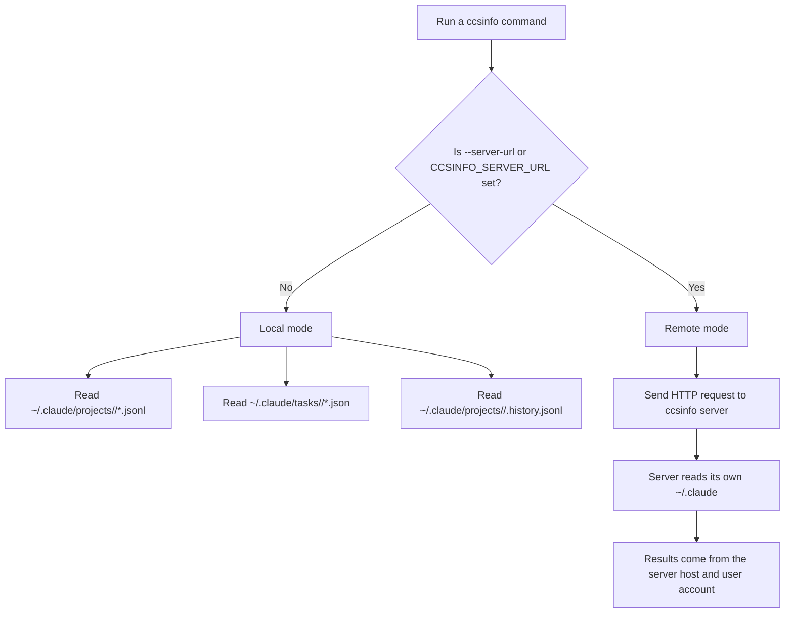

# Troubleshooting

If `ccsinfo` shows no data, odd project names, or missing tasks, the problem is usually one of these:

1. You are in remote mode when you meant to read local files.
2. `ccsinfo` is reading a different user's `~/.claude`.
3. You copied a shortened ID from table output instead of the full ID.
4. You used the wrong search command for the kind of data you want.
5. You looked up a task without the session it belongs to.

| Symptom | Most likely cause | First thing to try |
| --- | --- | --- |
| `No projects found.` | Wrong `~/.claude` directory, or remote server has no data | Confirm local vs remote mode, then check the user/home directory being read |
| `Project not found:` | You used a shortened or guessed project ID | Run `ccsinfo projects list --json` and use the full `id` |
| `Session not found:` | You copied the 12-character table ID | Run `ccsinfo sessions list --json` and use the full session UUID |
| `Task not found:` | Missing or wrong `--session` value | Re-run `ccsinfo tasks list --session <full-session-id>` and reuse that session ID |
| Search returns nothing | You searched the wrong index, or the message only contains tool calls | Use `search messages` or `search history`; if needed inspect `sessions tools` |
| `No active sessions.` | You are checking the wrong machine, wrong user, or a just-started session | Confirm mode, then wait a few seconds and retry |

> **Tip:** When you plan to copy an ID, prefer `--json`. The human-readable tables shorten project IDs and session IDs.

## How `ccsinfo` Finds Data

`ccsinfo` has two modes:

- Local mode reads files directly from `~/.claude`
- Remote mode sends HTTP requests to a `ccsinfo` server



In `src/ccsinfo/cli/main.py`, remote mode is enabled only by `--server-url` or `CCSINFO_SERVER_URL`:

```python
server_url: str | None = typer.Option(
    None,
    "--server-url",
    "-s",
    envvar="CCSINFO_SERVER_URL",
    help="Remote server URL (e.g., http://localhost:8080). If not set, reads local files.",
),
```

And in `src/ccsinfo/utils/paths.py`, local mode always starts from the current user's home directory:

```python
def get_claude_base_dir() -> Path:
    """Get the base Claude Code directory (~/.claude)."""
    return Path.home() / ".claude"


def get_projects_dir() -> Path:
    """Get the projects directory (~/.claude/projects)."""
    return get_claude_base_dir() / "projects"


def get_tasks_dir() -> Path:
    """Get the tasks directory (~/.claude/tasks)."""
    return get_claude_base_dir() / "tasks"
```

> **Warning:** In local mode, `ccsinfo` reads the `~/.claude` directory for the user running the command. If you run it with `sudo`, inside a container, over SSH, or from a service, it may be reading a different home directory than you expect.

## Missing `~/.claude` Data

If `projects list`, `sessions list`, or `tasks list` comes back empty in local mode, start by checking whether the expected Claude Code files exist for the same user account that is running `ccsinfo`.

The code expects these local locations:

- `~/.claude/projects/<encoded-project-id>/<session-id>.jsonl`
- `~/.claude/projects/<encoded-project-id>/.history.jsonl`
- `~/.claude/tasks/<session-id>/<task-id>.json`

That layout also appears in the test fixture in `tests/conftest.py`:

```python
project_dir = projects_dir / "-home-user-test-project"
session_file = project_dir / "abc-123-def-456.jsonl"

session_tasks_dir = tasks_dir / "abc-123-def-456"
task_file = session_tasks_dir / "1.json"
```

If your data feels "partially missing", check these cases:

- `projects list` only looks under `~/.claude/projects`
- `tasks list` only looks under `~/.claude/tasks`
- `search history` only sees projects that actually have a `.history.jsonl` file
- remote mode ignores your local machine entirely and reads the server's `~/.claude`

> **Note:** It is normal for `search history` to return nothing if `.history.jsonl` does not exist, even when sessions are present.

## Empty Search Results

A common source of confusion is using the wrong search command.

### `search sessions` does not search message text

In `src/ccsinfo/core/services/search_service.py`, session search only checks session metadata:

```python
searchable_fields = [
    session.session_id,
    session.slug or "",
    session.cwd or "",
    session.git_branch or "",
    project_path,
]
```

That means `ccsinfo search sessions "refactor parser"` will not find a prompt or reply unless that text also appears in the session ID, slug, working directory, branch, or decoded project path.

Use these commands based on what you want:

- `ccsinfo search sessions "<query>"` for session ID, project path, branch, slug, or working directory
- `ccsinfo search messages "<query>"` for user/assistant text content
- `ccsinfo search history "<query>"` for prompt history stored in `.history.jsonl`

### `search messages` only indexes text blocks

In `src/ccsinfo/core/models/messages.py`, message text is built from `TextContent` blocks only:

```python
for block in self.message.content:
    if isinstance(block, TextContent):
        texts.append(block.text)
```

That has two practical effects:

- tool calls are not searchable as message text
- a message with only tool-use content can exist, but still produce an empty text preview

If `ccsinfo sessions messages <session-id>` shows `Content Preview` as `<tool calls only>`, that message will not be matched by `search messages`.

When that happens:

- use `ccsinfo sessions tools <full-session-id>` to inspect tool activity
- use `ccsinfo search history` if you are looking for the original prompt text
- increase `--limit` if you expect more matches than the default output size

> **Tip:** If you are looking for something you typed, `search history` is often the best first check. If you are looking for something Claude replied with, use `search messages`.

## Project ID Confusion

Project IDs in `ccsinfo` are not plain project names. They are encoded directory names derived from the original project path.

In `src/ccsinfo/utils/paths.py`:

```python
def encode_project_path(project_path: str) -> str:
    """Encode a project path to Claude Code's directory name format.

    Claude Code replaces:
    - '/' with '-'
    - '.' with '-'

    Example: '/home/user/project' -> '-home-user-project'
    """
    return project_path.replace("/", "-").replace(".", "-")


def decode_project_path(encoded_path: str) -> str:
    """Decode a Claude Code directory name back to the original path.

    Note: This is lossy - we cannot distinguish between original '-' and encoded '/' or '.'.
    The path returned should be treated as approximate.
    """
    # Handle the pattern where /. becomes --
    result = encoded_path.replace("--", "/.")
    result = result.replace("-", "/")
    return result
```

This explains several confusing behaviors:

- the project `id` is the encoded directory name, not the friendly project name
- the decoded `path` is approximate, not guaranteed exact
- projects with `-` or `.` in their path can look odd when decoded back
- the safest thing to use in commands is the full `id`, not the displayed `path`

A real example from `tests/test_utils_paths.py`:

```python
path = "/home/user/.config/project"
encoded = encode_project_path(path)
assert encoded == "-home-user--config-project"
```

### What to do

- For `ccsinfo projects show`, use the exact `id`
- For `ccsinfo sessions list --project`, use the same full project `id`
- Do not manually reconstruct project IDs from the filesystem path
- If the project path shown by `ccsinfo` looks approximate, trust the `id` instead

> **Tip:** `ccsinfo projects list` shortens long IDs in table output. Use `ccsinfo projects list --json` when you need a copyable full project ID.

## Task Lookup Issues

The most important rule is: task IDs are only unique within a session.

That rule is enforced in `src/ccsinfo/server/routers/tasks.py`:

```python
@router.get("/{task_id}", response_model=Task)
async def get_task(
    task_id: str,
    session_id: str = Query(..., description="Session ID (required since task IDs are only unique within a session)"),
) -> Task:
```

And task files are loaded from a session-specific directory in `src/ccsinfo/core/parsers/tasks.py`:

```python
tasks_dir = get_tasks_directory() / session_id

if not tasks_dir.exists():
    logger.debug("No tasks directory found for session %s", session_id)
    return TaskCollection(session_id=session_id, tasks=[])
```

### What this means in practice

- `ccsinfo tasks show <task-id>` is not enough
- you must also provide `--session <full-session-id>`
- the same task ID, such as `1`, can appear in multiple sessions
- `tasks list` and `tasks pending` do not show a session column, so duplicate task IDs are expected

A reliable workflow is:

1. Get the full session UUID with `ccsinfo sessions list --json`
2. Narrow tasks to that session with `ccsinfo tasks list --session <full-session-id>`
3. Show the specific task with `ccsinfo tasks show <task-id> --session <full-session-id>`

If you are using status filters, the valid values are:

- `pending`
- `in_progress`
- `completed`

> **Warning:** If you see `Task not found` for a task ID that definitely exists, the wrong session ID is the first thing to check.

## Session Lookup Issues

There is one especially confusing edge case: the CLI help says a session ID "can be partial", but the current lookup path uses an exact filename match.

In `src/ccsinfo/core/parsers/sessions.py`:

```python
session_file = project_dir / f"{session_id}.jsonl"
if session_file.exists():
    return parse_session_file(session_file)
```

That means the safest approach today is:

- use the full session UUID
- get it from `ccsinfo sessions list --json`
- do not rely on the shortened 12-character table output

This matters because the human-friendly tables show only part of the session ID:

- `sessions list` shows the first 12 characters
- `sessions active` shows the first 12 characters
- search result tables also show shortened session IDs

> **Tip:** If you copied a session ID from a table and a follow-up command says `Session not found`, try the full UUID from `--json` before assuming the session is missing.

## Local vs Remote Mode Problems

Remote mode is useful, but it is also the easiest way to accidentally query the wrong machine.

Once `--server-url` or `CCSINFO_SERVER_URL` is set, commands use the HTTP client instead of local file parsing. There is no automatic fallback to your local `~/.claude`.

> **Warning:** If a server URL is set, your local Claude data is ignored until you remove `--server-url` or unset `CCSINFO_SERVER_URL`.

### Starting and checking a server

In `src/ccsinfo/cli/main.py`, the built-in server defaults to `127.0.0.1:8080`:

```python
def serve(
    host: str = typer.Option("127.0.0.1", "--host", "-h", help="Host to bind to (use 0.0.0.0 for network access)"),
    port: int = typer.Option(8080, "--port", "-p", help="Port to bind"),
) -> None:
    """Start the API server."""
    uvicorn.run(fastapi_app, host=host, port=port)
```

That means:

- `ccsinfo serve` is reachable only from the same machine by default
- if you want network access from another machine, start it with `--host 0.0.0.0`

Useful checks:

```bash
ccsinfo serve
ccsinfo --server-url http://127.0.0.1:8080 projects list
curl http://127.0.0.1:8080/health
curl http://127.0.0.1:8080/info
```

If you are troubleshooting a remote server, remember:

- `/health` only tells you the API is up
- `/info` also shows basic counts such as total sessions and total projects
- the server reads the `~/.claude` directory of the user account running the server process

### Why remote mode can look like "missing data"

In remote mode, these situations are common:

- the server is healthy, but its own `~/.claude` is empty
- the server is running as a different user than the one who has the Claude data
- the server is on another machine, so `sessions active` reflects that machine's active Claude processes, not yours
- a `show` command may report `not found` even when the real problem is connectivity or a server-side error

If a remote `show` command says something is not found and that seems unlikely, verify the server first with `/health` and `/info`.

## Why `sessions active` Can Be Wrong or Empty

Active-session detection is different from reading saved session files.

In local mode, `ccsinfo` looks for running `claude` processes and scans `/proc` for session UUIDs. That result is cached for 5 seconds.

Practical consequences:

- a session can exist on disk but not appear in `sessions active`
- a newly started or just-finished session can take a few seconds to appear or disappear
- if `claude` is running under another user, another container, or another machine, local active-session detection will not see it

> **Note:** If `sessions active` looks stale, wait a few seconds and retry before assuming the session tracker is broken.

## When Data Looks Incomplete Instead of Fully Missing

`ccsinfo` is deliberately forgiving when it parses Claude files:

- malformed JSONL lines are skipped
- invalid task JSON files are ignored
- parsing continues instead of failing fast

That is useful for resilience, but it also means corrupted files can show up as:

- missing messages
- missing history entries
- missing tasks
- lower-than-expected counts

> **Note:** If only part of a session or task list is missing, inspect the underlying files in `~/.claude` for malformed or partially written JSON.

## Useful Commands

When you are troubleshooting, these are the most useful commands to keep handy:

```bash
# Get full, copyable project IDs
ccsinfo projects list --json

# Get full, copyable session IDs
ccsinfo sessions list --json

# Check whether a specific session exists
ccsinfo sessions show <full-session-id>

# Inspect text messages in a session
ccsinfo sessions messages <full-session-id>

# Inspect tool-only activity in a session
ccsinfo sessions tools <full-session-id>

# List tasks for one known session
ccsinfo tasks list --session <full-session-id>

# Show one task from one session
ccsinfo tasks show <task-id> --session <full-session-id>

# Search by session metadata
ccsinfo search sessions "<query>"

# Search by message text
ccsinfo search messages "<query>"

# Search prompt history
ccsinfo search history "<query>"
```

If you are using the API in remote mode, these are the most direct equivalents:

```bash
curl http://127.0.0.1:8080/health
curl http://127.0.0.1:8080/info
curl "http://127.0.0.1:8080/sessions?limit=50"
curl "http://127.0.0.1:8080/sessions/<full-session-id>/tasks"
curl "http://127.0.0.1:8080/tasks/<task-id>?session_id=<full-session-id>"
```

When in doubt, start with this checklist:

1. Confirm whether you are in local mode or remote mode.
2. Use `--json` to get full IDs.
3. Use the full session UUID, not the shortened table display.
4. Keep the session ID with any task ID you want to inspect.
5. Use the right search command for the kind of content you want.


## Related Pages

- [Configuration](configuration.html)
- [Project IDs and Lookups](project-ids-and-lookups.html)
- [Active Session Detection](active-session-detection.html)
- [Working with Tasks](tasks-guide.html)
- [Searching Sessions, Messages, and History](search-guide.html)